# Plans for a Garden Tool Rack

### 1 Jan 2009

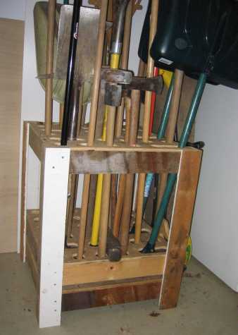

A few years ago I was fortunate enough to have some money *and* a
reliable contractor, and the result was a new garage.  But once it was
done, I couldn't bring myself to put nails or hooks into the shiny new
walls that I had just painted.  So I went off to look at tool racks.

I found some freestanding racks, but they were plastic, pretty
expensive and didn't seem to hold much.  Then while shopping at home
cheapo I saw a store display rack that looked about right, and I
figured I'd try copying it.  It worked out pretty well!

My design for a tool rack holds 30 garden tools in about four square
feet.  Plans and directions are below. I used whatever lumber was
lying around.  A few tips:

* I'm sure that different materials will work; for example, thicker
  plywood, 1x3 wood boards instead of 1x4 boards, etc.
* Make sure your hole saw is very sharp, and give it a chance to cool
  down between holes.  
* Adjust the number of connected holes depending on how many of
  your tools have wide handles, like snow shovels.
* You could use inside L brackets or outside (flat) brackets
  to connect the 1x4 frames.

Please drop me a line with a picture if you build one yourself!
Tell me what I forgot and I'll update this page.

## Diagram

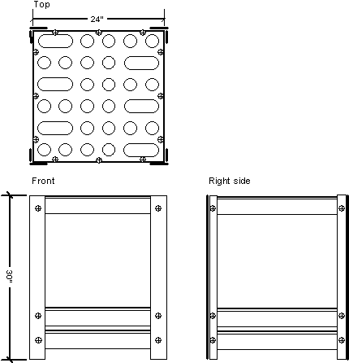

## Materials

1. 1/2 sheet 1/2" Douglas fir plywood (4' x 4' x 1/2")  
   [or 3 pre-cut 2x2 sheets from a big-box store]
1. 3 pieces 1 x 4 pine @ 8'
1. 2 pieces 1 x 4 pine @ 10'
1. 12 L brackets @ 1 1/2"
1. Box of 100 flat-head wood screws #8 x 1 1/4"
1. 24 flat-head wood screws #8 x 3/4"

## Cut sheet

1. Panels: 3 @ 24" x 24" cut from 1/2" plywood
1. Panel frames: 12 @ 23 1/4" cut from 8' lengths
1. Legs: 8 @ 30" cut from 10' lengths

## Directions

1. Clamp two 2'x2' (top and middle) panels together.
1. Drill round holes 2" diameter on 4" centers, set in 1" from sides.
1. Connect some holes with a jig saw to make ovals as shown.
1. Build three panel frames with four 23 1/4" pieces of 1x4 by
   attaching L brackets on the inside corners with the 3/4" screws.
1. Attach panels to frames using the 1 1/4" screws.
1. Rip down four legs to 2 3/4" (if the table saw needs some
   exercise :-)
1. Attach legs to frame-panel assemblies using the 1 1/4" screws.
   Leave a gap between the middle and bottom frames for your hand,
   and another gap between the bottom frame and floor for a broom.

---

## Reader Feedback

Thanks to the people who wrote me about using these plans!

### October 2010

Chuck of Mansfield, TX sent me a picture of
this very fine rack he built using these plans.  Sure looks better than
mine!  He reports that it cost him $45 and four hours labor.

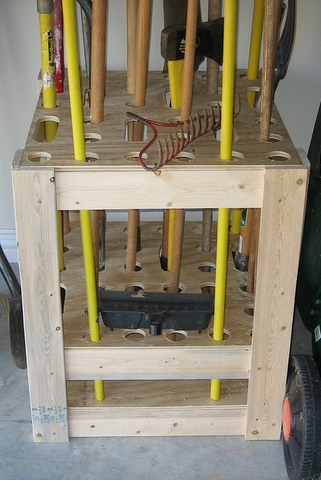

### August 2011

Pete H. of Seattle, WA sent me a picture and this note:

> The plans are spot on.  Appreciate the cutting notes for the boards. 
I used pre-cut 2x2 sheets of plywood from Home Cheapo. I added a set
of wheels on the bottom. I have this in a corner by the front of my
garage door and the wheels allow me to simple roll it out and access
any tool I need.  I had some left over stain so I used that you make
it look "richer".  Too fancy for the garage? The thing is solid and
does not tip or get top heavy, something that I was concerned about
with the store models. 
>
> Re wheels - Four swivel wheels from Home Depot... 2inch ... I still have
the bill... part number 039003094778 ... $3.48 each.  

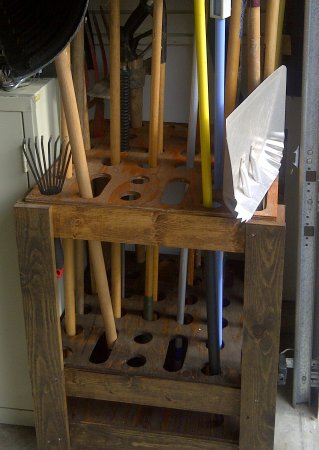

### April 2013

Gaizka L. built a custom version of this tool rack and sent me some details:

> I got mine built inspired by your design.
Thanks for the concept and the tips.
I didn't follow the blueprints, but borrowed some IP our of it.
I did include the wheels for easier access and also added a serrated
edge. That way I can just rest a tool that I'm currently using (or in
case the rack itself is full).
I also found a purchased tool hanger hanging around and I attached it
to the side.
It might be over-engineered, but is fun to see how it's been
evolving. I can clearly see where my thought process changed during
the build.

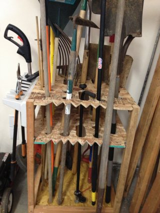

### February 2015

Brandon C. of Yorktown, TX made a double-wide tool rack:

> Just wanted to say thanks for sharing your tool rack plans. I built
one 2'x4' with 6 casters and a special hole for my fiskar post hole
diggers. 

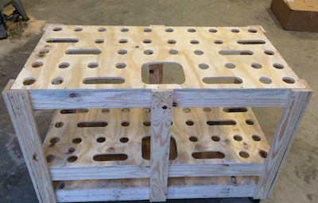

### January 2018

Rubbermaid sells a "deluxe tool tower" garage storage unit for about $80:
[Rubbermaid rack at Amazon](https://www.amazon.com/gp/product/B0009J5NRW)

### January 2018

Matthew B. of Wakeman, OH supersized the rack plans and sent me a picture of the result:

>Hi Chris,
>I just wanted to say thank you for the inspiration I found in your garden tool rack plan/blog. I modified it a bit, increasing the dimensions to 48" x 32" and using 3/4" plywood and 2x4s. The added width increased stability and I was able to use an 8-foot sheet of plywood with no waste. I also had to decrease the on-center spacing of the holes to 3–7/8" to allow for a 12 x 8 grid of holes between the outer frames of 2x4s. The materials cost a bit more, but the result is heavy-duty and it saved a ton of space, not to mention holes in my shop liner!
>
>Thanks a ton, Matt B 
>Wakeman, Ohio

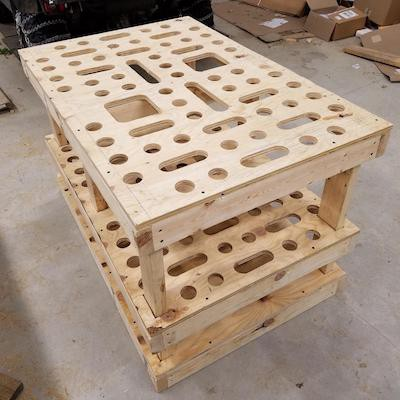

### July 2018

Dodie K. B. of Walnut Creek, CA built a long but shallow version of this tool rack and shared the results:

>I don’t know if you are still updating your blog or your blog is still active. But I found your pictures and instructions on how to build a garden tool rack and made a custom one to fit my small shed. Also my wife wanted to put the shovels in with handles up and shovel side down, so had to make modifications after I built it. It’s 16" wide, because I could cut the 3 pieces from one sheet of plywood without any waste.
> Size 16" wide x 6' feet long. Took about 8 hours.
> Thanks for the instructions!

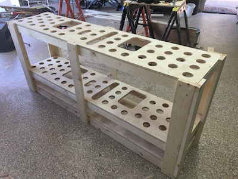

### February 2019

Paulo P. P. of Lisbon, Portugal scaled down the tool rack, upgraded to solid wood and added drawers:

>I found your pictures and instructions on how to build a garden tool rack and made a custom one to fit my small workshop.
> Size 24" wide x 12" long. I also put 2 drawers.
> Thanks for the instructions!

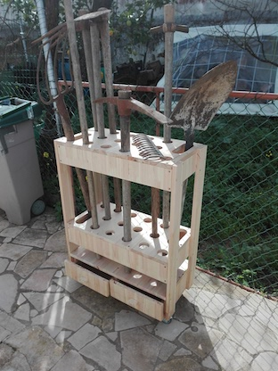

### February 2020

Rob C. of Riverbank, CA wrote to say:

>Hi Chris,
A few weeks back, I found your blog page for a garden tool rack, as I was searching for ideas to store my lawn tools. First off, great job on the design and instructions, and thanks for posting!
>
> I’ve attached a couple pics of my rendition of your plans. A couple modifications to your design:
>1. Used Kreg pocket holes and glue to assemble and join the legs, as well as the frames. Didn’t use L brackets.
>2. Used 3/4” plywood, as I wanted to use the leftover for another project. In retrospect, that might not have been the best thing. The 2–1/8” hole saw would not drill through both sheets of 3/4” plywood at once due to the shallow depth of the bit. Added quite a bit of time to drill through one layer, stop, remove the plug, etc… I got through it though.
>3. Built it to 18”x36” to better fit the space I’m storing it in.
>4. Used corner-mount casters, which are gonna work out really great.
>5. Didn’t rip down the 1x4’s for the legs. The time saved in ripping them was worth the extra cost to buy another 1x4.
>
> Anyway, gonna paint it and put all my lawn tools in it this weekend.
>
> Anyway, thanks again for posting!

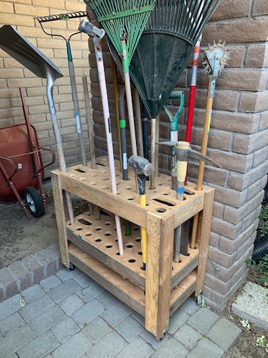

### April 2020

Matt S. from Duncannon, PA says:

>Chris,
> Have had you website marked for some time. This year I finally got to it. The plastic one I had was breaking apart and leaning heavily not do to abuse either. I generally treat things well. Made it with existing materials. It’s 2x3' with 3/4" plywood and added some casters. Thought it might be a tad top heavy once loaded so added horizontal 2x6s to base piece. Not sure if necessary. The great grandchildren will be using this one. Thank you for putting up the plans.
> Matt from Duncannon, PA.

###  July 2020

Kevin M. from Austin, TX built a revised version with a large uncovered section for bulky garden tools:

> Hello from Austin TX! I used the long weekend to finally finish making my relatively small version of your tool rack — one by three feet, with holes for two-thirds of that. Thanks for the great plans, it’s the gift that keeps on giving.

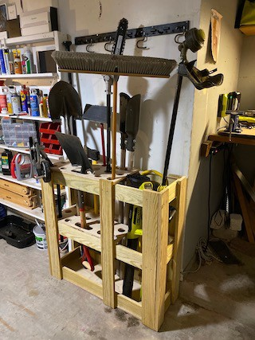