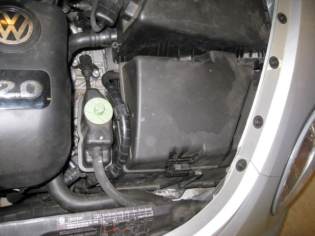
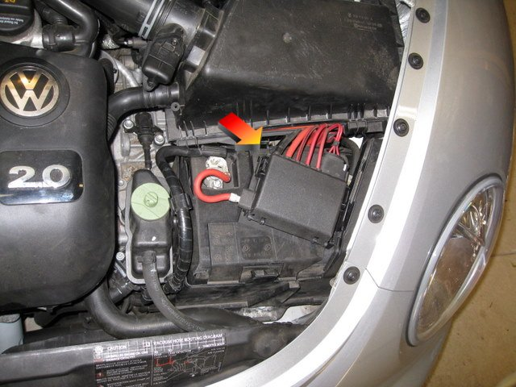
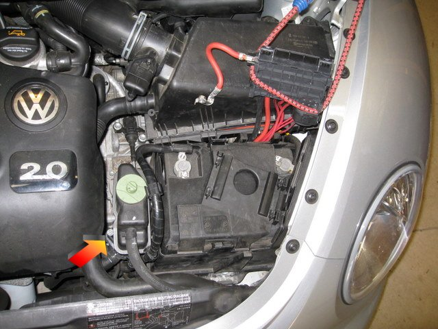
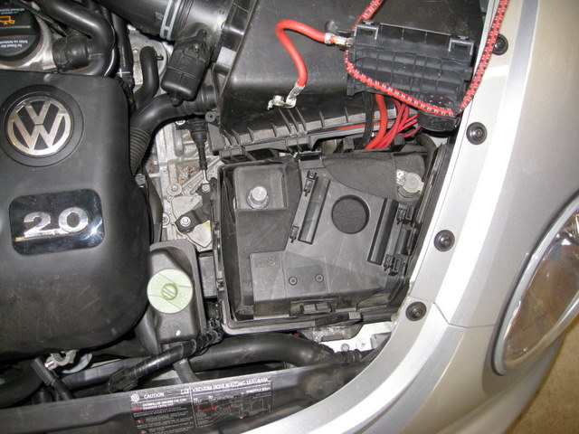
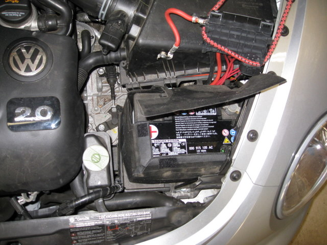
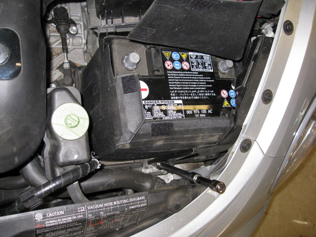
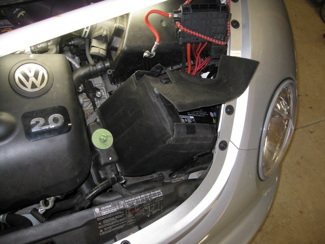
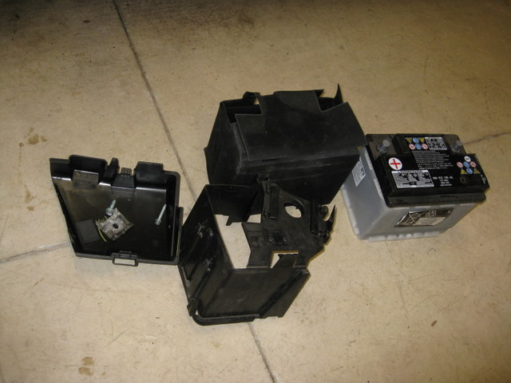
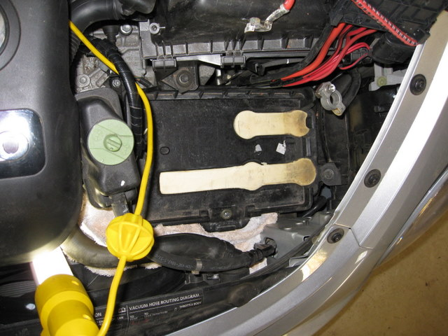

# Replacing a VW New Beetle Battery

### 27 Mar 2010

This note shows how I changed the battery on a 2005 VW New Beetle
convertible.  I hope it helps someone out there!

I finally acknowledged that I could not put off the car's odd starting
noises any longer and set out to replace its battery.  This was a 2005
new beetle convertible with a 2.0L engine.  The battery was never
changed, and I figured 5 years was a decent lifetime for the basic
manufacturer's battery.  The required size is Group 47, whatever that
means.  My local friendly VW dealer quoted me $230 to replace it,
hello!  Costco let me down, no Group 47 batteries at all.  NAPA
offered a battery at $110 with 18/75 warranty, 600 CCA.  On most cars
a battery change is a matter of unscrewing a single nut &amp;
loosening the cables from the posts.  How bad could it be, I figured?

Well. VW's engineers seem to take particular delight in making routine
maintenance difficult.  The oil plug on this vehicle is just about
inaccessible.  The tail lights and head lights are just *weird* to
remove when a (non-LED!) bulb burns out.  The battery was similarly
unpleasant. 

The good news is, anyone can do it, with time and patience.  You'll
need these tools: 10mm socket, 14mm socket (some people needed a
13mm), socket drivers, about 12 inches of socket extension for the
larger socket, a DIN5 hex key, a light, and a towel (really).  See the
end of this note for some tool-set suggestions.

This picture shows the view under the hood.  The battery is
*completely* enclosed in plastic.

In this picture you see that I've removed the plastic cover, which
isn't too bad, it is only clipped in place.  A strange junction box
lurks beneath it.  Oh boy.  The arrow points to the small tab that you
need to push down, then the junction box slides to the back (towards
the passenger compartment) and lifts off.

I loosened the nut on the clamp holding the red cable to the positive
battery terminal, removed the clamp, lifted the junction box, and
tied the junction box out of my way with a bungee.  In this next pic
the arrow points to the bolt holding down the power steering
reservoir.  That gets loosened next.  It takes a DIN5 hex key and
almost zero force.  The outside is round so no socket fits it.  Gee
thanks VW.  If you have an 8 inch long hex key you're a professional
and my idol.  I used a little hex key.  Don't drop the bolt!!  I found
an extra one in there that must have survived from the factory, go
figure.  And don't lose the washer.

Here the power steering reservoir is loose and dangling.
Next the top plastic shell can be lifted out.

The top shell is off and I've opened the velcro.  OMG!  There's a
battery in here!  Next loosen the bolt on the clamp on the negative
terminal and pull off the clamp.

This next picture shows the battery free of all cables and shells.
The only thing remaining is the bracket that holds the battery down at
the front.  I used a 14mm socket on the bolt; one reader with the same car
reports his had a 13mm bolt.  I really needed a 12-inch extension but I
made do with the basic long one plus the short one from my set.  The
bolt took almost zero torque to loosen.  I managed to lift the bolt
and bracket out without dropping them, which was a miracle.

In this picture you can see that the battery can be tilted and
removed.  It's heavy and just barely clears the obstacles. This
reminds me of those old problems in calc when I had to figure the
longest ladder that would fit around a corner.  My trouble light looks
like a lightsaber in the picture :-)

Here are all the parts I removed.  Can you believe all this extra
stuff!?  I'm not sure why they supply a jacket but there it is.  The
top cap has the hardware - the long thin bolt from the power steering
reservoir, along with the big bolt plus bracket from the front of the
battery.

Finally here's a picture of the empty battery platform.  It's quite
large, I think there is room for a much larger battery, maybe for very
cold climates??  Note the __towel I stuffed underneath the platform__
(see below), which should help when you reassemble in reverse order!

At this point I can confess to the near disaster I had without fear of
many people seeing it :-).  I put the velcroed jacket on the new
battery, then lowered the new battery in.  Next I tried to put on the
bracket .. and promptly dropped it.  It simply vanished into the
depths.  I mean it was gone.  No sign of it.  I jammed that yellow
trouble light into every possible crevice.  After much panicing,
cussing, visions of flatbed trailers, my wife killing me, and so on I
finally moved the radiator hose enough that I could see the bracket,
way down deep.  I managed to dislodge it and it went deeper.  It hit
the bottom of the engine shield (did I mention that VW engineers make
everything difficult?).  Thru some dumb luck I managed to get my hand
in from the side and reach thru far enough to retrieve it, and didn't
draw blood on the nice sharp edges.  Then I resorted to the towel -
stuffed it below the blatform to hide all crevices, then the next time
I dropped it the little bugger could not escape.  So that's the happy
ending to this story.

---

## Reader Feedback

Thanks to the people who wrote me about changing their batteries!

### December 2010

Ryan H. sent me these suggestions for the 
appropriate tools, the links go to Amazon: 

* A screwdriver set that includes hex blades:
  [Wiha 28199 Drive-Loc VI Interchangeable Blade Set](http://amzn.com/B000T9SBNK)

* A very nice metric socket set, but a little spendy:
  [Wera Zyklop 8100 SB 1 3/8-Inch Metric Ratchet Set](http://amzn.com/B001V9T42Y)

### February 2013

Stephen S. wrote me with this improvement to my directions:

> Your blog post for the battery change was great.  I had no idea where
to start.  One addition.  You do not have to remove the bolt and
battery bracket completely.  If you wind the bolt out about 3/4 of the
way you can get the battery in and out without having to lose the
bolt.  
