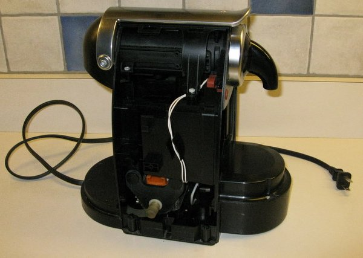
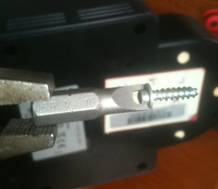
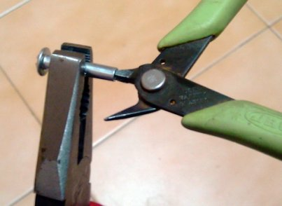
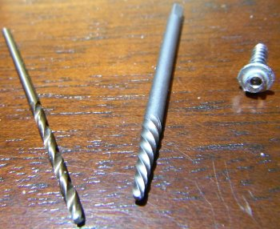
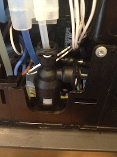
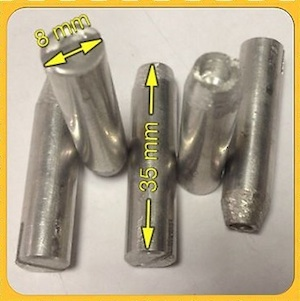
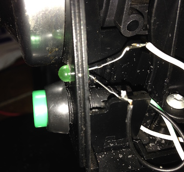
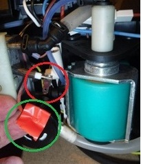
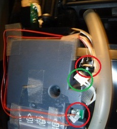
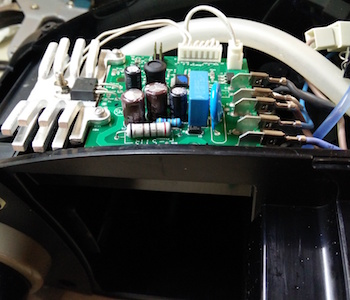

# Repairing a Jura Nespresso Machine
## Or: The Story of the Oval-Head Screw and Kindness of Strangers
### 27 June 2010, with many updates

## Contents

* [Summary](#summary)
* [My story](#my-story)
* [Buy or build an oval socket](#get-a-socket)
* [Sources for Nespresso parts](#need-parts)
* [Machine repair stories](#machine-repair-stories)
    * [2010](#stories-in-2010)
    * [2011](#stories-in-2011)
    * [2012](#stories-in-2012)
    * [2013](#stories-in-2013)
    * [2014](#stories-in-2014)
    * [2015](#stories-in-2015)
    * [2016](#stories-in-2016)
    * [2017](#stories-in-2017)
    * [2018](#stories-in-2018)
    * [2019](#stories-in-2019)
    * [2020](#stories-in-2020)

Please leave comments [at the github repo](https://github.com/chrisinmtown/chrisinmtown.github.io)

## Summary

Machine problems?  tl;dr?  Here's the diagnosis quickstart, see
details far below.

* What the !@#$%^ are these oval screws? 
    Somebody's attempt to ensure repair-shop business, you can buy or
    a build a socket to remove 'em.
* Push buttons don't work?    Probably poor electric contact,
   clean the back of the push buttons and maybe re-apply graphite.
* Machine doesn't draw water?    Probably a stuck check valve,
  free it up with a long thin bamboo stick or by pushing/pulling air
  via a syringe.
* Water leaks out the bottom?    Probably a cracked elbow joint
  in the high-pressure line from the pump, your only hope is an
  original part from Europe bcos epoxy will not hold pressure.
* Machine won't turn on?    If it's not bad push buttons,
  check if the in-line thermal fuses have opened; parts are cheap and
  are not on the circuit board, so the repair is not too diffcult.
* Rapidly blinking lights instead of coffee?    Probably a
  failed electronic part, here are the usual suspects:
   * Large rectangular capacitors on the little circuit board have
     failed for many, replacements are cheap but you have to be handy
     with a solder iron.
   * Temperature sensor in the heater block may have failed. Tiny part
    so it's difficult to repair, might need an original part.

## My story

A few years ago my family bought me a basic Nespresso espresso
machine, which is made by Jura in Switzerland. It uses little sealed
coffee capsules like this one:

The upside to the capsules that that they yield a very nice espresso shot,
with no skill required and no mess on the counter.  The downside is that
they are only available from Nespresso and as of 2010 cost US$0.55
each plus shipping.  (Update 2021: Nespresso capsules are far more expensive
now, but Nestl&#233; lost their monopoly when their patent expired so you
can get cheap capsules now, for example at Trader Joe.)

We used the machine for a couple of years, generating a nice recurring
revenue stream for Nestl&#233; while making our morning lattes.  But
over time the power button became recalcitrant.  First it required two
pushes to go on, then three pushes, then coaxing with a pencil eraser,
and this got ever worse until I was standing there for the better part
of a minute pushing, pushing, pushing while waiting for the DANGED
(ahem) light to start blinking.  Naturally it was out of warranty by
then, and sending it away for repair was almost as expensive as a new
one.  I actually eyeballed a new machine in some mall store where I
noticed that the latest Nespresso models have a simple toggle on-off
switch, so I sorta suspect this power-button trouble happened on a lot
of machines.

So off to the workbench, where I found that the machine's sides are
held in place by four screws recessed about 1 inch.  And the screws
have <b>oval heads</b>.  I'd never seen anything like that before, and
the security-driver kits at Sears had nothing to offer.  The deep
recess meant a needle-nose plier would not work.  I've never seen a
consumer appliance protected this carefully.

A quick web search found a special tool on ebay for $40.  Ouch!  I
didn't know if the machine's brain was bad or what, and $40 seemed
like throwing good money after bad, so I let the machine sit on the
bench.

A couple weeks (ok I admit it, it was months) later I found leftover
capsules in the kitchen and posted a note to Craigslist for someone to
take 'em for free.  I grumbled in my note about the funky oval-head
screws and offered to give away the machine along with the capsules.

Enter Dave H., a fellow New Jersey resident who responded to my post.
His machine had mouse trouble (don't ask), but he made a socket out of
an old bolt!  Look at this:

Even better, he sent me the socket!!  Complete kindness to total
strangers, I love Craigslist.  His remanufactured bolt loosened the
screws on the very first try.  The screws only go into plastic so they
require very little force to remove.  Here's the machine with the side
panel removed for easy access to the power button.  The heater is in
front (below the drip tray), and the pump is buried in the middle.

Here's a close-up of the super secret special swiss oval-head screw
(in the middle).  I put calipers on it and by comparing it with drill
bits estimate that the head is 1/8" at the narrowest and 5/32" at the
widest.  (Of course it's probably metric but I don't own metric drill
bits.)  Anyhow just 1/32 inch difference is enough.  The plain slotted
screw I chose as a replacement is on the right.

Well, back to the original problem, turning on the machine.  The power
switch assembly consists of a small circuit board and a molded silicon
button.  I loosened a bracket behind it (the screw required a Torx
driver size T-10) and pulled out the circuit board with the button.
Here's a shot of the board and button:

The inside of the button (showing) touches the circuit board when
pressed, and springs back a few mm when released.  There is no clicky
or other moving part on the circuit board, it only has two copper
areas exposed, an outer area and a circular inner area (a bit hard to
see).  Somehow the button completes a circuit when it touches the
board.  I'm not an EE at all (as has been made very clear to me at
work :-) but silicon conducts power?? The end of the button is black
as if it were coated in carbon, maybe that's the secret.

The board didn't look cracked, so I resorted to the obvious: clean
everything.  I windexed the board and the end of the rubber button,
put them back in place .. and it worked again!!  First touch turns on
the machine.  I was stunned.  That's the happy ending. 

If you have one of these machines with power button trouble, the hard
part is getting the case open. In my machine the apparent trouble was
schmutz blocking a connection.  Here's a side view of the bolt so you
can get a better sense for the dimensions, along with the wacky
oval-head screw one more time.

Thanks again to Dave H. for making and sharing this little socket.
He wouldn't even accept a pack of capsules for his trouble!  

You can borrow a socket if you like.  As you'll see below, various
sockets have circled the globe!  If you borrow one, you have to send
me a picture of your machine's guts for this page. :) If there's a
queue, you must send it along within a few days.  More commonly there
is no queue, which means you'll have to hang on to it for weeks until
someone writes me.

You will also need a Torx driver size T-10, it should be easy to buy
or borrow locally.

## Get a Socket

__Buy a socket!__

You can buy a tool to extract the oval-head screws on a Jura nespresso
machine:

* A 3.5 millimeter, 6 point socket may work. If you don't have a set
  with this size (I don't either, mine starts at 4mm), try this:
   
  https://www.amazon.com/Wiha-26535-Precision-Driver-Metric/dp/B000O5ILYS/
* A steel oval-head socket is about US$13 shipped, sold by Peter N, the
  Jura Capresso Doctor on eBay.  This has been used successfully by many people:
   
  https://myworld.ebay.com/juracapressodoctor
* Peter N. fabricates his own steel sockets in Greece and sells them for about $10 on eBay:
   
  https://pages.ebay.com/link/?nav/item.view&id=291262252009&globalID=EBAY-US
* 1/4 inch bit for oval screw heads from Esprase in The Netherlands,
  &euro;6.75 plus shipping:
   
  http://www.esprase.nl/product_info.php?products_id=569"
*  Oval Pan Head Security Screw Hand Driver, about US$12 plus $8
  shipping.  I have not seen this tool and cannot promise it's the
  right size. If anyone buys one, please send me a picture.
   
  http://newelectronx.com/proddetail.php?prod=oval-pan-head
*  Spanner bit (driver) size 10 at Amazon, about US$4 plus shipping,
  eligible for free shipping.  A spanner bit is actually made with two
  points for driving a security screw that has the matching two little
  holes on the screw head face.  But the tool has a gap between the
  points that's just about right for turning the Nespresso oval-head
  screw!  See below for reports and pictures about using a spanner bit
  to turn the oval-head screws.
   
  http://www.amazon.com/Vermont-American-15442-Spanner-Screwdriver/dp/B000GAQE8Q

Unfortunately the oval pan-head security screw bit is not supplied in
any tool sets that I've found.  For example, these sets from Harbor
Freight (links below) look promising, but Gregg L. checked them out in
person and reports that the needed bit is not included.

* http://www.harborfreight.com/33-piece-security-bit-set-93388.html
* http://www.harborfreight.com/100-piece-security-bit-set-68457.html

__Build a socket!__

If you already have your machine on the bench and don't feel like
waiting for a tool to arrive in the mail, look below for some advice
on building a tool to turn the oval-head screws.  Reusing a part from
Ikea seems to be the easiest option.

In April 2009 Jakou posted details on reworking a part from Ikea into
a socket to turn these pesky oval-head screws.  He reused a fastener
that Ikea ships with their furniture (see picture at right).  This
fastener is about 2.8cm (1&nbsp;1/8 inches) long and consists of two
parts: a hollow sleeve plus a matching M4 (metric 4mm diameter) screw.
An Ikea store often will give these out on request but sorry I don't
have a part number.  The only required tool is a pair of pliers to
squeeze the open end of the sleeve.  The picture below is
straight from his blog. 

Read the whole discussion (en fran&#231;ais!)
at the link below. If you don't understand French, a Google
translation is pretty good. Many thanks to Elvire Serres for sending
me this link:

http://www.tout-electromenager.fr/forum_lecture-4775-4-1.html

Also scroll down to see more details about Ikea bolts from Mr. Arenas
of Barcelona.

Mico N. of The Netherlands offers this advice to build a __metal__
socket:

> What I did was look around for an aluminium object (which can be
drilled easily) and would fit nicely in the recessed holes my machine
has to get to the oval head screws. Some were recessed 30 millimetre
deep. My eye caught this scalpel-like hobby knife holder and it is a
perfect match! You can buy these knives in the hobby shop for a few
Euros/Dollars.  I measured the thinnest part of the oval head screw
with a caliper and this turned out to be exactly 3.2 millimetres.
Luckily I still had a 3.2mm metal drill in my toolbox so I placed the
hobby knife holder in the vise and tried to drill a hole as much in
the middle as I could. As you can see from the photo I need more
practice to find the middle :-) After drilling a hole into the knife
holder of about 5mm deep I moved the drill from left to right in a
straight line to make the hole into an oval shape similar to the
screw.  After a while it was a perfect fit and I successfully used my
"tool" and unscrewed the oval heads from my Nespresso machine.

Jacopo L. of Milano, Italy offers this advice to build
a __plastic__ socket: 

> Just take a pen (a Bic is perfect for this job). Pull out the bottom
cap and the ink cartridge. Heat the tip of the casing a bit just to
melt the plastic and make it soft. Then press the tip on the oval head
and wait 30 seconds to let it cool down. Done. Now you have a perfect
tailor made oval screw driver!

However, several people have written me to say that they had poor luck
with making a plastic tool.  They melted several Bic pens but still
were not able to turn the screws.  So your mileage may vary here.

In August 2011 Rolfje blogged with advice on opening a Krups XN2001
machine, read it here:

http://rolfje.wordpress.com/2011/08/27/how-to-fix-a-krups-xn2001-nespresso-machine

He glued bits of metal with a slot to the oval screw heads.
The picture is straight from his blog:

## Need parts?

Here is a resource.

* Peter N, the Jura Capresso Doctor, sells parts for Jura and
  Jura-Capresso machines, at present thru eBay.  But since the
  Nespresso machines are made by the same Swiss manufacturer
  (Eugster-Frismag) that makes the Jura, some of the parts like
  internal O-rings may work for Nespresso machines too.
   
  http://myworld.ebay.com/juracapressodoctor

## Machine Repair Stories

Below I've gathered pictures and stories of machine repairs -- some
successful, some not.  Many machines were opened with a socket that
I've lent out. :)

If you prefer video over text, here's 15 minutes of explanation on
opening and repairing a machine:
 
http://www.youtube.com/watch?v=CDdAWKuCvhA

### Stories in 2010

#### 30 July 2010

Dave's socket traveled to San Francisco, CA
to help Thayne N. repair his Nespresso D90.  Success!

#### 27 August 2010

The socket returned to SF, CA to help Jim
C. fix a loose wire in his Jura Ultra.   Success number two!

#### 29 September 2010

Third trip to California, this time
to Jen L. in Encinitas. She opened her Essenza and convinced both
sets of push-button switch contacts to work again!
That's three successes and counting.

#### 11 October 2010

The socket flew over the pond to
Bert van E. in Utrecht, The Netherlands.  He got his Krupps Cube open
just fine, but the problem preventing the machine from turning on was
not obvious.  Have to count this one as a miss, unfortunately.

#### 22 October 2010

The socket continued its European journey
to Geneva, Switzerland.  There it helped Tony T. open his machine and
clean the contacts, the same repair that I did some months ago. 
Success number four!  He sent me these before and after pictures
of the contact circuit board.

#### 9 November 2010

Back to North America, the socket made
its first stop in Canada, where Antoine N. in Montreal used it to open
his D100 and re-clamp a leaking hose.

#### 19 November 2010

Fourth visit to California!  Bill V. of Northridge used the socket
to open his C100 and clean the power switch contacts. 
His machine's switch has three wires, a small LED in the middle of
the board, and a translucent rubber push button. 
He reports that it works fine again.

#### 10 December 2010

First visit to England.
Tom Q. in Basildon, Essex, UK used the socket to open his Siemens machine.
Unfortunately the fault was not in any obvious places like the switches
and he was not able to repair it.

#### 18 December 2010

Back to the U.S., the socket visited
Illinois, the Land of Lincoln, where Ivan B. used the socket to open
his Jura F60.  

#### 28 December 2010

Akos B. from Hungary wrote me that he found a simple tool to loosen
these oval-head screws.  It's called a spanner screw bit and Akos
reports that size 10 worked for him.  I bought a size 10 from Amazon.
It fits but does not grip the head very well.

### Stories in 2011

#### 3 January 2011:

Lost. &nbsp; :-( &nbsp;
The USPS ripped the envelope that Ivan used, and the original socket
fell out somewhere on the way from Illinois to Philadelphia. 
Ivan very generously offered to buy one of the Ebay
guy's sockets to keep this little community going.

#### 10 January 2011

Ivan replaced the home-brew socket that our beloved USPS dropped on
the floor with this shiny new one and sent it on to Philadelphia.

#### 14 January 2011

Sam G. in Philadelphia opened his C100 and began searching for an
elusive leak!

#### 23 January 2011:

Visited Travis E. in Newton, MA.
He cleaned his machine's buttons and they work again!

#### 13 February 2011

First time in Portugal! 
Paulo P. pried open his machine and polished away the poop that
prevented his push buttons from working properly!  (Forgive me, Paulo :-)

#### 28 February 2011

Second person in Portugal!
Eduardo N. opened his machine and sent me this picture.

#### 7 March 2011

Next stop was Spain, where Manuel L. in Madrid reported finding some metal
bits inside the socket that made it difficult to turn the oval-head screws. 
After some cleanup he was able to open his machine and diagnose a failed pump.

#### 6 April 2011

Third visit to Portugal, where Ad&atilde;o C. confirmed that the socket
is a bit damaged but still functional.  His machine had the same problem
as mine, and after some cleanup it worked again!

#### 1 June 2011

After nearly two months with no requests, David R. of Chicago wrote me
to ask for the socket.  He sent me this picture and note:

> in about 10 minutes the machine was dis-assembled, cleaned, re-assembled!

#### 14 June 2011

Second stop in Chicagoland to help Gabe S. open and repair his D290
with excellent results.  Gabe reports that he replaced the original
screws with #6 x 1/2 inch stainless-steel sheet metal screws.

#### 11 July 2011:

First visit to Asia!  Melvin P. in Singapore finally convinced those
pesky oval-head screws to turn with a little help from some aluminum
foil stuffed into the socket.  And he helped a friend too.  He
reports:

> I also realized (rather belatedly, after earning a bruised thumb) that
the tool works much much better when it is detached from the key ring
and used with a screwdriver handle attachment (the blue object in the
photo). While the key ring can provide the necessary torque leverage,
you really need a handle to provide the needed pressure to keep the
bit on the screw head.

##### 12 July 2011

The socket is significantly damaged.  Melvin P. sent me this close-up
picture.  To be fair, the ebay guy does say this tool is for light use
only. Melvin reports that he reworked it a little and it should still
work. 

#### 20 July 2011

Ralph ? wrote me from Cyberspace to say he successfully used a #8
spanner bit to remove the screws in his machine.  He reports:

>the space in between the prongs on the bit make a very tight fit at
exactly the most narrow diameter of the oval. it takes several
attempts, much slipping off the rounded head, a very good sense of the
axial center of the screw, and a steady hand to get the sufficient
friction to get the screw started.

#### 21 August 2011

Gregg L. of Hatfield, PA wrote me about his success with fixing his
machine:

> Appreciated your suggestions and pictures. Used the idea from Mico N.
and drilled out an X-acto handle as described using a number 31 drill
bit with no vise, since I don't have one. Worked perfectly. The
Harbor-Freight security bit set did not have an oval head driver and
the bi-slot bit did not work even with some filing. Did use the small
Torx bit from the set however to remove the top shield to make getting
to the buttons easier. Had a right hand button that would not
activate. Took it apart cleaned everything with rubbing alcohol and
cotton swabs.  Reassembled it with 4x1/2 zinc pan head screws (they
are a better fit than 6x1/2) from Lowes ($1.25), button now works and
wife is happy again.

#### 28 August 2011

George X. in Shanghai, China opened his machine with the socket but
had some trouble with the internal fasteners.

#### 24 September 2011 

Lawrence Sheed of Shanghai sent me a link to detailed instructions on
his blog for opening a Nespresso Cube (Krups XN5005).  The oval
security screws on that machine are not set deep, and he was able to
turn them with pliers.  Check out his pictures! 
 
http://www.computersolutions.cn/blog/2011/09/repairing-a-nespresso-cube-krups-xn5005

#### 9 October 2011 

Giovanni R. in London, England used the socket to open his machine.
He kindly repaired the socket before sending it along.

#### 19 October 2011 

Niek V. of Arnhem, The Netherlands disassembled his Nespresso Cube
after making further adjustments to the aluminum socket.  He diagnosed
two blown thermal fuses and replaced them successfully!  He reports:

>I fixed the Cube yesterday, it was so easy with the right tool!  The 2
thermo fuses screwed to the heating element were defective, so I
replaced them for &euro;3,50! At Nespresso they asked &euro;150,-
for repairing it!  To find the problem I started to measure voltage
from the connector (230V 50Hz) to the printed circuit board to see if
there is a strange value.  From the connector it goes first to the
on/off switch and from there to the 2 thermo fuses. The values were
right (230V) until I measured after the fuse, there was no voltage,
then I measured OVER the fuse with an Ohm meter (resistance).  It
should give a value greater than 0 but it was 0 or OL (infinite
resistance), so then you know the fuse has done its work and is
broken.  So I took them out and read what was on them. My fuses are:
Microtemp, Stabln, E5A00 167 C (degree), so I went to the electronics
store and bought 2 thermo fuses 
http://www.amazon.com/Thermal-fuse-167-degrees-celsius/dp/B000T9VESY
(they are also available at Amazon).  I replaced them, put it all
back together, pushed the on button and it worked. The result was a
fine cup of coffee!

#### 2 November 2011 

Niek V. wrote me about a new socket!

>I already told it, the socket is damaged and you need to fix it after
a few screws.  So I made a new one today and it just works fine. The
next one who's going to need it gets them both so he can decide which
one to use.

#### 4 November 2011 

Bruce F. of Long Beach, California wrote me about his regular drip
coffee machine:

>Thanks to your blog, I've just been able to open up my Krups 12 Cup
Coffee maker model 134A.  The 3-max cups switch was broken.  There are
two oval head screws about 1 inch deep on the bottom that needed to be
taken off.  I was able to make a similar tool to those that were
described, however the dimensions on the head of these screws were 5mm
at the narrow side and 6mm on the wide side.  Hope this helps someone
else. 

#### 21 November 2011 

Manny C. in Princeton, TX opened his Capresso to fix a leaky hose.

#### 24 November 2011 

Diana T. in Los Angeles writes:

>Let the folks know that all the advice was great and it worked
perfectly. Machine fixed in exactly 10 minutes. We replaced the funny
screws with the ones suggested by the blog and now our cat Frankie can
get her morning coffee (without it she's a MONSTER).

#### 6 December 2011 

Julie P. in North Wales wrote that she used the brass tool made by
Niek to remove the screws on the bottom of her machine.  She cleaned
the power switch and is now searching for the source of a leak.

#### 7 December 2011 

Noel L. from Puerto Rico reports the following experience:

>I also noticed that if you pinch the soft button from the outside, and
pull it out at the same time, it starts working again. Somehow,
accumulated dirt or sulfate is removed by pinching and pulling the
button.  This is really convenient especially if you are in a hurry
and do not have time to uncover and repair the machine.  I hope this
helps some Nespresso coffee lovers out there.

Second update 25 June 2014 from Noel:

>Today, I would like to update the same problem with another experience
that will help many friends fix their clogged buttons without breaking
apart the machine:
>
> When pinching the buttons do not do the trick, if you spray a small
amount of Silicone Spray on the power on and cup buttons, while having
the machine at a horizontal position, this liquid will penetrate and
reactivate the electric connection again and the machine will start
working properly.  Silicone acts like a cleaner and conductor and it
dries very quickly. I use it also for my stubborn iphone home button
and it works better than alcohol plus lasts longer. Although I don't
think the brand matters, the one I used is Liquid Wrench.
>
> Thanks for maintaining this very useful blog.

#### 10 December 2011 

Nick H. in London, England wrote me to say:

> Unfortunately the aluminium one is pretty chewed up and won't
work. The brass one will not fit either as there is a ridge around
all of the screws on my machine and the brass tool is too wide. 

#### 27 December 2011 

Ricardo R. in Mafra, Portugal wrote me about trying to open
his Nespresso xn2001:  

>Although i've already tried to open the Nespresso, but the
alluminium socket is very damaged...and the other doesn't fit...

I told Ricardo to keep these sockets since they don't seem to be of
any further use to anyone.

### Stories in 2012

#### 5 January 2012 

Dennis van D. in Utrecht, The Netherlands wrote me to report his
success with using a #10 spanner bit:

>Thanks to Rolfje and your blog, I managed to open and repair the dirty
buttons on my Krupps Nespresso :) Since I'm rather impatient, waiting
for an envelope with a tool while the machine's already on the table
is not something I'd like to do. Thankfully I saw a tool come along
that I had lying around (#10 spade bit), so I could start
dismantlement right away. It was a bit finicky with the first two
screws, but the 3rd and 4th came out as if the bit was made for it.
Thank you for making my mornings a bit less annoying ;)

#### 16 January 2012 

Todd S. from Cyberspace  wrote me to report his experience with using
a screw extractor on the oval-head screws:

> Thanks for your article about the Nespresso machine repairs. I was
ready to bust out the soldering wick and get geeky on that thing (it's
the office machine). Alas, the oval screw heads were a surprise. I
attempted to make a plastic "tool" using a pen (as someone
suggested). Then, it dawned on me that the easiest and cheapest
solution was to drill a small hole into the bolt head. Then, I simply
used a bolt/screw extractor to remove the factory screws.
>
> While drilling the hole into the top of the slightly-rounded
screw-head isn't too terribly difficult, it does require a bit of
patience and concentration.  A very simple
and durable "helper tool" would be a dowel.
Determine the correct dowel size for the holes on the bottom of the
case (these were paradoxically easier to drill than the top-mounted
screws).  Anyway, if you drill through the center of the dowel (which
should extend just beyond the top of the holes), you have a
jig/guide/etc.  It would help the process.  Anyway, I used a 1/16
drill bit (smaller is better... but needs to be a size that works with
the screw extractor).  Don't "go cheap" on the drill bit -- and be
certain to use a metal bit (one of the "fancy" coated bits is
appropriate, here, as it takes a while to start the hole). 

#### 17 January 2012 

I confess I still had a tool from Dave H. on my workbench.
It was a short, drilled-out bolt with a 1/4inch
drive hex socket as its head.  The large head prevented the bolt from
reaching the deeply recessed screws in my machine, so I put it aside.
Today I got motivated to try grinding down the bolt head to fit into
the recess, and this is the result.  It fits into my old machine!

#### 18 January 2012 

Peter N. of Wilmington, NC, the Jura Capresso Doctor, wrote me a long note about 
the stuff he sells on eBay for repairing these machines
 
http://myworld.ebay.com/juracapressodoctor/

>I just read your log about Nespresso machines at ..
>
> I'm the "flea-bay" guy you mention :)
>
> Let me give you some more history/input on this, as there is a lot to
say:
>
> $40 cost: The aluminum oval head tool was originally imported by me
from Germany. The German sellers charged close to $20 for the tool,
and a whooping $30 for shipping (!) and to add insult to injury, they
refuse to ship to USA, so I had to have the tools shipped to Finland
first and have my friends ship to USA adding further shipping
costs. At the time I ordered only 4 at a time (due to the cost, and
since I did not know if I was going to be able to sell them). Hence,
the $40 cost.
>
> $20 cost. After selling a few of the German tools, I decided to see if
I could have somebody make them for me. It was expensive to have them
made in small quantities, but I eventually found a company that made
me 200 of these for $6/each. This is when I dropped the price to
$19.95. The markup may seem big, but this tool was originally intended
for Jura-Capresso superautomatic owners that must pay Capresso a fixed
price fee of $235-$350 to get their machine repaired, and from
previous sales I found myself spending *a lot* of time helping people
diagnose problems with their superautomatics.
>
> Unfortunately the first batch of aluminum tools was not very strong
(as you note in your blog). The first batch of 200 tools was made to
my technical drawings, and the manufacturer apparently was not able to
follow it perfectly. This resulted in the tool not sitting tightly
enough around the screw head and I had to tweak each tool manually
(what a chore!) to make them work. While it worked, it was tedious and
the tool was admittedly not very strong. I was ready to give up on
this, but last summer when I ran out of tools, I decided to contact
the manufacturer and see if they could make the tool and guarantee a
perfect tight match with the screw head.
>
> Frankly, I never realized that there is another market for the tool,
that does not involve the complicated and overly expensive
super-automatics! Had I known that, I would have listed the tool for
$9.95 a long time ago and I will definitely make sure to put up a
specific Nespresso listing that I continuously will keep at a low
price ($9.95 / free shipping or lower). 

Peter was kind enough to send me a pair of sockets and screws.  I'll
send one to the next person who joins the queue.

#### 19 January 2012 

Today an Irwin #8 spanner bit arrived in my mail. As you can see from
the picture, the gap between the prongs is simply too small to fit
around the oval-head screws that were in my old Nespresso machine. But
the #8 has worked for some (see above) so your mileage may vary!

#### 31 January 2012 

Mr. Arenas of Barcelona wrote me about his adventures at Ikea, 
adjusting the bolts and repairing his machine:

>This morning I went to the Ikea Store, customer service area.
I showed them the photo, asked me where it belonged to, I said I was
not sure because I was doing a favour to a friend. They asked a guy
from the warehouse to come over and see, he had a look at it and asked
me, "how many do you need?" I said 4 units and in 3 minutes I had
them for free, at no cost!
>
> It's just perfect that these bolts have a Philips head, in one hand,
you don't need to attach the bolt to another piece in order to make a
handle. In the other hand, the Philips head allows you to use all the
force/power you need to unscrew the limed stuck screws.
And finally, this bolt perfectly fits the hole for the "Radio shaped"
Nespresso type machines like Krups XN2001, etc.
>
> Tuning was made with some robust pliers. I pressed each bolt following
the way of the slot in the bolt. This way is easier for the user to
know where the narrow part of the oval head is.  I pressed each bolt
half way in the plier, otherwise it can't be pressed, it's too hard
(or I'm not strong enough!)  Once each bolt has been given the desired
shape, I used this other plier to lower the inner part of each bolt,
otherwise it would not perfectly fit the oval-head screw. Also, I
could have be used a Dremmel instead, but once again, I did not have
that "so necessary" thin drill.
>
> Philips screwdriver is a MUST, otherwise the head of the bolt will be
damaged. If a short Philips screwdriver is used, then it's much better
because it gives you a much better control. When using this bolt, you
must press it very firmly against the oval screw with the screwdriver,
and do slow wrist rotations, relaxed, just like if you were opening a
safe, otherwise the oval-head in the screw may be damaged, and the
whole thing would turn into a big problem.
>
> Typical lime in the button board after 6 years of daily use.  Needless
to be said that I cleaned it with some cotton and alcohol. 
Yeah, I had an additional problem. The board was dirty, but the
conductive part in the sillicon button was completely gone, so after
cleaning it no way I could switch on my Nespresso! Ok, in order to
bypass this situation, I used a piece of aluminum foil and glued it to
the button. This is just temporary, but it works.
>
> I changed all visible screws in my Nespresso machine (10 in total). I
DO recommend everybody do it. This kind of oval-head (in the screws)
will go on getting spoiled each time they're screwed-unscrewed. These
type of screws were created as a protection for appliances, but as a
screw in itself, they're not efficent, and when unscrewed, they should
not be used again.

Mr. Arenas kindly made extras for others to use!!  

#### 8 February 2012 

One of Mr. Arenas' sockets went to Bruno T. in Lisbon, Portugal and he
wrote me to report an easy victory:

>Just got the tools from Mr. Arena and in 5 minutes got my problem
solve :).
Please confirm that it's to send it back to you or you have someone
new in queu.

Bruno also pointed out that the circuit board can be removed without
pulling out the rubber button.

#### 10 February 2012

Well, this is a first :) Lee A. of
Brooklyn brought his Nespresso machine all the way to my place in New
Jersey, and using one of Peter N.'s sockets we opened it quickly.  The
screws could be turned pretty easily with just the supplied key ring,
but we soon switched to turning the socket with a regular
screwdriver-type tool holder for a bit better control.  His machine is
modern and has a regular toggle switch at the back to turn the power
on and off, but still uses soft push buttons to start and stop the
pump.  Anyhow, the easy part is over; now Lee has to hunt down an
elusive internal leak.

#### 12-12-12 

Lee wrote me about his adventures in replacing
a leaky plastic elbow joint, which is circled in the picture on the
right.  The two wide, flat openings on the side of the joint are for 
retaining clips that grab the O-rings inside:

>My apologies for the extremely delayed response! Here's the final
result of my Nespresso project. I coated the broken one with epoxy and
duct tape and it temporarily fixed the problem. Then Peter ordered me
a replacement part which he then had to wait many months to receive. I
put on the part but there was leakage problems so he sent me some
replacement gaskets and some kind of water sealer/lubricant which I
put around the gaskets. Now everything is fixed.

#### 14 February 2012 

First repair in Africa!  Patrick d'H. in sunny Cape Town, South Africa
opened his machine using the old steel bolt that I ground down so it
would fit into the plastic wells on the bottom.  Maybe a reader can
help him, because I do not know the answer to his question:

>The issue I had was the following:  it was starting normally (warming
up).  As I push the pour button, after one second it switches off
completely the machine.  Would the problem comes from the switch?

#### 25 February 2012

While goofing around at the workbench
this afternoon I experimented with cutting a slot into the head of an
oval-head screw.  I used a dremel tool and a thin cut-off wheel, it
was a bit of a challenge to hit the middle and keep my hand steady.  I
think the result is pretty good: a small screwdriver fits very well in
the new slot.  If you have to work on one of these machines, this can
save you the hassle of running around to find replacement screws, and
it will be easy to reopen the machine!

#### 28 February 2012

Robert S. in San Diego, CA sent me this report about repairing his
Nespresso Model C machine.

>Babka and Duka could not use their Nesspresso machine.  The symptom
was the power on and off button took more and more pressure to turn on
the machine.  The fix was to wipe both pieces of the switch with a
clean Q-tip with 91% alcohol.  I wiped both on/off and start/stop
since I had it open.  I replaced all 8 screws with stainless steel #5
Phillips Pan Head screws 1/2inch long.  They can be ordered from
McMaster.com if they are not available locally.

>Robert, Nesspresso cafe lover, Nesspresso security screw non-lover!

#### 10 March 2012

Wim B. in London, England dropped me a line about using the old steel
bolt:

> I did indeed receive it; opened the machine and only had to clean the
sensor with a piece of cloth and it worked again. Changed the screws
for normal ones and we're very happy with it. 

#### 3 April 2012

Donnchadh M. in Hasselt, Belgium sent me this question about her machine:

>I recieved the opening tools today and got my machine open, thanks a
million.  ..
The machine itself has problems pumping water when theres a capsule
inserted but flows freely when theres nothing inside.
I cleaned everything and reseated all pipes but still seem to be a
weak flow so i am not sure what the issue is?? But at least i have it
open and we can see further if theres a fix.

#### 11 April 2012

Dave W. from Lake Worth, FL wrote me with some advice for using a
screw extractor to remove oval-head screws:

>After Nespresso told me it would be $125 to repair my C90 I started
googling, and I found your blog. An hour's work with a drill and a
screw extractor, and I had the machine open.

>For the screws in the shallow holes I just used a pair of small
pliers, and was able to grip the screw heads.  I wasn't able to fit
the pliers into the deeper holes, and had to use an extractor.

>I used the smallest screw extractor I had.  I believe I got it at
Harbor Freight, but you can also buy them at Sears and most hardware
stores.  They come in sets.  Normally you use a left-handed drill bit
to drill the hole, and often the drill bit itself will bite and spin
the screw out, but I had broken my 1/16inch left-handed drill bit, so
I used a regular right-handed one.  Because these screws are in there
with such low torque you only need a very shallow hole for the
extractor to be able to get a bite and turn the screw out.  In the
attached photo you can see the drill bit, the extractor, and a screw
with a very shallow hole in the head.  I used a cordless drill and a
steady hand.

>I cleaned the switch, and the
machine worked perfectly! Eight #4 panhead screws and it all went back
together. Thanks so much for this resource. 

#### 15 April 2012

Jorge S. from Lisbon, Portugal says:

>Here are a few pictures of the stripped down Krups. Unfortunately I
don't think I was able to solve its issue, as even after a full
check-up and cleaning it still resists to warm-up, the leds keep
blinking nervously when we turn it on... Maybe it's just time for 
a replacment.

#### 1 May 2012

Fausto P. a.k.a. MrWho from Coimbra, Portugal wrote me to report:

>I'd like to thank you for sharing your tips on opening up a Jura (here
it's a Krups) Nespresso Machine.  I succeeded using the melted BIC pen
trick - worked perfectly, cleaned the power button and closed it up
again with normal philips screws. Not bad for a &euro;10 machine I
bought from a friend who replaced it with a new machine.

#### 7 May 2012

George C. in Honolulu, Hawaii wrote me this note:

>Aloha.  Received the magic socket from Jorge in Portugal on Saturday.
Spent Saturday afternoon dismantling my machine and chasing down the
leak, which appears to be coming from the extraction unit.  I suspect
the tiny little red washer, although it appears to be in fine shape.
Note that as others have mentioned the original machined bolt no
longer grips the sides of the oval screw heads, but the "keyring
version" works perfectly.

#### 6 August 2012

Dave W. from Lake Worth, FL wrote me
again, this time to explain how he replaced the recalcitrant
soft-touch button in his Nespresso C90 with a more reliable button:

>I wrote  back in April to say I had used a screw extractor to fix my
machine.  After a few months it began to fail again, and the time
between wiping the power button got shorter and shorter.  So I
replaced the button with a real button.  Search for "B006WRNTA8" on
Amazon, to see a SPST momentary push button switch that fits right in
the hole of the C90.  I unsoldered the original circuit board and
rubber switch, and soldered in the button.  Now it works great, every
time.  See attached pictures. 

#### 6 September 2012

David A. from Atlanta, GA sent these
directions for unsticking a stuck check valve.

> My machine was not priming, so no water would flow from the tank to
the rest of the machine. The pump is a simple diaphragm pump, with
check valves to make sure the water only goes in 1 direction. Think of
the check valve as a cap at each end of the pump with a spring to hold
it in place. When the diaphragm is pushed in the flow direction, the
water pushes past the caps (and the springs compresses a little
bit). When the diaphragm moves in the non-flow direction, the caps
prevents the reverse flow of water. In my case, the input cap was
stuck. Unfortunately, the pump Nespresso uses can't be disassembled,
but there is a workaround.
>
> To repair a stuck input check valve:
>
> In addition to the screw removal tool (I used a spanner bit), you
need a bamboo skewer (see photo) or something similar. Remove the two
screws from the bottom of the machine holding the left gray cover
on. Pull the bottom out, the top of the cover it latched to the
machine.
>
> There is a yellowish clear tube running from where the water tank
sits to the input side of the pump. Pull it off.
>
> Insert the bamboo skewer and push gently to depress the check
valve.
>
>Put the tube back on and test. If you have success, reassemble the
cover.

#### 26 October 2012

Fellow New Jerseyan Paul S. of Randolph
stopped by my place to grab a socket in person.  He sent me this note
about restoring marital bliss :)

>Thanks for the use of the tool. I opened my C90 up no problem. I cleaned off
the connections on the power switch with an eraser, and replaced the
"screws" with #4 1/2 inch zinc screws, which fit perfectly.
>
>Everything seems in working order now and my wife can finally turn the
machine on by herself.

#### 12 November 2012

Enzo from Turin, Italy reported his
success with repairing a malfunctioning machine by replacing bad
capacitors.  He writes:

>I'm writing you from Turin (ITALY) because I think it could be usefull
for your blog readers to know how to repair their Nespresso coffee
machine when it doesn't works because of the "mad blinking" like
happened to Jorge S. from Lisbon, Portugal (15 April 2012 post).
I had the same problem and I totally fixed replacing two capacitors
(the blue squared capacitors) on the circuit board.
It seems that this capacitors are used as filter for the main supply,
but after a while they have some loss and the machine LEDs begin to
flash quickly and there's no way to prepare a cup of coffee...
It will cost a couple of dollars (even less) and the machine it will
work like a new one!
>
>The replaced capacitors are the two "blue boxes" in the picture.  The
value of each varies from machine to machine (every make use a
different one... here in Italy we can have KRUPS and De Longhi
machine) but is printed on every capacitor. In my case (KRUPS XN 2105)
one was 220nF (nano Farads) and the other was 680nF. Pay attention to
use the same kind of capacitors (X2 MKP 275 VAC).

#### 24 November 2012

Susy P. in Vevang, Norway opened her
machine only to discover that the pump had failed, and the price of
the new part was ridiculous.  She reports that she jumped at a deal
from Nescafe - buy 15 boxes of capsules and the machine is free!  I've
never seen that sort of offer in the U.S.

#### 30 December 2012 

M&aacute;rio P. of Portugal sent this advice for making a tool from a
plastic pen shell:

>Found your blog entry through Rolfje blog and solve my Krups XN2001
buttons problems in a hurry!  I'm just writing to show you the
solution I made after trying the first time with the BIC pen... So
after unscrewing just two screws it was broken... The platic walls
were thin and with little effort they brake.
>
>So, using a soldering iron I heated the front of the pen and spread
the melted plastic to block the pen so it would have a lots of plastic
on the top.  After, with the plastic moldable, I press it on top of a
oval screw and let it cool off.
>
>This way I managed to get a stiffer socket that has the exactly shape
of the screw head (picture attached).
>
>Thanks for this awesome compilation! 

### Stories in 2013

#### 6 January 2013 

Cathy L. of Phoenix, Arizona easily used a plastic pen case to remove
a set of oval-head screws:

>I was able to remove the oval screw from my Krups Brewmaster Jr. 170
by using the BIC pen method.  I didn't need to heat the pen.  I just
used the tail (non-writing) end with the plug removed and pressed it
firmly against the screw while I turned it.  Now, on to fix what
appears to be a pumping problem.

#### 7 January 2013

Jose L. D. D. of Barcelona, Spain hit
the all-too-common problem of a dirty switch that prevented his
machine from turning on, but his machine has torx screws in the base.
I don't know whether Jura is giving up on the goofy screws, or if the
factory just ran out that day and substituted whatever they had.
Anyhow here's the picture.

#### 20 January 2013 

Andrea W. in London opened her machine with the well travelled socket
and cleaned her machine's troublesome switch.

#### 30 January 2013 

Michael K. in Miami, Florida wrote me a sad story about mold in
his Nespresso C-100.

>First of all thank you for your effort in keeping this blog up.  Being
only semi-handy I look to the net for advice like this.  Great job.
I returned from a few months away to some absolutely disgusting coffee
and a moldy smell in my machine.
Descaled twice, flushed with boiling water and baking soda, boiling
water and vinegar and lots more boiling water.  No luck.
Two calls to Nespresso (total of 40 minutes on hold) to be told there
was nothing to do with a 4 year old machine but replace it.
Ordered a new one.  Got it.  Still curious about my mold problem so I
decided that even if I had to break it open I wanted to discover the
problem.
>
>FOUND YOUR BLOG- THANK YOU.
>
> The melted pen worked on all but one last screw so I broke the last
side panel off and started unscrewing everything I saw.
When I yanked the front nozzle off I found the problem.  YUK!!!
Not very happy about the last few coffees I drank anyway.  YUK, YUK!!
I'm certainly not an engineer but as far as I could tell from looking
at the construction of the machine there should not be any water where
I found the mold.
>
>You can call this one a success since I got it open (beat the evil
oval screws) and discovered the problem.
This was more of an autopsy rather than an attempted repair. 
I can't imagine how long the hold time with Nespresso will be to make
a complaint, considering I waited 20 minutes to buy a new $200
machine.
>
> By the way, if you are replacing an older machine they give you a $49
discount.  Only found this out on the second call- the first person
didn't offer it.

#### 2 February 2013

Jose L. D. D. of Barcelona, Spain wrote
me again, this time about a second repair that he performed.  I think
he is now an expert :).  And I quote: 

>A relative brought me to learn yours, with the same problem, so I
tried. But if wearing this special screws.
>
>I've got no problems but in a different way to explain what has
happened and how I did it.
>
>Once again I remind you that I use the Google translator, so if
something does not understand or is not clear, let me know and I
repeat it without any problem.
>
>I go:
>
> The first thing I noticed is that the screws are different. Displayed
 on your site about the oval measuring 5 mm x 6 mm, but this machine
 has an oval 4mm x 3mm.
>
> I'm not counting the failed tests I've done, but what inspired
 Mr. Arenas explained as he tried to do, with a screw IKEA, but it was
 great for my screws.
>
>Then I remembered that I had around a brass tube inner diameter of 5mm
and decided to try that. Just squeezed with pliers to shape and
within minutes I got.
>
> The only problem is that as the tube is 5 mm, the oval is left is 6mm
x 3.25 mm, but just press a little "side" to use it and that's it. I
send you a picture for you to understand better. Ideally, keep trying
until you gradually adjust
>
> Not quite perfect but made in minutes and above .... works.
>
> The brass tube I bought years ago at a store of aeromodelling.

#### 3 February 2013 

Martin G. of London, UK wrote me a nice note about his success in
repairing his machine.

>Thanks for a fantastic blog!!
>
> As you might have guessed, my machine broke down today, and I was
stuck on how to open the thing up.  My M 190 Magimix nespresso machine
had just stopped pumping.
>
>I decided to make my own tool - so I used an old Ikea spacer (as you
said), and it worked!  Then it was only a loose tube that needed
reseating.  Success!  Only cost me an evening fiddling around.  The
hardest thing was squeezing the Ikea spacer into just the right shape.
>
> I can't believe they put these screws in!

#### 14 February 2013 

Shai A. of Herzeliya, Israel (first socket visit to Israel!) wrote
to say that he opened his machine with the socket but has not yet
found the problem.

#### 16 February 2013 

Alex F. of Saint-Martin, French West Indies sent me a note and a
picture about his experience repairing his machine, which seems to
have a burned-out part on the board.

>I woke up this morning and my nespresso C90 didn't want to come
on. When I shake it, I could ear a part that was disconnect.
Thank you so much for your blog!!
I made the tool with the bic pen first. It was good for the 6 oval
screws below.
When I saw that the red switch was in perfect condition, I decide to
open the rest to see where this little round part was coming from.
To unscrew the 2 oval screws from the top, I fabricated a spanner
screw bit out of a regular flat bit by cutting with a grinder.
Then, I pull out the plastic cover in front of the main board, to
realize that it's completely burn.
> 
>I don't think it worth replacing it. I will still look to see if I
find one on the internet.

#### 4 March 2013

Oscar M. of Portugal sent me a picture and
this short note about his Krups machine:

>Thanks for your blog.
I opened my NESPRESSO in 5 minutes, cleaned the power button and
reinstalled the button rubber.
I'm another Portuguese using the melted plastic pen.

#### 19 March 2013

Alvaro G. of Malaga, Spain sent me a note
about blinking lights on his Delonghi machine that refused to make
coffee, including YouTube videos showing the symptoms:

>The problem? My Nespresso is not a KRUPS, it's a Delonghi model EN
95.P.  It's similar to the referred by Diana T in the 24 November 2011
quote.  But mine has two green buttons (small &amp; big) and the
on/off is on the back.  My problem is the blinking green lights, not
the "dead" on/off button (that I don't have in the same place... )
>
>Videos showing the bad symptoms:
 
Video 1: http://www.youtube.com/watch?v=gJopqKtR85c
 
Video 2: http://www.youtube.com/watch?v=uMcUcWyleIs
 
Video 3: http://www.youtube.com/watch?v=cF6QkJ_JEfk

#### 28 May 2013

Alvaro G. of Malaga, Spain  wrote me again with happy news about his machine:

>Thanks to Enzo of Turin (update 12 Nov 2012) for directions and email
help!  Less than 3$ fix !!  I replaced both capacitors on the machine
board.  The big one is rated 680nF and 275 volts, marked
"680nM275V-X2" and "PCX2337 MKP".  The small one is rated 220nF and
275 volts, marked "220nM275V-X2" and "PCX2337 MKP".  Both found on
eBay with that information. Also available on Aliexpress.com but at a
higher price.  So thats it. Before blue color. After yellow.
>
>The seller shop from where I bought the items (10 piece minimum) is
  http://myworld.ebay.com/2012topdeal   and I have 9 of each
available ... if someone needs them I'll be glad to give them away :)
>
> Video Working machine again: http://youtu.be/mj8E97SQ1Og

#### 29 May 2013

Received a stainless-steel socket from
Peter Nielsen.  He wrote:

> I finally got my supplier to manufacture the tools in nickel-plated
stainless steel! It required a big order and investment, but at least
I can now supply proper tool bits the way I think it should have been
done way from the start. These are going to sell for only  $3 more, or
$12.95, and will probably last "forever" unlike the $9.95 aluminum
tool that sometimes is toast (or at least requires adjustment with
pliers or a hammer) after a few uses. 
>
> It would be great if you let at least one of the tools circulate so
that we can see how long-lived the steel version is. I expect it to
last a lot longer than the aluminum version.

#### 13 June 2013

Mark S. of Metuchen, New Jersey used the
new steel socket to open his Nespresso professional (!) ES80 machine,
which was having flashing-light problems. There's a picture of the
very long oval-head machine bolt he had to remove. Mark wrote:

> I was able to extract all but 2 oval screws.  Try as I may, I couldn't
get 2 of them to turn without the driver slipping off.  Still, the
last two are inside and underneath the bottom plate.  There may be
enough room for me to get a small vice-grip on them to get them
turning.  If not, I may drill and extract them.  
>
> I think I found the pump, but it doesn't appear that I'm able to
descale its insides.  I may have to re-assemble it and resort to again
following their ineffective descaling instructions.  I have to descale
the thing every 2 weeks.  It has not been properly descaling.  I go
through the descaling process, carefully following the instructions.
The flashing descaling lights then re-set, but start flashing after 2
weeks, and the coffee begins to taste bitter, again.  I know it's not
defective lights, because when the lights flash, the coffee also
begins to taste bitter.  After descaling, the coffee is once again,
smooth and full tasting.
>
> I thought that by taking it apart, I'd be able to descale the inner
tank, etc.  Turns out there may not be an inner tank.  The pump may be
also the heating chamber.  I may have to find a way to get inside the
pump.

#### 20 June 2013

Ted V. in Thunder Bay, Ontario used the
latest stainless-steel socket from Peter Nielsen to open his machine
and sent this note:

>The tool arrived today (thurs, June 20).  Machine opened with ease
>
> Found the cause of the leak.   A cracked coupling.   Has anyone ever
had this problem?   Can I buy a part?   In the mean time I
experimented with a few epoxys and couldn't get enough strength.  I
took a washer and epoxied it to the face of the cracked/repaired
connector.   It seems to have given me enough strength.   I still may
order a new part as security.   I also used different screws to put
the machine back together.

Update 18 August from Ted:

>My repair job on the coupling didn't work but Peter the nespresso
doctor sent me a new part and my machine is working great.

#### 25 June 2013

Christophe M. in Toulouse, France
fabricated a bit to open his Krups XN2120, and then repaired it with 
capacitors from Alvaro G.!  He explains:

> I found your blog a few days ago while looking for information on how
to open Nespresso machines ; and especially their very odd screws.
For the record, I tried the bic trick that worked for 2 but my
hapiness stopped when I melted th pencil badly in the third cavity.
I then decided to for something I can easily do with what I had. I
came up with another variant of the tool (I attached the picture, as
I've not seen something similar).
It's made out of a standard bit , nearly plain octogonal, in which I
grinded a slot of about 3mm (damn, you're probably in inches so the
shorter dim. of the oval).

Update 24 July from Christophe: 

> A quick word to let you know that my machine is up and running again
:-)  Thanks to your blog and especially to Alvaro whose capacitors are 
doing a great job !!

#### 21 August 2013 Ray K. from Denville, NJ wrote to ask
for advice on diagnosing his machine's pumping problem:

>From another Jersey boy.
>
>I have a D300 which I put into storage in my cellar about 5 years ago
when I got my first Keurig. Did not have room for both on my counter.
>
>My interest in espresso machines was recently revived. I brought it up
from the cellar and was unable to revive get it to pump water, even
after calling Nespresso. They no longer sell or repair this great
model. They few tricks they had me do were to no avail.
>
>So, being an engineer I was determined to get inside the machine and
see what was wrong.
I was really stumped by these oval looking screws and searched high
and low on the internet for help. I finally came across your blog
after googling "nespresso tools." At last -- some enlightenment as to
how to open the machine. Bought the key-ring device from Neil of ebay
for $12.95. It worked great.
>
>I ordered the machine and now am stumped. All connections are solid
and the hoses are tight, but the machine will not draw water from the
reservoir. It stays in the first few inches of the clear feed
tube. There are lots of hoses, some for the stem operation.

#### 11 September 2013

Craig S. from Rimini, Italy sent along
his success story about repairing his machine's pumping problem:

> I found your blog whilst searching the internet for advice on fixing
our Nespresso machine.  Thought you'd like to know that I managed to
open it up using the BiC pen method that a couple of your readers had
suggested.  I couldn't believe how easily the melted pen unscrewed the
very first oval screw on the machine, but then the plastic of the pen
broke on the second screw.  Pen number 2 broke quickly as well, but by
pen number 3 I had gotten the 'knack' and managed to dismantle the
machine no problem.
>
> I fixed the 'water-not-drawing' issue by forcing air and then water
into the drum thing (which I assume is the pump) via a syringe.  See
attached photo.  Fortunately the point of the syringe fitting
perfectly into the rubber seal and I first forced air in which cleared
the opening.  They I pushed in water and then pulled it out again
using the syringe. Did this a few times.  All working fine again now
and my Wife can now take the machine to her office, which is why I
dragged it out of 'retirement' in the first place.

#### 23 September 2013

Jonathan L. from Los Angeles used the
steel socket to open his D290, but a solution to its blinking lights
eluded him:

> Here's a pic of the D290 circuit board. I tried replacing the blue and
white caps but neither fixed the problem. It still either flashed all
lights during startup or just wouldn't start up at all. Thermal fuse
passed a continuity test. Giving up and either buying a used D290 on
eBay or upgrading to the Delonghi Lattissima Plus. But glad I gave it
a shot!

#### 26 September 2013

Markus H. from Mainz, Germany sent
in this advice about repairing Nespresso buttons:

> I find it worth mentioning, that
The black paint at the back of the silicon buttons is graphite.
I used graphite spray to renew this and the buttons worked like a
charm again. 

#### 10 October 2013 

Frank van B. from the Netherlands sent
me a note about sources for information and parts:

>I found your Jura blog when I did a search for a Krups Nespresso
eachine and I enjoyed reading the whole thread from 2010 on, it's
great and much appreciated !  Since the patent has expired the
Nespresso cup machines have become more popular in Europe as now
coffee cups from other brands are available and often way more cheap
as the Nespresso ones, some of these newbie coffee cups do very well
here.
>
>I'm from the Netherlands and find it a challenge to solve problems
with goods that seem to be designed to be replaced after (minor)
errors and the Nespresso coffee machines are one of these, a repair
costs at least 75 euro and at that same price (or even less) a new
machine can be ordered online, what a waste of money and good
materials that is as they mostly end up in the rubbish !
>
>During my searches for parts and manuals I found a couple of
interesting sites and for the blog this English source is a good start
for parts and a workshop manual that few have access to:
 
http://www.buyspares.co.uk/krups/coffee-makers/catalogue.pl?shop=krups&path=561166

#### 9 November 2013

Cam B. from western Canada sent a
picture and story about a failed temperature sensor:

> I am dealing with a [flashing lights on machine] issue at the
moment. What I discovered in my unit (careful application of the #10
spanner got mine open) was that the epoxy holding the temperature
sensor in its brass housing (threaded into the thermoblock) had
expanded over time and broken one of the wires.
>
>See picture.  That little glass bead is the actual sensor. It was
potted with some epoxy into the brass housing, which was then threaded
into the thermoblock/heater unit in the machine. It looked like the
epoxy had expanded over time, and in doing so had broken one of the
wires to the sensor. I guess the way the controller works is if it
doesn't 'see' a temperature change - hard to do with out a working
sensor - it shuts the unit down and blinks an error code.
> 
>Working now on trying to source a replacement part. Lots in Europe
apparently, but the 52euro shipping is a bit of a pain.
>
>Thanks for putting this info together. I found a similar site in
France where 'magimix m200' users were sharing repair stories. They
had electrical and water flow diagrams as well. People really love
their coffee, I guess.

#### 22 November 2013 

After six weeks en route the steel socket finally reached Ricardo V. in
S&atilde;o Paulo, Brazil who wrote:

>Look at the beautiful thing that just arrived ("Just").  Customs +
Post here s**ks  ..
>
>Here's some photos,  after the long way traveled by the tool.   Thank
you so much, I'm still trying to believe this internet power. 

#### 28 November 2013

Kelly B. from Fremantle, Western
Australia shared a picture and story about repairing her machine:

>Thanks for your Blog. It inspired me to make a tool out of a split
pin.  It was nice and soft so easy to drill out. My supervisor tried
to get a tool and we've waited for weeks.  Now I can replace the
damaged cord and get it back in use. Thanks.

#### 28 December 2013

Jean-Paul G. from Dampierre en
Yvelines, France made his own socket and sent me a picture of it:

>Today I had a very good read at your topic on this subject.  I had
dismounted my Krups XN 2105 a few weeks ago. I did that by using a
bolt in which I have drilled an ovalised hole. It worked pretty well.
However I had not diagnosed the trouble I was facing, as the machine
had been working in an erratic way. The green lights were blinking but
sometimes I was able to make a cup of coffee.  I tend to believe that
the capacitors could be causing the troubles as explained by Enzo of
Turin and Alvaro G of Malaga.  I understand Alvaro G still has
capacitors to offer.  Could you please pass him my email so that we
can be in touch.

### Stories in 2014

#### 4 February 2014

Pierre V. from Belgium sent me a
picture of his Magimix M100 circuit board with a burned capacitor,
unfortunately I had no answers for him.

> My name is Pierre and I mail You from Belgium. Thanks for Your blog
about repair a Magimix M100, it was really helpful.  I have an other
question : I open the machine and pull out the electric print, and
there was a piece burn out, know You the value of this piece so I can
replacing? I put a photo with.  Is It also necessary to replace the
two resistors (blue) and above all what can be the reason of this
defect?

#### 23 May 2014

Sasha L. from Israel wrote me to ask about a part:

>Thank you for repairing blog of JURA coffee maker.
> I bought this Oval head key Repair Tool ant it is perfect and cheap:
http://www.ebay.com/itm/Oval-head-key-Repair-Tool-for-Jura-Krups-AEG-Nespresso-/181305075389?pt=Small_Kitchen_Appliances_US&hash=item2a369fe6bd
>
> maybe you can help me with buying this part which I can't find...
or maybe you can tell me which wire goes to the switch and which to
the led?

#### 25 May 2014

Onno M. from The Netherlands dropped me a
line about his experience repairing his recalcitrant Nespresso buttons
-- remarkably similar to mine :) -- and I'm happy to add a link.

http://www.glowbug.nl/oddsNends/KrupsXN2001.html

#### 3 June 2014

Du&#353;an M. from Brno, Czech Republic 
completely reworked his ES 80 machine's switches and sent me
details about the result.

>thank for many helps of your site.
>
>My story :
To first is thermosensor failed. I make new with NTS 100 kohm/25C.
By repairing i make shortcircuit and circuit board fired up.
>
>Now i had free hands to make anything....
I going back in to years 1990's and make the Nespresso with  "hand
steering ".
Only new pieces :
>
>On-Off button for 1. heat circuit with thermostat 90 C
>
>Control light
>
>On-Off button for  Pump/Kofee
>
> On-Off buton for 2. heat circuit with 120 C Thermostat for steam
>
> It's all. Now is machine ready for long, long time.

#### 23 June 2014

Brenda C. from Chicago reported 
success with her repair of a Citiz+Milk:

>First of all, thank you for posting all of your repair stories
to your blog.  I would have never attempted to fix my machine without
reading everyone else's experiences.  I can't stress enough my
appreciation.
>
>Here's my update: 
>
>A friend of mine was going to toss out her Citiz+Milk machine and I
took it instead to see if I could do something with it.  The espresso
machine made noise like it was working but it was leaking from the
bottom of the machine.  Nothing was coming through the top.  I started
my project to locate the leak by trying to take it apart.  I found
your blog immediately when I attempted to get those evil oval screws
off to no avail.  Wow.  Was that annoying.
>
>I used the bic pen trick and three pens later I got all the screws
off.  I manhandled the rest of the machine to get to the guts of it
and found 2 parts totally cracked, the "elbow fluid connector" AND the
"air valve apd cpl mount" (the air valve is pictured below). Here is
some good news and bad news: Both parts are available in the UK via
buyspares.co.uk and partsmaster.co.uk (yea!), the elbow is available
for shipping to the USA, HOWEVER the airvalve is ONLY available for
purchase by EUROPEANS (wha???).  Seriously.  In my case, I have a
friend in the UK, shipped the parts to her and she brought them with
her to the US on her last trip home and delivered them to me. (Yes, I
know this is impossible for most people, but I wanted to share this
story anyway).  I tried to find a work around to get something shipped
over here, but I never found an option other than the "I have a friend
in europe" scenario.
>
>I replaced the parts and threw out the other ones, but still had a
leak.  Turns out that each part has an o-ring at the connection (some
red, some black) and I didn't see one of them attached on the damaged
part and I threw it away without checking closely.  That was pretty
dumb on my part.  Instead of paying $15 to ship an o-ring from the UK,
or wait until Christmas for my friend to come back home, I found a
replacement at HomeDepot (pictured below).  HomeDepot did not have
silicone o-rings (I think silicone o-rings are red and are more high
temperature resistant), but so far the regular black rubber is doing
the job on the elbow connection, also, the size should be metric, but
the imperial ones fit fine and are not leaking. Lastly the #4 sheet
metal screws to replace the Evil Ovals works very well also.
>
>All fixed, not leaking, and delivering delicious coffee!  
>
>To sum up: 
>
>Pro-tip: Hold onto all damaged parts until you are absolutely sure
you're done with them - inspect all damaged elements for additional
working parts that you might need.
>
>THANK YOU AGAIN! 

#### 21 July 2014

Joe M. from cyberspace sent this note:

> I was just looking through your blog on deconstructing Nespresso
machines, and just thought I'd let you know that I'd had great success
using a Dremel with a thin cutting wheel, and just converting the
screws into flatheads. It works well, and allows for reuse without
having to replace the screws. If thin enough a file could also be
used.

#### 9 August 2014

Demetrios B. from Cleveland, Ohio sent this question that I was not able to answer:

>I have a Nespresso D290 machine that has served me admirably for
several years. 3 days ago the yellow light began blinking and the
machine would no longer brew. After several attempts of pushing the on
and brew buttons simultaneously I was able to get the machine to power
on and I descaled the machine. It worked for the rest of the day but
was making an intermittent clicking noise. I turned the machine off,
but have not been able to get the blinking yellow light to stop.  ..
I have partially disassembled the machine and the capacitors look
good. I would like to test the thermal fuses but coul use a real
disassembly manual. Can you help?

#### 27 August 2014

Luke R. in Auckland, New Zealand
wrote to borrow the socket and get capacitors:

> I have stumbled across your blog on the Jura made nespresso coffee
machine! I have a flashing light issue where the lights blink
continuously and I can not get the machine to respond to anything
... Now I can't for the life of me remove these screws and I was
wondering if there was one of tools floating about that could be
posted to me here in New Zealand? ... Also Avaro mentioned he had some
capacitors available, how could I get in contact with him?

Ricardo V. sent the socket and Alvaro G. sent capacitors, thanks guys
for your quick responses!  After a long, long trip down under, on 28
September Luke wrote again: 

> The socket arrived this weekend! I have now opened my machine and much
to my delight their was no water damage in sight! ... I am now trying
to work out the issue, I have 2 thoughts, possible air block in the
system ( but then again this wouldn't cause my lights to blink)
... Orr the capacitors, so I will await their arrival and get them
changed! 

On 18 November I got the good word:

> This is perfect timing, after a long wait on parts I finally fixed up
my nespresso this Sunday and all is back together! 
I shall post the tool on to Chris D in the UK tomorrow morning and
will also send over my before and after shots of my fix to you Chris
L!
> I will also include the two capacitors that i replaced on my nespresso
machine with similar flashing light issue in a hope that this speeds
up Chris D's repair. (very easy soldering jobby).

#### 29 August 2014

Vic from cyberspace shared instructions
and pictures for fashioning a tool from an X-acto knife handle:

> I fashioned the tool from an X-acto knife per instructions found on
your blog. I enclose photos. I was able to open the C90 and test
it. Found no obstructions impeding water flow so conclude that the
pump must be failing. Importing a replacement pump from Europe would
have cost more than the $99 Inissia from Nespresso. So I bought the
Inissia. Their service department was very helpful and tested the
unit with me over the phone. They came to the same conclusion. Their
recommendation, surprisingly, was to keep the unit since it still
worked but just took longer. I bought the new unit anyway; I didn't
want to run the risk of being without my espresso for a number of
days.
>
> Here are the steps I followed in making the tool:
> Use an xacto knife with a slim handle. It must fit into the screw
 hole.
> If the tip of the handle is curved, file it down flat. It helps to
 use a vise. See photo.
>  Drill a 5/32 in. hole in the center of the handle--mine was not
 exactly in the center; no matter. It helps to use a C-clamp and a
 drill press. See photo.
> Use a hammer and tap lightly on one side of the hole and then the
 other to change the shape of the hole from a circle to an oval. See
 photo.
>  Test the tool. If the fit is not right keep hammering a little at a
 time until the tool fits. Don't try to adjust too much at one time.
>  Be sure to remove the blade before using the tool.

#### 3 September 2014

Stefanos in Athens, Greece sent me a
happy story plus a picture about repairing his madly blinking machine:

>I came across your blog about repairing the Jura Nesspresso coffe
maker and decided to give it a go when my machine started suffereing
from "mad blinking" and couldn't use it for some time. After removing
the oval screws, I followed Enzo's (from Turin) advice (update
November, 12th 2012) and repaired my NEspresso coffee maker.
>
> Thanks for the very helpful blog and special thanks to Enzo for the
solution to the problem.

#### 14 September 2014

Szilveszter P. in Budapest,
Hungary dropped me a line about his success in making a tool and
cleaning his machine's on-off button:

>Thank you very much for all the information on your blog about
repairing a Nespresso machine. I had the same power button problem,
and successfully fixed it, with the help read on your site. I wanted
to fix it right now, so could not wait. My solution was using a
cocktail spoon I found in my kitchen right after I gave up fixing it
right away, and some flat wire.  It worked for me, and I could fix the
power button. You need to press a bit hard while using it, but it
worked for me.

#### 20 September 2014

Sjors H. of Waddinxveen in the Netherlands
sent me a story and picture about replacing capacitors in his
Nespresso XN2105:

>Your blog on the Nespresso is repairs is impressive. I made my wrench
from an Ikea adjustable foot for a drawer.  I'm from the Netherlands
and my Nespresso XN2105 blinked irreguarly, while heating up and gave
only a little water afterwards. After disconnecting the flow sensor, I
got a full cup of water. It turned out to be the 680nF capacitor that
had only 100nF of its capacity left. I replaced it with 470nF I had
laying around and the machine works for now.  I also put some
conductive glue on the pads of the buttons to get them working well
again.  I hope your blog will help many people to repair their
machine.

#### 6 October 2014

Pedro A. of Lisbon, Portugal sent his thanks for helping him repair his Nespresso XN2001:

> I could not let my day finish without thanking you for the Nespresso
oval screws hack :)
> 
> As I stumbled on your pages, the idea of getting on the queue to have
a chance of trying one of your sockets crossed my mind a few times,
but as long as I read more and more ways to hack the damned oval
screws I gave a try to the melted BIC pen. Well, it worked like a
breeze :)
> 
> Five minutes (or less) to get to know where the silicone button had
gone (literally gone...) after half an hour trying to access the
screws with pliers. 
>
> Please accept my enthusiastic salute to ALL of the people who
contributed to make life a little less hard to the rest of us. The
idea of a world wide traveling socket just made my day and I wonder
where this civilization could reach if we acted like this in so manny
different activities.
> 
> My silicone button is ruined (FUBAR, actually) and I am wondering in
ordering a replacement or try one the third party button solutions I
saw on your blog. In the case that you want another repair story, I
enclose a couple of pictures.
> 
> Thanks again for maintaining this kind of public service ;)

#### 13 October 2014

Eros C. from Italy reworked a coffee capsule to fix a leak, here's his story with many
illustrations:

> Hi Chris, thank you a lot for your blog... i used some info that i've
found on your blog in order to repair my nespresso coffee brewing
machine i have at work.. 
>
> The original problem was that using the compatible capsule the capsule
holder inside the central brewing unit (CBU) of the nespresso machine
went loose.. so when we are going to use again the original nespresso
capsule instead of the compatible (hard plastic type) the water
injected inside the capsule was leaking from the capsule holder (when
you was making the coffee) from the bottom inside the waste capsule
container.. the water was not going only through the capsule to the
ejector that let the coffee flush on the coffee cup but the same water
was leaking from the holder through the bottom ending in the waste
capsule container. 
>
> i used the bic building socket guide in order do take apart the
nespresso en 95 coffee machine.. some photos i saw to organize my idea
and make a plan of action.. 
>
> then i fixed the nespresso en 95 leakege (fig.0) simply using a used
nespresso capsule.. here's my procedure.. sorry i didn't have any
camera or phone with me so i didn't take photos of the whole process
... i hope the information i'm going to send to you will be helpful
for some other guys... 

> first of all take apart the nespresso (or krups) coffee machine until
you can see inside the CBU (compact brewing unit) fig.1 , the CBU from
the upper will looks like in the fig.2 and moving the lever you will
open the capsule holder (part signed with A) after that then you will
see the inner plate fig.3 , now simply prying gently with a
screwdriver in the points indicated in the fig.3 you will see the
front plate popping out from the CBU because there's only a smaller
lever that hold it.

> Now take a used nespresso capsule and empty it fig.4 , wash it and cut
all the way around over the point indicated by the red arrows in fig.5
, now you will obtain a sort of alluminium disk with a thicker rolled
edge like fig.6, now cut the outside rolled edge in the points shown
by red arrows in fig.7 because it will be too much thicker for our
purpose, at the end you will have an alluminium spacer like fig.8 , a
sort of alluminium ring or washer.

> Now look carefully at the fig.9 , you will see the capsule holder
signed with n.10, it is the part that moves back and fort when you
will activate the coffee machine lever, then you will see the inner
plate (the one you pryed out before with the screwdriver) signed with
n.13 , and the place where you will have to put the alluminium
spacer/washer obtained cutting the nespresso capsule because it is
indicated by the blue arrow .. 

> After that you will have to put the inner plate back in it's position
and thanks to the lever that moves back and forth the nespresso
capsule holder you will have to press the inner plate back in place. 
>
> OK, now you will have almost the job done.. 
>
> Put together the nespresso coffee machine and if you have done the
process in the right way you will have the water leakage problem
solved easy and peasy... 
<
> all the best from eros in italy ...  a nespresso coffee machine fixed
with a nespresso capsule.. :-) 

#### 14 October 2014

Michael N. of Thessaloniki, Greece 
writes that he machined tools to turn the oval-head screws and is
offering them for sale:

> I want to thank you for your special blog about repairing a nespresso
machine. I live in Thessaloniki, Greece and I own a tool and die
machine shop.  
> 
> I found your blog in search for solutions in my problem. My Krups
Xn2005 was not working properly. After a second the cup button
wouldn't pure coffee and the machine was shutting down. It was the
same problem with a fellow from South Africa I think but there was no
solution posted.  
> 
> So I made an oval head key to open and make a little inspection
wishing it was just a dirty button.  Unfortunately that was not my
problem and after changing a capacitor that was dead didn't manage to
fix. So I called the nespresso club and they told me that it is
repairable and it will cost &#8364;40. So I did. And now it is working
again.  
>
> In the mean time I searched the eBay tool and saw that it is for sale
and that maybe I could sell mine back. My design is simpler and more
compact. Although I own a cnc in my machine shop I made it by hand. So
I realized that I could beat the price and sell it a little cheaper.  
>
> After a few days someone ordered my tool! And then I made a few more
that they are also sold!  
>
> So I want to thank you for this opportunity and if someone needs a
tool he can order it maybe from me.   This is the link:  
http://pages.ebay.com/link/?nav/item.view&id=291262252009&globalID=EBAY-US

#### 19 November 2014

Bob B. of Toulouse, France wrote me
that he used instructions sent by Eros to fix a similar problem on his
machine:

>Dear Chris,
>
>I red your blog about Nespresso repair, and I wanted to thank you, and
thank Eros (from Italy), for the post of October 13th 2014, explaining
with great detail sthe way to repair an insidious leakage due to
ageing of the mechanism, with a part of a used capsule.
>
> I applied the procedure, and it works !
Again, many thanks, you are great !
>
>Best regards,
>
> Bob

#### 10 December 2014 

Boldizsar BENCSATH of Budapest, Hungary wrote me about his success in
replacing the capacitors on his Nespresso C100 machine:

> Hello Chris,
> 
> Thanks for your page, I've posted my own detailed stuff at
> 
> http://boldi.phishing.hu/2014/12/11/fixing-nespresso-c100-osszevissza-vilagito-ledek-strange-blinking-leds/
> 
> Added pictures (high-res, by clicking on them)
> 
> boldi

#### 13 December 2014 

Chris D. of Surrey, UK borrowed the steel socket and repaired a failed
solder joint on his machine's circuit board.  He reports:

>Hi Chris,
> 
>Just to say that thanks to your blog and the trusty globe-trotting
socket tool, I have now fixed my Krupps XN 2100 Nespresso machine. 
> 
>Once opened and the covers removed from the main PCB logic board, it
was fairly clear to me what the problem was. There had at some point
been a small leak (a one off I suspect) and coffee had rolled down the
LED/button wires and caused a bunch of corrosion on the PCB and solder
joints.  Once diagnosed as "dry-joints" (hence the intermittent
problem initially), I colour coded the wires RGB with a marker,
de-soldered them from the PCB and proceeded to use some isopropyl
alcohol and cotton buds to clean up the corrosion and connectors on
board and the wires themselves. 
> 
>Once this was all done I simply re-soldered the wires back to the PCB, making sure that there was an ample flow of solder in the joints so as to ensure a good connection; put everything back together and hey presto, all in ship-shape condition again and tested multiple times to make sure I had got both the diagnosis and the fix correct.
>
> I've attached a zip file with a few photos showing the corroded joints
for your blog, and I have the socket tool here with a bunch of the old
screws and the capacitors that Luke sent me from New Zealand as I did
not use them.  All is ready to be shipped either back to you or to the
next person in need; let me know what you want me to do.
> 
>Many thanks again Chris.
> 
>All the best,
>
> Chris D.

#### 31 December 2014 

Ari N. of Santa Monica, CA dropped me a line to tell me all the details
about a vacation-time repair aided by a bic pen, I confess I edited it
slightly for length!

> Happy New Year!  I wanted to write you after reading your blog about
the oval screws in the Jura Nespresso machines.  I hope you'll find my
story interesting and unique...
>
> ... all we had to do was bring
half a dozen tubes of Nespresso capsules. As soon as I had a free
moment, I plugged in the machine, filled the reservoir, opened the
lever knowing I would have to prime the pump, and fully expecting it
to work, pressed the button...  Almost all the normal sounds occurred,
except no water came out.  I pressed it again, moving the lever,
checking the reservoir was seated properly, etc.  After numerous
adjustments, checking etc. I was dismayed and dejected that I couldn't
get it to work.
>
>So I figured I would try to repair it by taking it apart (no usual
problem for me).  I was fearful that sitting at this beach hotel for
11 months, the pump or valves were rusted or some seals had failed.
But figured I would try anyway. 
>
> I happened to have a hex key set and seeing a few Torx screws figured
I could take it apart.  But as you know that doesn't get you far. I
looked at the oval-head screws and figured those couldn't be screws -
they must be rivets!  Damn Nespresso (Jura)!  I guess they figured the
machines are cheap enough and force you to buy new rather than
repair. I then decided to google Nespresso repair and stumbled upon
your blog.
>
> What a goldmine!  I was astonished to find that I could actually
remove the (previously thought of as) rivets/screws!  However I needed
a tool today!  Ordering one, machining one, getting one passed on were
all non-options as I am on vacation with almost no tools and there is
no home cheapo here or anything like it. However, reading about the
bic pen, I thought, well maybe I'll give it a shot. Turns out the
little shop up the road actually sold them so I bought 3 (knowing it
took one guy 3 tries).  I was hoping that it was a stuck check valve
and not something more serious and figured if I could get the cover
off it was worth a try.
>
> Suffice it to say I melted a pen, set it on a screw to get the shape
and bingo, IT WORKED!  Like a charm!  I was incredulous and
ecstatic. I then had to figure out how to get a bamboo skewer (in a
small town in Mexico).  I looked around our hotel room, and after
trying a few small screwdrivers and such that I keep in my dop kit,
realized that the ink insert I had removed from the pen was the
perfect size tool!
>
> Inserted it gently, replaced the hose, put the tank on, plugged it in,
and BINGO, water started flowing out the dispenser.
>
> Suffice it to say, my wife repeated that's why she married me, and we
now have espresso again every morning.  Thanks to you.  Didn't even
need to ask you to have Chris D. forward the tool to me.
> 
> I've attached a photo in case you want to use my story (hopefully
edited for length) showing that all you need for this repair is a
70-cent pen and some fire. One thing to note that might be helpful to
future readers using this method is that the pen needs to be melted
quite sufficiently that the orifice melts small or closed and is well
melted and you have to hold it onto a screw without moving until it
sets hard (probably 15 whole seconds).  If you do that, the shape of
the inset/socket (as you can see from the photo) will be pretty
perfect.

### Stories in 2015

#### 4 January 2015 

Carlos M. of Lisbon, Portugal wrote me about repairing his
brother-in-law's Nespresso machine by removing the thermal fuse
entirely (which I can't recommend - my opinion is, the more safety the
better in these blasted little devices):

> I'm writing to you to share my adventures repairing my brother in
law's Nespresso, in which your blog had an important role!
> 
> "This died on me. It doesn't turn on anymore. I'm going to get rid of
it, unless you want to try to repair it."
> 
> "hum... that is probably a fuse... let me check"
> 
> That's how it started.
The first difficulty were, of course, the screws. After googling a
bit, your blog stood out with lots of information.
As a first step I created a tool for those screws using a powerdrill
and a bigger screw.
Next, I read all your blog posts about similar problems, and found
that one of the thermal fuses was blown. Since there are two of them,
I just removed the blown one and connected the wires together.
>
> Finishing, I replaced the screws with some normal ones, to ease future
support :)
>
> "Here you are, it's fixed, just try not to keep it on for long, just
in case"

#### 9 January 2015 

Jim O. of Germantown, IL sent me a novella (just kidding Jim! :) about
repairing his drip coffee maker:

> Hi Chris,
Add me to the list of those indebted to you for your wonderful blog!  Thank you! Thank you! 
>
> Because of your blog I was able to perform a fairly straightforward
repair on my Krups 130A &quot;Coffee Aroma&quot; coffee maker. The
problem was obvious: the power switch was failing - if I manually held
the rocker switch in a position halfway between on and off I could
still make a pot of coffee.  Less than satisfactory if you're making
ten cups, which may take about 5 minutes to brew! No big deal, right?
Simply remove the bottom of the coffee maker and change the switch
out.
>
> Wrongo! Like the other Krups tales of woe, there was a pair of
oval-head tamper proof screws at the bottom of 3/8&quot; diameter, 1
inch deep recesses in the base plate of my coffee maker interfering
with my simple repair.  I googled for &quot;Krups coffee maker oval
screws&quot;, and I was fortunate enough to find your blog. Before
trying to machine a metal tool, I decided to give the melted plastic
pen technique a whirl. Finding one from my local credit union, I held
the end in front of a MAPP torch flame. After a few seconds I could
see a nice blob of molten plastic at the end of the pen. Plunging this
into one of the bores till it bottomed out, I waited a few minutes,
then tried turning the plastic barrel. I have to admit, I was not
optimistic. I was surprised, then elated, when I easily turned the
first screw out. Separating the screw from my pen tool, I easily
removed the second screw.  FYI ... using a caliper, I measured the
screw head ovals to be 5 mm x 5.7 mm
>
> Getting to my repair now, my European-designed, assembled in Mexico,
coffee maker had a 10-cent power switch made in China. Switch
specifics: 
> 
> lighted SPST rocker switch
>  3 spade connections - 3/16&quot; tabs (most replacement switches
  are 1/4&quot;) 
>   Hole dimensions:  roughly 7/16&quot; by 1&quot;
> 
> I couldn't find this switch any place in other than lots of 50 or
more, so I settled on a $7 GSW-42 Gardner Bender switch that I could
Amazon Prime to my home. It took a little whittling with a utility
knife on the hole in order to make the new switch fit. I also had to
cut off the three 3/16&quot; spade connectors in my coffee maker and
replace them with 1/4&quot; connectors. Just got through putting the whole
thing back together with, of course, two new sheet metal screws! Have
attached pictures of the plastic tool with defeated tamper-proof
screws, and the inside of the coffee maker with the original switch. 
>
> I noticed that you've added a Jan 2015 entry to your blog, so reasoned
that you may still be taking on new material. If you judge my little
narrative to be of any value, please feel free to add.  I've spent
more effort on this repair than the coffee maker may have been worth,
but it was gratifying to extend the life of a perfectly usable
appliance in an otherwise disposable society. 

#### 10 January 2015 

Nick G in Hong Kong sent a short note about his machine problem &amp; repair:

> Thanks to your great blog, I managed to fix my Nespresso Essenza in a
matter of 20 minutes. I had the same power switch problem that you
had.
> 
> Fabricated my oval screw tool from a Bic biro (only one required),
opened up the sides, switch out, windex the contacts and
reinstate. Good as new.

#### 14 January 2015 

Nicoloas P. of Valeyres-sous-Montagny, Switzerland wrote me with
advice on building a socket to turn oval-head screws:

> I am not sure if the related blog contains this simple way to 'build'
a socket for the oval screws:
>
> Looking for a pipe or cylinder to be transformed to have an oval end,
I eventually got across a 'pipe' with a M5 thread cut into it. This
might be called 'bush', 'screw collar' or 'threaded sleeve'.
> 
> It needs to be s.t. like 3 cm (more than an inch) long.
> 
> Squeeze an end with a bench vice (or vise) to become oval.

#### 17 January 2015 

Kevin L. of Newcastle, NSW, Australia gave details of his battle with
roaches in his friend's Nespresso machine:

> Whilst tearing my hair out trying to find a way of opening a friend's
leaking Nespresso Citiz, I stumbled upon your blog.
>
> The melted ball-pen trick worked magically, but as you say, melt it
down to a round blob at the end to get a strong and solid tool.
> 
> The cause of the leak became rapidly clear. Our local roaches,
A. periplaneta and B. germanica, love the mouth-feel of silicone
rubber, and if they get water at the same time, even better! Did I
mention they also like warm and dark?
>
> As a local repairman said to me, they are what keep us in business,
because the ones that don't chew pipes and insulation short out the
electrics.
>
> The cause of the problem is clear, you can even see the chew marks.
> 
> As these are all at the low pressure end, I'll replace the damaged
segments. All else is OK.
> 
> Thanks for the inspiration and a fascinating blog

#### 28 January 2015 

&Aacute;d&aacute;m H. of Sz&aacute;zhalombatta, Hungary reported a
Nespresso repair success: 

> Have repairing essenza machines for some time now, but I just found
your page, sadly not earlier.
> 
> Mainly I got essenzas with the broken elbow joints, and essenza
automatics because of the blown capacitors, but I figured out those
myself. Also I have found earlier the spanner bit opening for those
f#@&#&amp;n oval heads (but I always change them to standard screws). 
This time I write you because of a 'failure' because I got the damn
thing to work, but another two error surfaced, and it is really
interesting, just wanted the community to know.
> 
> The speciment is a "Tur-Mix TX-150", practicaly a Krupps Essenza
automatic. It was given to me that do what you like with it from one
of my relative. The main problem was the knows oddly-flashing-leds
thing, nothing to see, change the two capacitors (picture attached
before/after) Note that the PCB has holes for 3 diferent size
capacitors, so even Jura thought about it maybe. Also note that Jura
uses lead-free soldering material so unsoldering it will take higher
temperature AND precisity, because the holes are galvanized, so they
can be easily ripped off. Assemby (yes I have broken one connector,
but repaired it) and anything looks good. Until today when I arrived
home to see a huge amount of water flowing from the machine. No broken
joints, and based from the amount of the water it must be on the
low-pressure side. Thought of the flowrate meter, because it was wet
and yes, it was not that watertight. After disassembly (rotate the
head) I changed the old O-ring and used some piston grease to be
sure. It was good, but water keeped to flow so I drained all the water
from the machine putted it to a clean surface and puted the full
watertank back, and voila (see the last picture) the compressor was
leaking from the low pressure joint, and from under the plastic
joint. Nothing to see up till now, but it can't be worse, I will
somehow dismantle the thing to see what can be done.
>
> The compressor is an Invensys CL4, but of course it is really hard to
find one (and is near 30 EUR plus shipping) I had a spare CP4 home
(don't ask, I had) which is slightly stronger (70W vs. 60W) but with
the system as-is it is working like a charm. If I can manage to do
something with the compressor I will contact you and the community
again.

#### 31 January 2015 

Harry E. of Amersfoort, The Netherlands had to replace fuses AND
capacitors to get the caffeine flowing again, he writes:

> I got the Krups XN2125 defective from someone. It was dead as "a pier"
and nothing helped. After a struggle of 1 hour the machine was open en
indeed one thermic fuse was blow, after replacing it (&euro;3,50)
there was again life to discover but suddenly (after 2 coffee) the two
switches were blinking rapidly as it shouldn't be. After replacing the
2 capacitors (680nF and 220nF, &euro;4,50) the Nespresso works again
as it should be. 
>
> I did replace all the damned screws with normal 3.5x12mm and now no
problems anymore with opening and closing. 
> 
> THX for the info/help/photo's
> 
> The picture shows the fuse location, i used a connect block to test if it
was really the fault fuse.

#### 1 February 2015 

Jaco van der L. of The Netherlands reported a new source for an
oval-head tool, and also success with fixing a leak (but I couldn't
show all of his pictures):

> [The source] is a Dutch site, but I don't think that will be an issue:
>
> http://www.esprase.nl/product_info.php?products_id=569
> 
> Including delivery cost (within Holland) it was 8,88 euro.
>
> My Nespresso Citiz & Milk was leaking water, so I bought a tool (a 1/4
inch bit costing 7 euro) and opened it up. On picture 1 you see which
part comes off first. You do have to work on the internal fixations a
bit, maybe picture 2 is helpfull in understanding where to get it open
without damaging it. The next step is to loosen all cables and
connections, as shown in picture 3. Then the main housing can be taken
off. After removing the 4 screws, it comes off easily (picture 4). The
2 flexible tubes are for water feed and aeration to and from the water
beaker. I noticed that the aertion connection had come loose. With a
bit of manouvering and use of screwdrivers I was able to reconnect it
without further opening the machine, see picture 6.

#### 1 February 2015 

John P. of Athens, Greece also repaired a faulty thermal fuse:

> I own a Krups XN2120 for a few years. During a cold day of the winter,
I opened my machine and saw the lights fading strangely. After 2
minutes my machine died.
>
> I decided to try and open it up before throwing it away, so I did
some googling while trying to open the tricky screws, so I managed
to craft a tool by drilling a bolt, took me about 2 hours or so.
> 
> Then I got my electrical testing screwdriver and found out that the
power of the machine stopped right after the thermal fuses. After
searching about the fuses I found your blog, so, I called a few
shops with electronic equipment and found the fuses at a very cheap
price (10 pcs - 5.90&euro;) and replaced both of them.
> 
> Finally, I replaced the screws with typical screws [3mm diameter, 16mm
length] for future cases!
> 
> I'm sending you two pictures with the fuses locations on the boiler,
and the screws I used to replace the originals.
> 
> Thanks for sharing the info you've managed to find.

#### 2 February 2015 

&Aacute;d&aacute;m H. of  Sz&aacute;zhalombatta, Hungary sent more
details about leaky pumps:

> I have disassembled the invensys cp4 vibration pump to see, that the
plastic valve has broken in the line of the factory welding (see arrow
on pic 1) so like this it is the smallest problem that it leaked, the
bigger is that it also sucks in air when running and the pressure just
cannot build up, so not optimal in any way. I could locate a reseller
here in hungary that sells ARS CP4 type vibration pumps (nearly the
same as the Invensys (pic 3) ones and also made in Italy, but for
higher-end presso machines, see pic 2) which was about EUR 5, so I
give it a try. There was 2 main difference, one is the electrical
connectors (looks to the other side) and one is the thermal fuse. The
only big thing needed was that the electrical conector for the pump
must be slightly longer (I used a d=1,5mm copper cable, 10cm long) for
it to work. If it does not starts don't be afraid, just change the two
wires on the pump and it will work. It works like a charm, and
caffeine could run through my vanes once again (excep caffein-free
capsules of curse at night).
>
> For sidenote, the ARS CP4 has the same pressure-volumerate curve as
the Invensys one, but according to the machines plaque it needs less
cooling time ([sarcasm on] Note that the Invensys pump says 1.5min
cooling after 1min operation at 60W, but the electronics are for 70W,
and in this case 1min operation-2min cooling, so proper descaling
technique is like the one at the nespresso page? [sarcasm off]). So
they can be exchanged if this is the broken part, but look out for the
proper electrical connection, because the pumps input is the same as
the heat exchangers, so quite large amount of current will be going
through there.

#### 9 February 2015

Cam B. of western Canada sent an update about his 2013 repair adventure
which also relied on the kindness of strangers: 

> An update, and success story.
>
> I finally had someone in the UK purchase the temperature sensor I
needed from a UK website and ship it to me. The website wouldn't ship
to North America, so this random internet user from Reddit's /r/coffee
userbase was kind enough to purchase it and ship it on. So I installed
that part, and powered the unit back up, and... it still wouldn't make
coffee! So then I dug into the power flow to see what was going on,
and discovered the thermofuse on top of the boiler was open. I
replaced that with a $3 part from a local service supply. Put
everything back in place and switched it on. Success! It filled the
boiler, heated the water, and pumped it out of the discharge port. A
coffee soon followed. The unit has been running flawlessly since. 

#### 9 March 2015

Ian G. of the Isle of Man sent a snapshot showing his superior soldering skills :)

> I have a Krups XN2120 which had displayed the flickering buttons
problem a couple of times but had corrected itself when turned off and
left for a few minutes. Then a few days later the machine was dead. I
expected to have to throw my machine away but found your blog, made a
tool and took the machine apart; one thermal fuse had blown so I
replaced it along with the two rectangular capacitors and it is back
to functioning perfectly. Thank you for collating all of the Nespresso
information -it has saved me the cost of a new machine. I have
attached pictures of the new parts in situ and of the tool I made. 

#### 24 March 2015

Mary M. of Wollongong, Australia found a
way to fix an air-locked Nespresso machine.  She reports:

> I found your blog by chance as I've had problems with Nespresso N95
and was going to ask if your tool would find its way to Australia
but first decided to try the "melting the bic pens method" for those
horrible oval screws. Took a few goes but it worked!!! Thanks so much
for your blog.
> 
> Only problem is now not sure how to fix Machine now.. Machine
turns on fine but when I press the button to make coffee it's making
motor noises but not pumping water at all. Was hoping it was a loose
hose but they all seem ok. 
> 
> Turned out I didn't need to take it apart at all. Apparently the
internal pump gets air locked if machine not used for a while... found
answer here:
> http://www.whichpodcoffee.com/nespresso-problem-water-coming

#### 1 April 2015

Jaap H. of The Netherlands reported that a
standard 3.5mm socket will turn the oval-head screws:

> Hi Chris,
I read your site on the special tool to open up a krups nx 2105
I was a bit surprised to read it took you all so long to find one.
I used a small 3,5mm size metric socket. One of those that sit on the
end of watchmakers screwdriver type tool. 5 dollars for a complete
set. It slips nicely over the screws. Had it open in a minute.

#### 11 April 2015 Micah

 R. of Park City, Utah got his
yard-sale-find Le Cube working again with the traveling socket:

> Thank you so much for arranging to have the socket wrench sent to
me. It worked like a charm, after trying multiple different variations
on the theme including trying to melt several bic pans, trying a
needle nose pliers, trying a soft aluminum screw hole bent to fit.
> 
> I have a new espresso Le Cube. My wife picked it up at a yard sale for
$30.  My problem was that the button for the small cup only produced a
few drops, and the button for the large cup produced way too large of
a cup and just didn't stop going. I'm not sure exactly what the
problem was. I opened up the machine, made sure everything was clean,
made sure all of the buttons and levers were adjusted properly, took
off oneof the hoses to make sure that the O-ring was not worn out,
reconnected it, put the whole thing back together, and it works
fine. I suspect that the problem might have been the hose connection,
or just that it was not clean enough.
> 
> I am happy to forward the socket wrench to the next frustrated self
repair man. Just let me know.

#### 27 April 2015

Tim W. of Melbourne, Australia sent a note about his capacitor repair:

> Greetings from Melbourne Australia
> 
> Thanks to your blog my nespresso essenza is back in business. We also
had rapid flashing lights then total failure. I opened the case with a
#10 spanner bit, found one of the thermal fuses had blown. Found
replacement fuses and caps on ebay and waited...  with the final part
arriving tonight I can report the surgery was a success. Pics show new
yellow caps and 2 green lights!

#### 9 June 2015

Jan Willem van K. of Meppel, The
Netherlands reported his struggles with a whistling Nespresso cube: 

> What a wunderfull site you made about the Jura Machine. When I
discovered the blog I was already past the oval screws, and was
looking for the reason of the sudden death of my Cube Nespresso Coffee
Machine. It appeared to be the thermal fuse which had be burned.
After already replacing the brewing unit last year, this was the next
challenge. But thanks to your website I managed to discover about the
thermo fuse.  It was a pity that the first replacement didn't last
long and I had to change it again. Again the hard plastic disassembly
and again the oval screws, for which I have bought a great &euro;13,-
tool. It even fits in my electric screwdriver. But after the second
replacement of the fuse it appeared to have changed the coffee machine
into a singing teakettle. Either I did something wrong, or I'm a great
transformer.  Any idea what this could be?

&Aacute;d&aacute;m H. of Sz&aacute;zhalombatta, Hungary spotted Jan's
report on the blog and offered a diagnosis:

> Because the machine has blown more thermo fuses in a rather short
time, I think the NTP (Nespresso Thermoplan, the thermal sensor of the
heating unit) has either misfunctioned or blown but in electrically
closed way, so I think that the sensor is the problem here. It can
even answer the whistle thing also, beacuse normally the water cannot
be hotter than 112-115&deg;C based on the system and the fuse itself,
and this much steaming can be done only if the heater unit is overheated.
>
> If the NTP is working correctly (it can be tested in an other
nespresso machine, that uses this heater type), then the electric
board is defective, and it allows continuous heating. I don't know
that the Magimix type Cube uses the relay based electric board or the
triac based one, but measure the output to the heater before anything.
>
> The nespresso systems uses 6 bars minimum when running (mainly at
lungos and the cosi). Pre-heating of the water is to 95-96&deg;C (on
start, ambient pressure) which can cause at the outer surface of the
heater unit more then 100&deg;C (but slightly beacuse it is metal, so
conducting the heat quite well). The thermo fuse burns out either 116
or 125&deg;C, don't remember which is at the heater, but I remember it
is the 125&deg;C type. When running at full power (16 bars) the
boiling point of the water is near 200&deg;C, but of course the system
regulates it to 96-97&deg;C for the optimum coffee brewing.  
>
> But if the NTP is working incorrectly 112 degrees can be achieved
(theoreticaly and under pressure of 1.5 bar abs. of course), and like
this large ammount of steam can be generated when opening the lid,
even when not running because geometrical reasons there will be excess
pressure in the heater (didn't measure it out, but when boiling it can
easily increase the pressure with ~0.5 bar), becuse it will boil the
water, not just heat it, and the unit is manufactured for hot water,
not for steam (which requires 1000x more space and can flow
only into one direction because of the pump blocking the other way),
of course the steam will not be more, than 100&deg;C but the water in
the heater can heat up to that much before blowing the termal fuse.

Jan Willem v. K. wrote back to report success:

> Thanks to Adam my steaming coffee machine works again !! I start to
get really handy with disassembling the "Le Cube".
It was the NTP or as we call it, the "temperatuurvoeler". At
www.onderdelen-totaal.nl they knew which part it was, so it was easy
ordered. replacing the NTP this machine works well and no longer
generates steam.

#### 26 June 2015

Tal H. of Israel wrote me about replacing
the flaky rubber button in his machine:

> The last time the button was not working I sent it for repair at
Nespresso.
For a significant amount of money and a lot of effort on my part, I
accept service rather dubious - I guess they just opened and cleaned
the button.
> 
> This time - With the explanations I found at your blog I was able to
prepare a screwdriver and replaced the button (standard "momentary
button")

#### 11 August 2015 

Dave W. is a frequent flier in this blog, he writes:

>Another update from Dave W in Lake Worth. This time the green button
on my Essenza stopped working, and disassembling it and cleaning it
did not work. I bought a green button off Amazon (search for
B00HZY5U2M) to match the red button I replaced the power button with,
and found a large green LED in my junk box. (Search Amazon for
B004JO2PVA if your junk box has no LEDs.)  I unsoldered the existing
button, replaced it with the new button and LED, and drilled a hole in
the front panel for the new LED. It works great now. I've definitely
gotten my money's worth.

#### 19 August 2015 

Graham S. wrote from London about repairing a Krups XN2800 machine:

> I found your blog a few days ago when I was looking for info on a
faulty Krups XN2800 Nespresso machine that I'd come across.
> 
> I replaced both caps although possibly only one was faulty. However,
as they only cost me &pound;1 for the two I couldn't be bothered fussing with
changing just one then the other if necessary.
>  
> In 2012 here was a chap called Patrick d'H. from Cape Town asking
about a unit that switched itself off when the coffee button was
pushed, the same fault that my one exhibited. I can confirm that
replacing both the 220nF and 470nF capacitors has fixed the fault for
me.
>  
> Great blog!

#### 13 November 2015 

Jo&atilde;o B. of Lisbon, Portugal took his Krups Nespresso on the high seas:

> Congratulations for your blog on Krups Nespresso machines. It helped
me a lot, mainly with the tips to take out these oval head screws.
Nice job.
> 
> Starting September 2014 I crossed the Atlantic in a 42 feet sailing
boat, from Lagos, Portugal to St Lucia in the Caribbean, via the
Canary Islands and the Cape Verde Islands. As you know the first is a
Spanish region, while Cape Verde is a former Portuguese colony where
the official language is Portuguese.
> 
> A nice and peaceful trip that started in mid September and ended
in the beginning of December with a total of 30 sailing days.
>
> We were 4 Portuguese people on board and as you know Portuguese enjoy
an espresso coffee after lunch and another after dinner as well as
some others during the day - and night ! (in such a trip you sail day
and night with men on watch 24 hours a day).
>
> The problem was: Boats up to 50 feet normally do not have a 220VAC
generator. They all have a 12VDC system and for such a trip almost all
have small inverters 12VDC to 220VAC to charge computers, mobile
phones, shaving machines, etc, etc.
> 
> These inverters are typically rated 100 to 300 Watts.
>  
> But my Krups Nespresso is rated 1260 Watts. Big problem. Not
enough 220VAC power onboard.
> 
> However: 4 people, minimum 4 coffees per day times 30 days = 480
coffees.  That deserved some investigation.
>
> To the great disappointment of my wife I borrowed our coffee
machine from the kitchen, having promised her that I would return it
in good working condition.  That was in mid August 2014 and I forgot
to tell her when I would return the machine.
>
> Machine is Krups type XN2100, 220-240V~ 1260W 50Hz.
Made in Switzerland Ref XN210010/1M0-0606
>
> Test with a power meter showed that the heating part of the machine,
the one that heats the water to approximately 85 deg C, consumed 1200
Watts and the pump had a consumption of 60Watts, for a total of
1260Watts.  This pointed to remove the heating, thus reducing the
machine consumption to the 60 Watts of the water pump, which the
inverter could supply.  Cold coffee is no good so water had to be
heated to boiling temperature in the gas cooker and transferred to the
coffee machine container.
>
> I disconnected the wire that powers the heating resistor. Green circle
shows tip of power wire (with red insulation tape covering the female
connector). Red circle shows male connector on heating element
> 
> I disconnected the temperature detector (see green circle).  The
machine would not start.  I measured the resistance of the temperature
detector and connected a variable resistor of a slightly bigger
resistance (see upper red circle) to the temperature detector input
(see lower red circle). The variable resistor was adjusted. When it
reached 6.85 kohm the machine started operating. Good
> 
> I heated water to boiling temperature in the gas cooker and filled
the water container. Then took three cups of water (without coffee) to
heat the body of the electric water heater and then took the four
coffees in a quick succession to keep the water hot enough. Quality of
the coffees was as good as with the machine before the modifications.
>   
> However when disconnected from the mains and connected to the output
of a 12VDC to 220VAC inverter that I had at home the machine would not
work. I thought that the only reason for that was the wave form of the
cheap inverter I had at home. These inverters are good enough to power
computers, mobile phones, etc but the microprocessor in the Krups
machine is clever enough to block operation when it sees a square wave
instead of a sinusoidal wave.
>
> Fortunately the boat had a good quality sine wave (or quasi sine wave)
inverter and when I tested it in the boat the machine operated
100%. Bingo.
>
>  Warning: Boiling water and transferring it to the coffee machine
in a sailing boat is a dangerous operation and should not be attempted
unless you have calm or moderate seas and with great caution. The last
thing you want to have is a boiling water burn in the middle of the
ocean. I saw it happening to a crew mate some years ago. It was not
nice. Fortunately we were less than two days from the nearest harbour.
> 
> The machine operated quite well during the ocean crossing and all
the crew enjoyed their espressos every day after lunch and dinner.
>  
> The boat only returned to Portugal this Summer and I just got the
machine a week ago. After some reverse engineering it is working in my
kitchen, some15 months after it left it, 

### Stories in 2106

#### 18 January 2016 

Mark M. wrote from Perton, Wolverhampton about repairing a Krups
XN-2009 machine: 

> I had an unusual request to repair a Krupps XN-2009 nespresso
machine. It was dead - however, I would not have been able to open it
without the info in your blog. Thanks!
> 
> Anyway, I quickly made an oval socket (hand drilled an M6 bolt, with a
3mm drill - and just opened it up sideways - worked a treat!). As a
way of thanks - I thought I would share my repair info:  
> 
> There is a 220uF electrolytic capacitor on the control board. In my
case, this was short circuit - preventing the PIC microcontroller from
powering up. Replaced the 220uF cap, and it works fine. 

#### 21 January 2016 

Jason from Hong Kong sent advice about turning those pesky screws:

> Greetings from Hong Kong! Just wanted to thank you for your website on
removing the annoying oval screws and notify you and anyone else
having trouble of another method I found to work for a Jura S9
Avantgarde. I tried quite a few of the suggestions including making a
tool from a tube and the Bic method, I was going to buy the tool but
(un)fortunately, Amazon won't post them here, and other sites wanted
US$100 for post!
>
> I ended up using an improvisation on a trick I picked up for removing
seized rounded bolts from old motorcycles. On motorcycles you can make
an 'ear' using a cold chisel and hammer to jolt the bolt free. Using
an automatic centre punch radially I was able to get the initial
movement of the screw. Once you have managed to rotate it, even after
only 10 degrees or so I could undo it easily using a pair of long nose
pliers.  Thanks again for keeping the site up for so long,

#### 25 January 2016 

Niklas K. from Freiburg, Germany related his story about a DeLonghi cube: 

> A friend of mine let me have a Nespresso DeLonghi Le Cube he wanted to
throw away, because "it makes a lot of noise but doesn't make
coffee"... i.e. no water flowing. Researching the matter on the
internet, I found numerous fixes from pulling back the lever to
tilting the machine. None worked. An air-lock, or rather deadlock. 
>
> So I finally decided I had to open up the machine. I was almost at the
point of giving up because I couldn't get out those pesky rivets - or
at least that's what I thought it looked like at that point. It was
your blog that opened my eyes that those rivets are actually screws,
designed so that people don't simply open up the machines instead of a
repair service doing the job. So I went on to buy an oval screw bit on
the internet to open up the machine and to get to the truth of the
matter. It turned out that all the tubes and pipes were entirely
dry. I found that I could easily disconnect the transparent tube that
connects with the white cylindrical thing (see photo - I don't know if
this is the main pump). Using a small and a bigger syringe, I was able
to squeeze enough water into the circuit for the pumps to pump water
again. Voil&aacute; - Le Cube is up and running again!
>
> Thanks for the time you take updating and maintaining a blog that is
resourceful, impressive and has undoubtedly been a priceless
database for this world's fix-it-yourself community. 
>
> Best wishes from Germany,

#### 28 January 2016 

Tomer B. from Haifa, Israel sent me a note about a machine rescued
from the curb:

> I love fixing things, so when I saw  pretty new-looking coffee machine
on the curb I picked it up and took it home...
After plugging it in I saw the lights go on and start flashing like
hell, after a call to the nespresso support (no help) I started
looking online. Found an Italian You Tuber who shows how to make one
of those ellipsoid wrench thingy. After opening her up and looking
inside I found nothing wrong, cleaned all the pipes and pumps so it
will be like new but it was still blinking!
Luckily I found your blog and read the whole thing. Never did I read
so much about coffee makers in my life! I figured my machine suffered
from the mad blinking disease and needed a replacement cap's so I
bought a pair of those cap's and replaced them east-peasy!
Brand new free of charge nespresso machine!
>
> Oh and since I'm an engineer the milling guy at my Eng. company made
me a real professional ellipsoid wrench so I can now help all my
Israeli nespresso friends!
>
> Thanks a lot! if anyone in Israel needs a hand send them to me!

#### 29 January 2016 

Robert C. from Bahrain sent me a question about a C90 that I could
not answer: 

> Very interesting blog, I was happy to find so many people interested
in keeping their Nespresso Machines running.  I'm living out in
Bahrain and just had my work nespresso machine (C90) stop working the
other day.  It'll turn on and go through the heating cycle, but once
the coffee button stops flashing and I start making coffee, the
machine stops and turns off.  I managed to get it apart and made sure
the check valve wasn't stuck causing it to trip off.  Have you seen
anything similar or have any ideas?  Thanks in advance for any help.
>
> As I continued my troubleshooting, I hooked up the pump directly to
220V (Its a european machine) and the pump works fine.  So I'm led to
believe the electronics are the cause.  I'm more of a mechanical type,
so any help getting through the electrical troubleshooting would be
great!  Thanks again.

Frequent reader &Aacute;d&aacute;m H. of Sz&aacute;zhalombatta,
Hungary spotted Robert's question here and sent tips on 1 Feb:

> I have two (three) tips, but I think the known capacitor problem is
the thing here, there is possibility they cannot withstand the extra
heat after start (barely working).
The C90 is the manual essenza, so all the main parts are identical
that of the automatic ones, so he can try the change of the 220nF and
470nF capacitors.
The second tought is the triac driving the heater unit (the 3 legged
chip with heatsink on it) but if the heater is heated up correctly I
don't think that it should be the problem.
On third the elecrical grid at Bahrain, as I read, it is like at
continental Europe (230V 50Hz) with a formerly GB plug type, but I
cannot get information about the frequency tresholds, with the
nespresso IC-s are really sensitive of, which also can cause this if
the capacitors are worn, so we are back at the first point.
Other then this I don't really have ideas that can cause the machine
to shut down when the pump is initiated (the pump's capacitor is the
220nF one).
Of course if the machine is dismantled already clean the buttons, they
cannot cause this problem, but if it is already in pieces...

Robert wrote me again on 19 Feb with good news:

> So I replaced the small capacitor a couple of weeks ago since that one
was available in Bahrain, but the machine still had all the same
symptoms.  Now I just got the big capacitor in and it seems to have
solved all the issues.  So I would say for this problem you're
probably ok just changing out the big capacitor.  Thanks for the help
and keeping up the blog.

#### 30 January 2016 

Gilles M. from Vernon, France customized his machine with an extra set
of (working) buttons.

> I found your blog and I must admit that I loved the travel stories of
the tools !
>
> After reading all the entries, I tried to build my own wrench, first
with my 3D printer (what are they for, if not repairing stuff ?) then
using the 'drill-a-bolt' method, since my ABS-printed wrench was too
soft to unlock the screws.
> 
> Seeing some people reported a recurring issue, I decided to to the
full makeover :
> cut the heads of the oval headed screws so a regular screwdriver
would be enough for next time (or at least for reassembling the parts)
> replace the silicon buttons by standard temporary push buttons
>
> Since the push buttons I had on hand were too small to fit the holes,
I kept the silicon buttons as 'labels' with their power and coffee
icons, placed a new green LED inside the coffee silicon button,
rewired everything, and drilled two additional holes for the push
buttons. I had to cut some silicon and part of the original PCB to
have my push button go through, but it keeps the buttons nice and fit
into the original holes. Look at the last picture to see how it looks
in the end !

#### 13 February 2016 

Chris C. from Mallorca, Spain asked for help with finding a
replacement for a cracked resistor on his Essenza's circuit board:

> Thanks for your blog and what you are doing for us Nespresso
owners. After reading your blog I managed to open my machine (small
strip of aluminium with a V cut in the bottom did the job). I was
wondering if you can share the attached photo from my Esenza and ask
if any of the community can identify the big (cracked) resistor at the
front. I make it 100m ohm, which is huge, and I can't find any that
look any like that, so I was hoping another user had come across the
same problem, and had a solution.

#### 22 February 2016 

Ernest K. from Roslyn, NY asked for help with his D290:

> Thank you for your great blog. I am searching to find a solution for
my d290 problem. The machine turns on but the green lights for the cup
symbol and the steam symbol never turn on. The machine does nothing
but sit there with the red "on" light illuminated. 
> 
> The heater gets hot.  The red "on" button behaves abnormally.  It
should come on flashing until unit warms up and is ready. Should then
go solid along with the green cup buttons and steam button.  Mine
comes on solid immediately and green buttons never light up.
> 
> Any ideas?  TIA.

#### 28 March 2016 

Lindsay G. from Australia offered much guidance about tools for
working with security oval-head fasteners:

> Originally i was going to write about my repair like everyone else,
but as i was reading the blog - i felt in my opinion that there was a
vacuum that i could fill. Before i could do anything with my machines
, before i could start any repair, I needed to take out those
screws. Seriously i tried everything on this blog to get the screws
out, i even bought the screwdrivers from the referenced area
above. Some of the tools strip out far too early and you can tell from
the feel that they are made from cheap metals - even though there
advertisement descriptions read otherwise. Some of the other
screwdriver kits (such as the ones from harbor freight) don't even
have the oval screw bit anywhere in the case; while the other links
are plainly the incorrect oval drivers. Although, It is noted in the
header that the sets don't have the oval screwdriver bit. I have to
admit I did some wishful shopping in hopes that I would find that oval
bit in those cases. I know shame on me... Chris said it well throwing
good money away...
>
> After some personal research and long chats with each company, i
finally sourced a good list of some screwdrivers and screwdriver
kits/sets that I think should be placed in the header portion of this
blog [ which is done - Chris L. ]. After all - getting the screws out is the
starting point that we all face; and if we could just get by that
hurdle easily - it'll allow us that extra energy to focus on what's
actually important - fixing the machine and getting back to enjoying a
rich, smooth cup of java ;) okay, let's begin. i promised Chris that i
wouldn't slander anyone in my write up. so the cheaply made
screwdrivers that i bought that stripped out after a few turns - i
won't even bother mentioning; and i actually purchased every single
one. i also double purchased some of the good ones, just in case they
were bad. i ended up returning the spares of the good ones for a
refund because i didn't need them.
>
> The first picture shows the n-usa-o, there should be a link in the top
area of this blog for this one. 
> 
> The second picture is a complete security screwdriver set with the
oval bit in it. It has everything: magnetic handle, torx screw bits,
and most importantly the oval bit. I love this set and I couldn't live
without it. Since I've owned it; it has successfully helped me repair
so many machines - not just coffee machines. It is called the
security-screwdriver-bit-set-102 [ link above also - Chris L. ].
>
> Here's a coupon for Newelectronx that I used that might still work for
anyone looking to buy: "Newelectronx-Breast-Cancer-Awareness".  It
gives 15% off. That helped me dearly on shipping expenses

#### 29 March 2016 

Eduardo C. from Lisbon, Portugal reported a successful repair of his D120:

> Many thanks on having that repair a jura nespresso machine blog
with some shared stories, since I was able to repair my nespresso
machine.
>
> I don't know if you are still updating with new stories but I've
decided to share mine so it can help others..  I've placed some
pictures and videos in the following link during the repair:
https://goo.gl/photos/DEM1MeE3kGJW3JZy7
>
> I had a water leak from the bottom of my nespresso D120 and no coffee
came out.. Went to a nespresso store to get it repaired and they would
charge me 65&euro; fixed price per repair, whatever the problem might
be. It seemed a little bit excessive for a leak so I tried to repair
on my own.  For the oval socket I've used some sugestions in your blog
and make my own from a bolt. The bolt was long enough to be able to
unscrew the bolts with my hands without making much strenght..
>
> One video shows where the leak was. The retainer spring had brake and
the pipe wasn't able to keep in place due to the water pressure.  I
used a hair pin to replace the spring retainer and cut it to fit the
socket.  A second video shows the machine working properly with the
hair pin securing the pipe.  I hope it holds until i buy the retainer
spring which I found for about 0.65&euro;
>
> thank you once more

#### 31 March 2016 

Ruud R. from The Netherlands posted a video of his XN5005 Cube's bad
behavior, rapidly flashing its two little-cup & big-cup brew lights. 
Then he sent me a picture and explained how he repaired the machine: 

> I've read your blog entirely and perhaps is my problem with the
alternating flashing buttons the same as the rapidly blinking lights
on the jura machine?
https://goo.gl/photos/2b9AUjK7zoGkdFBK6
>
> you can add a new succes story to your blog!
I have replaced the two caps with new ones and the Cube is giving
coffee again!
The screws are replaced with normal pozidrive ones.
Tnxs for keeping your blog alive!

#### 26 April 2016 

Trevor A. from down under in Sydney, Australia crafted an oval-head
socket from an old bolt and sent me a picture:

> Many thanks for your Blog.  I have a DeLonghi EN 90.M Nespresso
machine, where the power button was taking more and more presses to
power on.
>
> After reading your really interesting blog and all the suggestions, I
made myself a tool to remove the dreaded oval head screws, by using
the suggestion (by Dave H. at beginning of blog) of drilling an oval
shaped hole in the end of and old steel bolt. I was able to remove a
non-recessed oval head screw using long nosed pliars, and used this
screw to continually test the recess I was drilling in the end of the
bolt, drilling a little at a time, starting with a centre hole, and
then extending it sideways with a slightly smaller drill bit, till the
screw head fitted.  I was then able to remove the sides of the machine
using the tool on the four recessed screws underneath the machine.
Then removed three more torx screws to remove the plastic top casing
of the machine.  I could then easily remove the circuit board and
power button. I cleaned the "contacts" on top of the circuit board and
the bottom of the switch with methylated spirits, reassembled the
whole machine, and power button worked first time!
>
> Unfortunately, I don't have a photo of the coffee machine
disassembled, but have attached a photo of the "tool" I made from an
old bolt. The tool was made with just 2 drill bits, an electric drill
and a vice for holding the bolt. I'm not an experienced machine
engineer or tradesperson, but a retired computer professional from
major computer company, with a career spanning coding, operating
systems support, project management, technical pre-sales and systems
architecture on mainframes. So I like to analyse problems, fix things
and have them working properly!

#### 23 June 2016 

David A. from Chester in BR-exiting England repaired his Magimix M200
and related the details:

> Hi Chris, found your blog while trying to repair our leaking M200
Magimix Nespresso coffee machine so I'm posting details. Its very
similar to the D290! 
>
>This was a wedding gift 13 years ago so I was determined to get it
resolved, a small puddle of water appeared below the base each day -
obviously an internal leak!
>
> I got the oval tool from ebay, a seller called "coffee-for-all" within
a couple of days and had the thing disassembled quick enough. 
> 
> Again, it was the plastic elbow coming off the top of the high
pressure pump. Initially i tried changing the O-ring but I realised
the elbow itself was the fault. Both terminals to the HP pump were
corroded too and there was evidence of a lot of leakage, but it
cleaned up OK.
> 
> New Angle Connector part no 11154 was ordered from
"magimix-spares.co.uk", the only source I could find. The design has
changed slightly but functions and fits the same.
> 
> The o-ring between the elbow and the HP pump was not in the best shape
so I ordered metric 4x2mm (4mm internal diameter, 2mm cross section)
nitrile from a supplier for a few British pounds. This was a perfect
fit and seems better than the imperial equivalent 5.28x1.78 shown in
the service manual.
> 
> The service manual is here... http://www.partmaster.co.uk/images/mediator/1984/service%20manual%20-%20xn4050%20(platinum).pdf
> 
> All for fixed for &pound;20. And I hope she goes on for many more happy years!

#### 27 June 2016 

Julian S. from Geneva, Switzerland fixed a trash-picked Nespresso Turmix 150
by replacing its capacitors:

> Hi Chris,
I found this site when trying to open a Nespresso Turmix 150, which
was left as "broken" next to a garbage bin in the basement of my
apartment block. In my experience, something that is apparently not
working for one person can be fixed by another.
>
> I couldn't open it with my security set, so made up a tool from the
inside of a brass shower door roller which had a 4 mm thread in the
centre. I drilled this into an oval, added a long 4mm bolt as a handle
and easily removed the security screws, then cut a slot in each head
to allow a screwdriver to replace them.
>
> The green LEDs seemed quite dim, and flashed slowly as the water
heated up, then faster as it neared the correct temperature. When I
pushed either of the cup size buttons, the pump buzzed on/off/on/off
intermittently, taking several minutes to half fill the cup.
I only had two 220n capacitors and one 330n (recycled from old wall
socket power supplies), so replaced the 220n first with the same
results. The 220n was not the faulty capacitor.
>
> I then made up a larger capacitor from a 220n + 330n in parallel =
550n, hoping this would be enough capacitance, and it worked (see
picture)! The LEDs flashed much stronger and brighter and the pump
came on continuously. It seemed the full 680n is not needed, but I
will buy one to add the correct value.
>
> I hope this helps anyone with an intermittent pump problem.

#### 16 Sep 2016

For those who like to play with fire, Kym
L. from Adelaide, South Australia offered instructions on crafting
sockets from molten metal:

> I enjoyed your Nespresso repair blog, having wrestled with these
machines a little myself. 
> 
> A couple of thoughts on the dreaded oval head fasteners:
> 
> If you can't remove any of the fasteners;
Find a small, clean Allen head screw and check that the head of the
screw (the area that the Allen key normally fits into) will fit into
the coffee machine's fastener recesses, and also over the oval head
fastener itself with a little bit of clearance.
> 
> Make sure that the oval head fastener is clean and in a clean recess
in the base of the machine. Invert the machine if possible. Now dab
the oval fastener with a paint brush/Q-tip moistened with a little
WD-40 or similar. Mix up a tiny amount of JB Weld and fill the recess
in the Allen head fastener with this. Don't over-fill! Now, squish it
over the oval head fastener and leave it in place for a day or so. If
you do it right, the WD-40 will allow the cured JB Weld to release
from the oval fastener, meaning you are left with a molded JB Weld
'socket' that is easily strong enough to remove all of the oval head
fasteners in one of these machines if you are just a bit careful.
>
> If you can remove one oval head fastener and you like fire and melting
things;
Again, this relies on using a small Allen head socket. The different
here is that we are going to use heat, so you'll need a butane burner
at the very least as a heat source. Now get your hands on some
aluminium brazing rod (hardware stores) or at a pinch, some
solder. Have a couple of pairs of needle nose pliers or a vice on
hand. 
> 
> You will need to have removed just one of the oval head fasteners from
your machine, intact. 
> 
> Now, ideally, gently place the Allen head fastener, head upwards and
level, in your vice. Heat with your butane burner until very hot. Now
melt your aluminium brazing rod or solder (the brazing rod is better
and tougher) into the recess where the Allen key would normally fit
until you have filled the recess with liquid metal. 
>
> Next step, while holding the oval head fastener with pliers, carefully
plunge the oval head into the liquid metal and hold it there. In just
a few seconds the liquid metal will set hard. Allow to cool. The oval
head fastener should now pull out of the mould fairly easily. You now
have a 'lifetime' oval socket removal tool. (Just hold the threaded
part with pliers to turn).
> 
> Just thought I'd share these methods for anyone who is a bit
stuck. Needless to say I take no responsibility for anyone glueing
themselves together or burning their shed down.
> 
> Pic 1: Used an old 5mm socket and 'cast' the oval head using JB Weld
as in the first methd I described. It's a little rough around the
edges but it is easy, cheap and anyone could do it.

> Pic 2: Here's a pic of a (shiny) Allen head fastener as well as the
(dull) fastener that I've used to cast the oval head using Aluminium
brazing rod. It looks rough but believe me, the oval head impression
is actually very good and the tool (held in pliers) would last
forever. If I could get more motivated I'd weld the fastener to a
screwdriver to make it easier to use. I'll get there eventually.

> Pic 3: And here's a pic of the fastener full of melted solder ready to
'cast' the oval head screw. Solder melts at a lower temperature than
the aluminium brazing rod, but it doesn't set instantly - once you
dunk the oval head of the fastener into the pooled solder, you'll need
to walk away for 5 minutes or so while it hardens properly.

#### 10 October 2016 

Jeroen v.V. shared a question about his Le Cube machine:

> Thanks a lot for your website! Found your weblog while looking for
some information on the Le Cube pcb while repairing and modifying my
Le Cube nespresso machine.
>
> I first removed the oval screws two years ago with plyers and brute
force slightly damaging the back plastic (but it's flat against the
wall so fortunately it doesn't show). Found out that the cause of the
malfunctioning device where two thermofuses I replaced. A month ago I
noticed a leak inside the central brewing unit where my (cheaper)
capsules would leak into the waste container. Happens to be the same
problem Eros C (13-10-2014) described. Fortunately he also had a fix
and following his description solved that problem. 
>
> At the moment I am looking for a steady 5v power supply from the PCB I
can use to power an mini ESP8266 wifi module which can already trigger
the coffee maker (and detect when the machine is heating up). Still
haven't found it yet but when I start working on it again I'll mail
you some photo's.

#### 19 Oct 2016 

Daniel V. from Barcelona, Spain reported a successful capacitor swap
on a Krups machine:

> this is Daniel Vila from Barcelona (Catalonia/Spain). This is just to
thank you for your valuable blog collecting lots of information very
useful when trying to repair our Krups.-
>
>In my case I suffered the typical 'two-leds mad blinking problem' and
replaced both blue capacitors for new yellow ones (you can see the
attached picture). Now it works again. Perfect!
>
> hope this info can be useful to others and you can update the page
with this email.
>
> by the way, I used a cooper tube , a little bit bend, to extract the
f. screws...

#### 2 November 2016 

Rene v.d.W. from Zoetermeer, The Netherlands sent a note and picture
about her Krups XN5005:

> Thank you for sharing all the Nespresso information in your blog.
>
> Just finished the repair of a Krups XN5005 for the second time.  After
the first attempt, replacing the capacitors,  it was working fine for
half an hour but died again with a nasty smell.
>
> The thermal fuses had gone, again, and there was an extra surprise in
the form of a completely burned out relay. 
>
> After cleaning the soot and replacing the relay all is working well
again. 
> 
> So my advice,  if you are to replace the capacitors,  replace the
relay as well since it is of the same quality as the  capacitors.
>
Seems that I will enjoy my Krups a bit longer than the manufacturer
intended,  so thank you from the Netherlands.

### Stories in 2017

#### 8 Jan 2017

Dan L. from Chicagoland shared his Citiz story:

> That long blog posting you do about the oval screws for Nespresso machines - wow what a fantastic thread. Thank you so much for doing that. 
>
> My story with a Citiz. 
>
> It started leaking coffee into the base. It got really bad the day I
brought home a brand new Breville Creatista machine. The machine was
jealous, I guess. The oval screws, amazing. I ended up with a pair of
needlenose pliers and was able to get all 6 screws off. On the Citiz
they are not recessed, so it wasn't too hard.
>
> What was almost impossible though, was disassembling the
machine. Whoa, all those plastic clips and weird construction. Even
with the service manual
http://www.olino.org/wp-content/uploads/2014/09/MagixmixManual4Pro.pdf
and two videos of people taking one apart, it was still really
difficult.  Hate to mention this video, but it was the only one where
the person actually takes the thing apart https://youtu.be/-MiH0MiNVxU
>
> Turned out, the capsule clamp just needed to be really cleaned out. It
was full of dried coffee.
> 
> Replaced the screws with #4 Philips head 1 inch screws with #4
stainless steel washers.
> 
> Without your blog thread, I would have never been able to get inside
that machine and fix it. Thank you so much.

#### 25 April 2017 

Mary A. of Saratoga, California solved an air-lock problem in her Nespresso:

> Thank you for your blog on repairing a Nespresso machine!  I'm not at
all handy, but it gave me the confidence to order the key off of eBay
and try a couple of things rather than sending the unit to the
landfill.  In the end I figured out that I just needed to get rid of
the air by doing this:
http://www.whichpodcoffee.com/nespresso-problem-water-coming
>
> I figured this out thanks to Mary M's post from March 24, 2015.
> Appreciate you keeping this site going as I'm sure I'll run into one
of these problems some day!

#### 22 May 2017 

Vagelis K. of Athens, Greece fabricated a socket to repair his Krups XN2125:

> Congratulations on your great page on repairing the Nespresso coffee machine.
> 
> Mine, a Krups XN2125, started to have an erratic behavior, running
water for a few seconds and not being able to program the time, and
ended up in not working at start-up: the light was blinking normally
as at warm-up and gone to a quick blinking. Being hesitant to send it
to an authorized Nespresso service (knowing that this would cost me
nearly as much as buying a new one on offer), and being an experienced
DIYer, I searched the Web and, gladly, found your blog.
> 
> What I immediately realized is that the problem lied on the two MKP X2
capacitors, which had to be replaced. And, reading the long story in
your blog, I understood that the main issue is with the weird screws
used on those machines.
> 
> I will describe to you how I got off those weird screws. Firstly, I
managed to unscrew one of the smaller and shallower front screws with
a suitable hex socket. I would use this screw as a guide to make a
suitable wrench. I happen to have a mini lathe, so it was easy for me
to make an initial hole on a piece of brass rod. The diameter of the
hole was the small distance of the ellipse of the head of the original
screw. I also happen to be a dentist, so I have a lot of burs. I found
a suitable straight cylindrical bur with which, by trying continuously
on the head of the screw, I managed to shape an elliptical form for
the wrench. After that, I made a slot on the other side and it was a
piece of cake to take out all the other screws.
>
> I attach a couple of photos of the wrench that I have made.
> 
> All the rest was straightforward and no problem encountered. I changed
the two capacitors and reassembled the machine. I didn't even had to
change the screws to more "normal" ones, since screwing and unscrewing
with the wrench I made was just as easy as with any other screw. So,
my Nespresso is again back in use and everyone in my family is
enjoying again their Nespresso coffee.
>
> I just want to thank you for your great help. Without the hints and
information provided in your blog, my attempt to repair my Nespresso
would be much more difficult. So, keep up the good work!

#### 16 Aug 2017 

Steve M. of Santa Rosa, CA found magic petroleum gel to repair a leak in
his Citiz machine:

> Hi, I am writing to say thank you for hosting and posting such good info to help nespresso owners get back to their morning fix.
> 
> My Citiz machine had developed a rather substantial leak. Enough that
brewing a "cup" of coffee would basically fill the overflow tray under
the used capsule container. 
> 
> Thanks to info you posted, I used the "bic pen technique" to deal with
the oval bolts. Once all the plastic shields were removed, I carefully
hooked up the electronics, warmed up the machine and pressed a brew
button, being VERY careful not to short anything. With shields
removed, I could see that it was leaking from "somewhere behind the
capsule." Additional disassembly revealed that an o-ring was dry and
water was coming out from the area that normally grips the capsule. 
> 
> I ordered some of this:
McGlaughlin Oil Company PETROL-GEL Lubricant, 4 oz Tube 
About $6 on Amazon, here is the link:
  https://www.amazon.com/gp/product/B002TWJ2L0
> 
> Petrol Gel is the number 1 sanitary lubricant used in the dairy
industry and soft serve machines. The lubricant is made with an
odorless, tasteless, high viscosity index paraffinic base oil. 4 oz
tube Impervious to water FDA approved...
> 
> I slathered some of that on the o-ring and re-assembled. Leak-b-gone!
> 
> So, thanks again!

#### 1 Sep 2017 

Marco P. of Italy replaced the capacitors in an old Nespresso Krups XN2008:

> Hi Chris this is Marco from Rimini, Italy.
>
> I just want to say thank you for the good info found on your blog that
helped me to fix an old Nespresso Krups XN2008 
> 
> It's an old machine one colleague brought at work that was turning on
but as the "Cup" button was pressed was going off just after few drops
of water 
> 
> I got a bit crazy with the screws but the tool in the picture saved my day
>
> Now I modified the screws so to use a normal screwdriver
> 
> I replaced the capacitors with new ones (80 cents well spent) of equal
value, but just a little different in shape (the big blue bubble you
see in the picture below) 
> 
> The smaller one of 220nF is a bit longer (the gray one in the picture
below) but the circuit board has a second hole linked with the
original one that allow to mount it seamlessly 
>
>Thanks again

#### 13 Nov 2017 

Henry K. of Maputo, Mozambique asked about the erratic behavior of his
Magimix M100, but all I could suggest was gunk blocking the flow:

> We have a second hand Magimix M100 that we don't use often enough.
When I went to make a coffee yesterday, it went gbrr and nothing came
out.  Not one drop. As though it was blocked.
>
> A bit of googling and watching of videos later, and having realised I
needed to deal with those infamous oval screws, I stumbled on your
website.  Amazing!  How the internet used to be!
>
> I had resigned myself to paying too much for a special tool and it
taking ages to arrive.  After perusing your blog, I first thought of
trying the long nosed pliers option and popped to the hardware store
this afternoon.  When passing down the school supplies aisle, the bic
solution you wrote about sprung to mind so I picked up a couple of
bics just in case.  So, the first two screws came out easily with the
pliers. However the others were too deep. Given how easily they had
turned this gave me the courage to try the bic solution.  First time
and good for four screws!  Thanks to the DIY genius who thought that
up!
>
> Case opened, water flows through - but not well.  No air blocking pipes.  
>
> But the pump is still temperamental/blocked.  I keep pushing the
coffee button: it whirrs and then a drop or a stream comes out. It
then needs turning on again. (Same problem as Patrick in Cape Town -
did he ever fix his?)  I thought it was the button, but I took that
apart, wiped with cotton bud, and couldn't see anything wrong with
it. (Do I need a special cleaning solution?)  Pressing hundreds of
times, I have managed to fill four tea cups with boiling
water. Occasionally a few bits of gunk/dried coffee come out.  It is
improving.  But it is not getting better in a predictable way.
Sometimes nothing; sometimes 1-2 seconds of flow.  Any thoughts?  I
think I need some DIY descale tips.  Or has something gone wrong with
the little circuit board?  Re-reading your blog, it looks like we
might be in capacitor territory... :(

#### 6 Dec 2017 

Alex P. of Amsterdam, The Netherlands successfully replaced the
capacitors in his Magimix M220:

> My magimix m220 nespresso broke down with the rapidly blinking lights.
Luckily I found your site! I opened the machine following your
instructions, and replaced the 2 yellow capacitors: MKP-X2 MKP-X2-0.33
nF 275 V/AC 10 % 22.5 mm and MKP-X2 MKP-X2-0.68 nF 275 V/AC 10 % 22.5
mm for a total cost of 2&euro;. The machine works like new again,
saved me 150&euro; repair costs, thanks for the great help!

### Stories in 2018

#### 9 Feb 2018 

Paulo F. of Portugal reengineered the buttons on his Krups nespresso
after using a spring-steel grooved dowel pin to remove the oval-head
screws:

> Her's my fix on the buttons on the nespresso.  Here are the buttons
  i've used since the silicone ones are terrible.
>
> https://www.aliexpress.com/item/2PCS-10MM-Mini-Metal-Button-Switch-3Pin-Momentary-Self-Released-Not-Locking-Power-Push-Button-Flat/32828588124.html?spm=a2g0s.13010208.99999999.262.Htqota
>
> I've added a Led and made a hole for it.  Her's some pictures, with
the overall look, of it.
>
> Regarding the key to open the machine and remove those screws: Since
the screw heads are oval you only have to buy a steel pin that fits
the head.  These kinds of pins
>  
>  https://ever-hardware.com/wp-content/uploads/2017/03/Parallel-pin-spring-grooved-dowel-pins-tension-sellock-roll-black-galvanizing.jpg
>
> https://szinsail.en.made-in-china.com/productimage/nSjEJlQOacVg-2f1j00rFDQczmdCpkf/China-Stainless-Steel-Grooved-Spring-Pins.html
>
> These pins are very hard and will break before bending.  They are also
very cheap, you'll have to buy one that fits the top of the screw.  In
case they break , you can easely replace it.

 

#### 20 Feb 2018

Josep C. of Barcelona sent me a note about
successful replacement of the thermal fuse and capacitors in his
Delonghi Essenza EN95:

> I am writing to you to thank you about the compilation of different
issues that can plague Nespresso Machines. Thanks to the comments that
you have in your blog, I was able to repair a Delonghi Essenza EN95
machine. Let me mention that I do not have any background on
electronic engineering or repairs, but managed to find that one of the
thermal fuses was not working. After replacing it, the machine started
to work, but with the "mad blinking" lights problems.
>
> I was able to have the Delonghi working for five minutes before the
new thermal fuse stop working (blown up). It seems that the mad
blinking lights problem was heating the boiler without control. Then,
I decided to give a try to capacitors, and changed the big one (680
mF) and installed another new thermal fuse.
> 
> The machine works like a charm, I have been using it for a couple of weeks and everything seems to be okay.

#### 27 May 2018

Erica C. of Toronto, Canada borrowed the
socket and cured her machine of an airlock problem.  She writes:
  
> I hope you are doing well. I am reaching out because I found your blog
on the internet about the Jura Capresso machine repairs. I recently
found mine (an Essenza C100) in a closet when we were moving, and
didn't think about it (we have been serious french-press coffee
makers!). When I went to try it of course it didn't work. It is
warming up, the pump is trying to work, etc etc... but no water.
>
> We tried all the typical airlock techniques, but no dice. It took me a
while but I eventually found your blog, and I am blown away! It is
amazing how many years of history you have on there. I read through
the entire post and I am just so thrilled to have found something so
perfectly representative about what the internet should be!
>
> Anyway, we tried the Bic pen technique and got 4 out of 6 screws out
of the machine... the shallow ones came out right away, and the two on
the left also came out fairly easily (my tip - when you melt the pen,
leave it on the screw for the 30 second wait time... it really cements
them into the plastic and makes getting them out fairly easy. I guess
you have to make sure you don't meld it to the actual coffee machine
though.
>   
> The last two screws, the deep ones on the right, are fully stuck in
there though. To the point where my pen actually broke under pressure
before the screw loosened. After the success with the first screws, I
don't know how these others have gotten themselves so jammed. It is
both the screws on the one side, I tried them both.
>  
> Anyway, I am wondering if you know if I can fix the airlock just
having the left side of the machine accessible - there is clearly air
in the tubes, I can see the bubbles. I think the tube I need to access
is on the other side. If I do need to open it, do you still run your
metal tool exchange? I have looked on ebay, unfortunately the
recommended tool doesn't ship to Canada.

(.. insert long wait here for the socket to travel .. :)
 
>  I spent last night opening it - the final screw put up a good fight. 
I managed to clear out the air (it was fully airlocked) by using a baby syringe filled with water. Good news is that there don't seem to be any other problems with the machine and it has run through several rounds of water perfectly! 
>  
>I will be replacing the screws with easier to use ones! 
>
> Thank you so much, it was well worth the wait - the bic pen just couldn't get that last screw out! 

### Stories in 2019

#### 28 July 2019

Summer M. of Los Angeles, California
borrowed the socket but a repair eluded her:
  
> At first it was the part that you mention in your blog, using windex
to clean it so the silicone had a connection. But then I put it
together again and then the sensor that was telling it to stop pouring
wasn't working at all. So I took it apart again and cleaned it more. I
can't really find what it is online that I'm supposed to do to fix
this issue. Heard of this by chance?
>  
> However, this time the button with the cup on it broke so the button
isn't attached to the square part anymore. I tried to rig it so I
didn't have to buy a new button, but it didn't work. So now it won't
brew at all bc the button isn't touching the circuit board right is my
guess.
>  
> I'm pulling my hair out. It's been a lot of time spent to fix this and
doesn't seem to be going in the right direction. I need to call
Nespresso to see how much a button is. I can only find them on Ebay
for more than they seem worth, especially if I just have to chuck the
thing.

#### 4 Oct 2019

Mary S. of Clive, Iowa was next in the queue
for the steel socket and reported her experience:
  
> I was able to remove those pesky screws and actually got the Nespresso
running again.  Yippee!! It is only used when my daughter visits (she
and husband have another Nespresso) so I think it was an air lock. 
Thinking now I should turn it on and run a cup or two every now and
then.  I also bought replacement screws in case I need to take it
apart again.    
>
> Thanks to you . and your blog!  
>  
> Have a nice weekend!

#### 9 Dec 2019

 Richard C. of Hoddesdon, Hertfordshire,
England found this blog and sent me his story:
  
>Hello Chris,
>  
>Just wanted to say than you for your very helpful blog on repairing
this machine.  My machine is a Krups Nespresso XN2105, as repaired by
Enzo of Turin in November 2012.  I had the machine for around 12 years
and it was very reliable, but then the Lungo and Espresso buttons
started to flash in a 'dot dash dash' sequence and the machine would
not produce coffee.  I made a metal tool to remove the oval-head
screws. I then replaced the two capacitors (220nF and 680nF) on the
PCB and the machine now works fine. I also repaired my son's similar
machine, which had developed the same fault.  I'm pleased to have been
able to extend the life of these machines; they look pretty well made
and I just hate to discard useful things.
>  
>Thanks again, and kind regards

### Stories in 2020

#### 12 June 2020

Guy H. of Albans, Hertfordshire, UK sent me this epistle:

> Hello Chris from St Albans, Hertfordshire, UK!!
>
> I wonder whether you are still keeping your long-running Blog article running and up to date?
>
> Inspired by it and after a little bit of experimentation, a few failed attempts, much determination not to be beaten by a stupid machine  and a jot of serendipity  I had success in opening up my Krups Nespresso XN2001 which has been serving me faithfully for many years. using a new simple idea and solution which you and future readers may be interested in.
>
> I guess I must have had it for about 15 years or more, with very regular use. A few years ago the red power button got dodgy  I managed to source a replacement one from the internet but as I was unable to get the screws out at the time, I had to fit it using a trick I saw somewhere on the web (cant remember where now). This comprised unclipping at the top and gently prising and holding back the panel without removing it  followed by a kind of keyhole surgery operation through a very narrow access.
>
> But recently the green coffee button started playing up  so I thought in the first instance I would just try cleaning up the contacts. This did the trick (again using access without unscrewing)  but unfortunately getting the rubber button back into its hole via a couple of inch gap at the top is very difficult, and I managed to break it. So I have been living with a workaround for a few days using the sheared off rubber as a key  pushing it through the front to make contact with.the switch which I shifted slightly further forward (this picture taken after subsequently removing the panel:

> However this wasnt particularly reliable or satisfactory  so I have sent off for a new rubber part. But as I didnt want to risk breaking that one too, I though I would try to get the side off in the mean time, to give me better access and to make the repair easier.
>
> After trying various things, and looking around the house and the garage, I was looking in my final place and was literally about to give up  when I found these in my stock:

> I imagine you may have something similar over there  I call them cavity wall fixings  that you can use to fix things to plasterboard over bricks, or to other hollow internal partition walls.
>
> So  I took the bolt out of one, squeezed the threaded end ever so slightly with a pair of pliers to make it oval  and fortunately/coincidentally the same size as the dreaded screw head used pliers again at the other end to bend over the flange for easier leverage  and made this custom tool:

> I inserted it into the recessed plastic channels which house the oval-headed screws, grasped the bent flanged end with my pliers, applied firm pressure into the machine and gradual anti-clockwise pressure  and although they didnt really want to, amazingly both screws came out sullenly like two guilty children!!
> 
> So now I await the arrival of my new spare part through the post to complete the repair :-)
>
> I thought you may just be interested, seeing as you have quite an interesting history on the topic!
>
> Take care and kind regards

#### 29 Nov 2020

Andrew v.d.M. of Cape Town, South Africa wrote me about those diabolical oval-headed screws:

> I came across your page at [ ..] while trying to find a solution to those diabolical oval-headed screws (to hell with the manager who made that decision!) and just wanted to share a very simple solution I was lucky enough to come up with.
>
> I have a small screwdriver set that includes the hexagonal M sockets. I figured that since the internal space of a hexagon was longer from corner to corner than it was from side to side I might have one that fitted. As it happened, the 3.5mm one fitted the oval, although not tightly enough for all the screws. My solution was to squash it slightly with a pair of pliers (a vice would have been better) and that worked perfectly.
>
> I wasnt able to fix the machine though. The descale flashing refuses to be reset even though taking it apart revealed that it did not need descaling.
> Kind regards
> &rew

#### 23 Sep 2021

My Nespresso story has reached an end.  The search engine results no longer include this
blog if you search for machine repair help, plus the old machines with the oval-head
screws are 10+ years old so most people will not attempt a repair. And just yesterday
my original machine stopped working. It's over 14 years old and now has the same symptom
that Demetrios B. from Cleveland, Ohio reported in 2014: the warm-up light blinks forever,
and with that light blinking instead of staying lit, I cannot start the machine pump.
