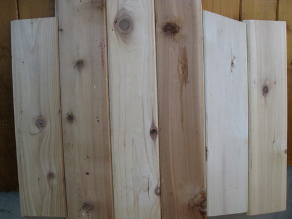
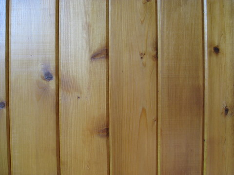
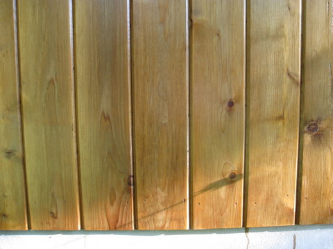
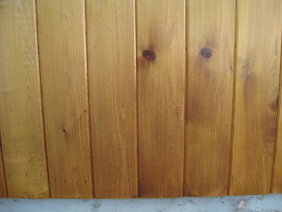
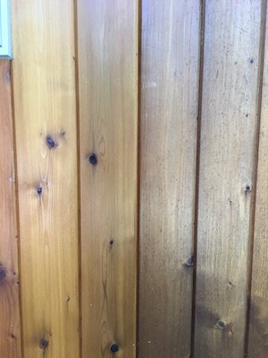
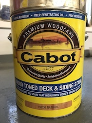
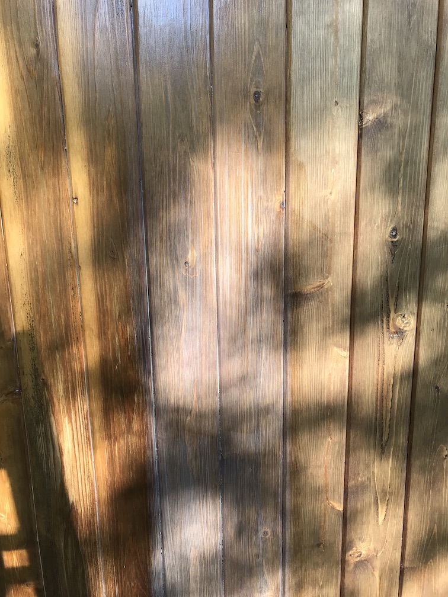
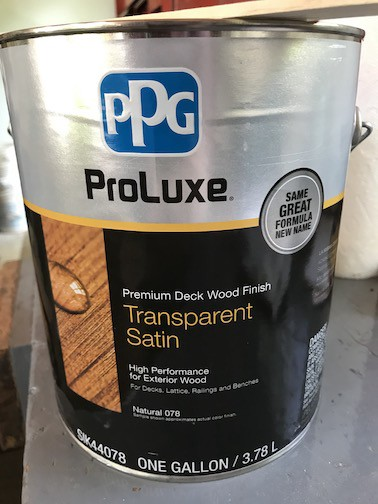
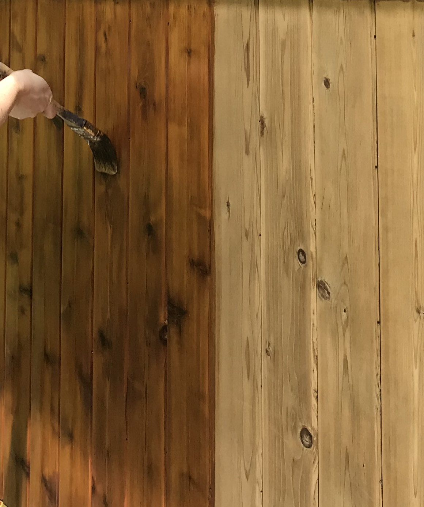

# A Tale of Two Cedars
## Or: Care and Feeding of Cedar Siding
### 10 Sep 2010, with updates

This post is about my continuing efforts to maintain a natural finish
on cedar siding. In a nutshell, the surface needs to be treated every
year or two, which I completely didn't understand when this all began!

Here's the backstory.  About 2004 I had some windows replaced on the
house, and the rough sizes were different enough that the only way to
make the final job look nice was to replace the siding on that wall.
That wall was sided in 50-year-old 1x4 tongue-and-groove pine (or
maybe douglas fir).  The two options my favorite lumber yard could
offer were 1x6 TNG pine (cheap), 1x6 TNG #2 knotty cedar (not cheap at
about $1/linear ft). They also offered #1 TNG clear cedar which is
beautiful and almost free of knots, but that was WAY not cheap at
$2+/linear foot.

So we had the first wall done in #2 cedar.  The natural grain looked
just amazing.  Here's a reconstruction of unfinished TNG.  You can
see lots of color variation.  Some planks are very light, others are
dark, maybe heart wood.  

Anyhow the rest of the house was painted so I figured I would grit my
teeth and paint over the cedar also.  Oh no.  The wife took one look
and said "we can't paint that."  Maybe the picture helps you
understand why I went along!  And so it began.

The only finish that seemed suitable was Cabot Clear Solution.
At the time their high-VOC product #3000 was available in New Jersey.
The stuff is like brown water, it's almost that thin.  The Cabot people
recommended one coat.  Seriously, just one coat.  That first coat
penetrates the wood and leaves essentially nothing on the surface.
It's quick and dead easy to put on.  It dried in about a day.
Unfortunately I don't have a picture of that, because that's been
years ago.

Rain and sun attack my siding all year long.  I was worried about
UV bleaching and fading the wood.  I was concerned about rain, but not
much.  Boy were my expectations all wrong.  

Here's a picture of a wall treated only with Cabot #3000.  This
wall is on my porch, so it's is exposed to strong sun but to zero
water.  It has a modest gloss because over the years I have put on
about four coats of clear solution.

This wall does not fade at all.  In fact I think cedar just might be
like cherry, and darken over time.  So my worries about UV causing
the wood to fade were completely unjustified.

Water, on the other hand, simply rips this covering to bits.  At the
first drop or two of rain the coating is like, whoa, I'm out of here!
Of course I'm exaggerating, but the shiny finish literally disappears
over the course of about a year, leaving the wall nearly unprotected.
Here's a picture of a wall that gets blasted by rain and sun, with a
fresh coat on it.  I'm hoping you can see the brown areas and streaks
that are caused by the water. This wall also has some light areas,
from a bit of sanding I did before applying the most recent coat.

The last picture is of a wall that suffered considerable water damage.
Basically rain hit the dirt and splashed mud up on the wall, and that
stuff just ate into the finish, leaving nasty spots and stains.

Cabot recommends recoating every one to two years.  Can you imagine
repainting your house every year!?  To be fair, the coating is so easy
and quick to apply that my wife and I can coat the entire house in a
single (long, exhausting) day.  But that doesn't mean I want to do it.

My experience has been that any wall touched by rain needs to be
recoated every year.  A wall that never gets wet can go, well, probably
easily three years without any treatment.  I confess I have not let
any walls go that long.  I thought maybe the colors would not match
if some walls were coated much less frequently than others.   Once
we're out there re-coating the siding, I do them all.  

Anyhow this year I could not put off the recoating any more.  It had
been two full years.  In the past I washed the walls with water and
squeegeed them dry a few days before.  I tried something a bit
different this time - I sanded the walls.  Not really sanded down to
wood, just hit the surface with a quick pass using #150 grit paper on
a palm sander.  This got all the dirt off.  It left some swirly marks,
but they disappeared after being coated.  I like the smooth finish,
but all that sanding was a lot of work.

The State of NJ put some hurdles in my way too.  A few years ago New
Jersey and other states set new regulations for paint and varnish,
mandating greatly reduced levels of volatile organic compounds (VOC)
compared to the old stuff.  Cabot duly reformulated their products and
their fine (but smelly) #3000 disappeared from New Jersey.  My only
experience with the replacement, product #9200, was horrendous.  I
made the mistake of applying it on a humid day, and it basically
refused to dry.  Then rain arrived unexpectedly and completely messed
up that one wall.  Since then I've avoided that product.  I managed to
source a couple of cans from Ohio before that state also changed its
VOC laws, but that won't last forever.  My wife says she sees pink
elephants after working with it all day tho. 

In some desperation to protect the exposed walls from water I've
started experimenting with polyurethane.  This month I treated two
walls with a coat of Spar exterior oil-based urethane satin finish,
right on top of the clear solution.  Polyurethane is unpleasant to
apply, it's like painting with honey.  And it dries quickly enough
that maintaining a wet edge is a challenge.  The wall color didn't
change much, but it's far glossier than I wanted.  I was afraid the
poly would cause the varnish layer to buckle, or peel, or something.
So far nothing of the sort has happened.  I am hoping that with the
layer of polyurethane (i.e., plastic) the wall will go two full years
without sustaining water damage.

Here's my bottom line. The finish I find most pleasing is the Clear
Solution, reapplied frequently.  The color is nice, it's not highly
glossy, and it's easy to apply.  But if you miss an annual coating in
a wet area, the wall will quickly get brown streaks and spots.

## Update August 2016

Polyurethane sucks!  What a bad decision I made, trying that product
on an exterior wall over an existing finish.  The old Clear Solution
product would fade to nothing over years, but the poly peeled and
flaked off after about 2 years, looked like little bits of plastic
wrap all over those walls, horrible.  Didn't get a picture tho,
dangit.  Had to sand those walls back down to bare wood and start
over.

This summer another wall was due for re-treatment.  I tried a
new-to-me Cabot product: Australian Timber Oil, their product number
19400, in a color called Natural. It looks like mustard, murky and
yellow, yet somehow soaks in and dries nearly as clear as my old
favorite #3000.  But the VOC isn't nearly as bad, and this "oil"
product somehow cleans up with water.  

The first coat soaked in well and dried in a few hours - definitely
didn't have to worry about an overly fast drying speed or trying to
keep a wet edge, that was easy.  The can stated that only one coat was
necessary, but I find that impossible to believe, so I put on a second
coat.  The second coat also dried adequately overnight in very dry,
warm weather.  With two coats on I feel the wall has a chance at
resisting water for a while.

The picture below has timber oil on the boards on the left, old clear
solution on the boards on the right (and plenty of mildew, ugh).  
The color match is pretty good.  This is good news, there's a Cabot
product that has some oil base, dries well and has a pleasing color.
Time well tell how it resists water. Stay tuned.

##  Update October 2017

Another year of rain had its way with my siding and it was time to
recoat a wall or two, I started with one that has a southern exposure
and little shelter so really takes a beating.

I wasn't so keen on using the Timber Oil again.  Even tho I put on 2
coats the surface remained rough. I have to say it was still resisting
water, but I'd feel much better if there was a bit of a glossy
surface.

I talked with my local paint store.  The man there said the Timber Oil
is very thin, really intended for hard woods; it will just soak into
cedar.  They recommended Cabot Wood Toned Deck &amp; Siding Stain
#19200 in color natural, which seems to be a reformulated version of
the low-VOC 9200 that I tried years ago.  The man repeated the advice
of "just one coat" and warned me that there's a risk of a second coat
staying goopy, just not drying.  This product has the blue top with a
warning about oil contents, but I don't know what's really in there,
it cleans up fine with soap and water.

The wall seemed OK to recoat - did not need to be sanded down.  I got
most of the mildew off by cleaning with bleach & dish soap, then let
it dry for a full week. On a bright warm dry Saturday I got back on
the ladder and recoated.  Here's a picture of the wall.

The stain again looks like weak mustard in the can and goes on quite
milky.  This picture shows about six boards.  The two on the left were
coated about 5 minutes before, the two in the middle have a fresh
coat, and the two on the right have not yet been coated.  You see how
it goes on milky but rapidly goes clear.  After 24 hours of dry 72
degree weather the surface was cured, a little glossy.  I also sanded
down one very small, badly damaged area and coated it, that area still
was a hint tacky and not entirely dry after 24 hours, which was an
unpleasant surprise.  I'm sure that low VOC is good for painters and
the planet but boy it's a challenge to use.

##  Update June 2020

I have given up on Cabot products!
Next round of refinishing, because some areas of the house had become so damaged that I could not ignore it anymore. Also I was fortunate to get extensive help thanks to the virus quarantine.
Found a product this year at my local family paint store, made by PPG and called ProLuxe premium deck wood finish. I bought the transparent satin in the lightest possible color, Natural, altho even that is pretty dark brown. This is a two-coat system — none of that “one coat is enough” fake news you’ll find on cabot cans.

My loyal assistant and I sanded entire walls of the old #2 knotty cedar boards down to bare wood, first with 100 grit to get off the finish, then 120 grit to polish. The first coat of varnish soaked in deeply, the second coat made a shiny, water-resistant surface layer, it’s a little difficult to show in a picture.

Left is varnished, right is sanded.

The result looks so, SO much better than the mustard-colored stuff I used three years ago. Time will show how it holds up to water of course.

---

[Blog index](../index.html) / feedback to christopher d&ouml;t lott &aacute;t gmail d&eth;t&nbsp;com
