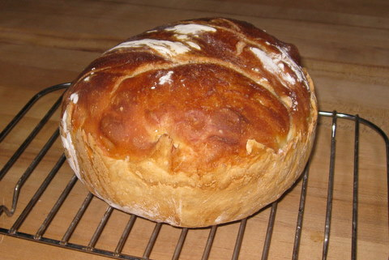
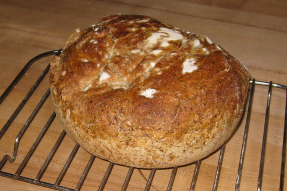
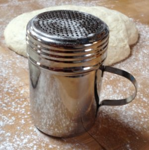

# Baking No-Knead Bread

### 3 Oct 2010

First I'll bore you with the back story.  When we were in gradual
school at UMCP and had more time than we do now, my buddies Bill,
Scott and I made valiant attempts at baking decent bread at home.
This was before good bakeries popped up everywhere, and long before
grocery stores received par-baked loaves to finish daily.
Occasionally we'd get something almost edible but never good enough
to motivate us to make it again soon.
Then I spent a few years in Germany where good bread was everywhere,
and never baked.  When we moved to New Jersey over a decade ago there
was some good bread around and even tho I finally had a kitchen to
mess up, I still didn't attempt any bread.

Then late in 2008 I stumbled across Mark Bittman's article in the NY
Times on baking no-knead bread (links are below).  I printed it out
and it lay on my desk for a solid year.  Maybe it was longer, I don't
know.  Finally in some fit of desk cleaning I unearthed the sheet
and forced myself to make it.

Before I go any further, here is a link to the recipe at The New York
Times, and for good measure a link to the Sullivan Street Bakery:

http://www.nytimes.com/2006/11/08/dining/081mrex.html

http://www.sullivanstreetbakery.com/

Making the dough is almost no work.  Back in grad school we were too
impatient to knead the dough enough, and this recipe solves that
problem.  To bake this bread you need a medium-size oven-proof
container with an oven-proof lid, ideally ceramic.  Well, I used a
makeshift system of a mixing bowl and an inverted frying pan.  (Once I
almost melted the bakelite knob on a frying-pan lid, but don't tell
the wife.)

So my very first loaf emerged from this ridiculous bowl and frying pan
contraption .. just amazing.  It looked like, well, like a real loaf
of bread.  It tasted GREAT.  The kids and I ate it in, uh, probably
about an hour.  I made another loaf immediately, baked it the next
day. The second loaf, despite my best attempts to mess it up, was
great too.  Hmm.  Suddenly baking bread got a lot more attractive.
Here's a picture of today's loaf of white bread, just the straight
recipe.



Eventually I experimented a bit.  I have found that this recipe works
just fine with whole-wheat flour or rye flour, but not more than about
1/3 of the total flour.  One more picture, this is a loaf with about
1/3 rye flour and maybe a quarter cup of some goofy flax seed that I
found in the pantry.  It doesn't rise as much as an all-white-flour
loaf but the taste is a lot more interesting.



This has become my standard thing to take to other people's houses.
Their kids usually devour it, even the rye version.  I also found a
smallish ceramic pot with a ceramic lid that has become my standard
bread baker, just got lucky at the local home-goods store that sells
remnants etc.

I'll wrap this up with a big thank-you to Jim Lahey for sharing the
fruits of his research, and also many thanks to Mark Bittman for
writing it up!

## Update 18 Feb 2012

After seeing a friend use a shaker to
distribute flour evenly when making gravy, I finally got one for
making bread.  It works great!!  This is probably something totally
obvious to real bakers but it took me a long time to stumble upon it.
That's today's loaf rising in the background, sitting on top of a
silicone baking sheet liner that is nicely covered with flour from the
shaker.



Here's the plain-text recipe, just in case those links above ever stop
working. I sure hope they don't mind me repeating the recipe here.

```
baking the perfect
loaf of bread at home

Formula and process created by
Jim Lahey, owner of Sullivan St Bakery.

formula

3 cups (430g) flour
1 1/2 cups (345g or 12oz) water
1/2 teaspoon (1g) yeast
1 1/4 teaspoon (8g) salt
olive oil (for coating)
extra flour, wheat bran, or cornmeal (for dusting)

equipment

Two medium mixing bowls
6 to 8 quart pot with lid
  (Pyrex glass, Le Creuset cast iron, or ceramic)
Wooden Spoon or spatula (optional)
Plastic wrap
Two or three cotton dish towels (not terrycloth)

process

Mix all of the dry ingredients in a medium bowl. 
Add water and incorporate by hand or with a wooden 
spoon or spatula for 30 seconds to 1 minute. Lightly 
coat the inside of a second medium bowl with olive oil 
and place the dough in the bowl. Cover the bowl with 
plastic wrap and let the dough rest 12 hours at room 
temperature (approx. 65-72 degrees F).

Remove the dough from the bowl and fold once or twice. 
Let the dough rest 15 minutes in the bowl or on the work 
surface. next, shape the dough into ball. Generously 
coat a cotton towel with flour, wheat bran, or cornmeal; 
place the dough seam side down on the towel and dust with 
flour. Cover the dough with a cotton towel and let rise 
1-2 hours at room temperature, until more than doubled in 
size.

Preheat oven to 450-5000F. Place the pot in the oven at 
least 30 minutes prior to baking to preheat. Once the dough 
has more than doubled in volume, remove the pot from the 
oven and place the dough in the pot seam side up. Cover 
with the lid and bake 30 minutes Then remove the lid and 
bake 15-30 minutes uncovered, until the loaf is nicely browned.
```

Please leave comments [at the github repo](https://github.com/chrisinmtown/chrisinmtown.github.io)
