# Making Fire-Roasted Salsa

### 7 Oct 2010

I have long loved eating Mexican food in general and salsa in
particular.  In grad school my buddy Bill and I conducted
some experiments with salsa.  Well it wasn't a bad excuse to drink
beer, right?  So we gathered different onions, different peppers,
etc. and made salsa.  Lots of salsa.  Some was so hot we could barely
stand it, we called it drano.  Some was basically salad -- we were
making pico de gallo before I knew what that was.  After much goofing
around back in '92 we wrote up the recipe for
[Damn Good Salsa](19920102_salsa_eng.html). I know now that we had
barely scratched the surface.

Occasionally I'd find a really great salsa in a restaurant, and my
favorite had bits of charred tomato in it and a hint of a smoky
taste.  This is my attempt at recreating that flavor.  Here's the list
of ingredients and directions for my latest favorite version. After
that there's some pictures and fairly useless commentary from my
latest batch.  

Fresh tomatoes have abundant water, so much that it can make the salsa too 
thin.  Roasting the tomatoes first solves this problem and adds huge flavor.

__Ingredients__

* 10 ripe plum tomatoes
* 1/2 red onion
* 1-2 cloves garlic
* 2+ jalapeno peppers (ideally chipotles)
* 1 lime
* half a bunch of fresh cilantro
* 2 T red wine vinegar
* 1 t cumin
* 1/2 t ground black pepper

__Directions__

* Wash tomatoes, slice in half, arrange on baking sheet
* Broil tomatoes about 30 minutes until skins are black
* Pluck skins off tomatoes; see below
* Process tomatoes thru a food processor cheese grater wheel,
     or dice by hand
* Dice red onion finely
* Combine tomatoes and onions in a large pot
* Extract juice from lime, add to pot
* Clean garlic, peppers, and cilantro, then put in food processor
  with the chopping blade
* Add vinegar, cumin, pepper to the processor
* Run processor to mince everything up, add to pot
* Bring to gentle boil
* Let cool, serve with chips!

What about the skins? Sometimes I simmer the skins in the extra liquid
from the sheet pans, puree the result, cook it down until almost syrup
then add it back to the salsa for extra depth of flavor.

## Step by Step

Plum tomatoes were abundant in the farmer's markets around here a few
weeks ago.  I bought a big box, easily 25 pounds, for just $20.  The
picture below shows just a few.

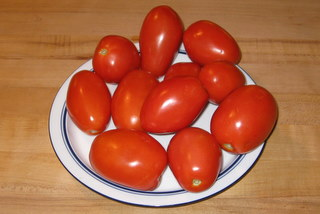

These plum tomato halves have been under the broiler for about 30
minutes. Below you can see enough for a double batch of the recipe.

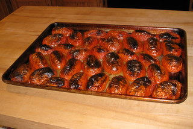

In this picture you can see how they look after I've plucked off all
the skins.  The blackened skins are usually easy to remove, but
sometimes are a hassle.  

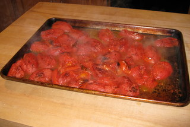

This is the cheese-grater wheel on our ancient cuisinart.  Hey, it
still works.  This wheel produces a nice coarse texture.  I don't want
to turn the tomatoes into juice with the chopping blade!  Yeah, I know
I took a photo of the container on backwards.

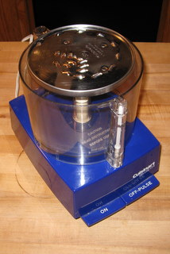

The tomatoes have been through the mill.  This is dead quick and easy.

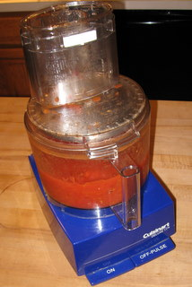

Here's all the good stuff that makes it salsa.  This bunch of cilantro is
about half what I usually find in the market, don't know why it was so
small.  So I used the whole thing.  

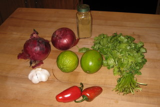

I'm using a whole onion because I'm making a double batch.  You just
gotta chop the onions by hand.  I've never been able to get a
satisfactory texture out of the food processor. 

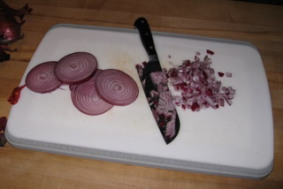

This is the part I like the least.  Cilantro leaves turn to disgusting
black mush really really quickly and I don't want any of it in my
salsa.  Here I'm separating leaves from stems and washing it a few times.
The extra onion is hanging around, sneaking into pix.

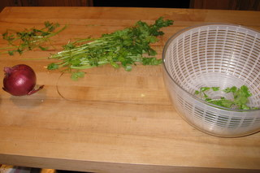

Cilantro is key to the salsa tho, and that's why I put up with the
hassle.  Here's the cleaned result, ready for the processor.

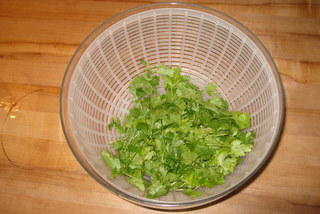

I had high hopes for these beautiful ripe jalapenos but they had NO
HEAT at all, a disappointment.  Unfortunately I was all out of
chipotle peppers.  A chipotle is a smoked jalapeno, often sold dry
but also sold "en Adobo" which means canned in a rich tomato sauce.
I highly recommend you try a chipotle in this recipe.  The heat 
increases slightly after the salsa is mixed and cooked, I guess the
capsaicin takes a while to escape from the seeds.

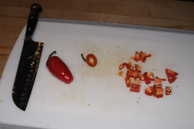

Lime is the other key ingredient.  I resisted making a margarita.  But
only because I had no tequila in the house.  Dangit.

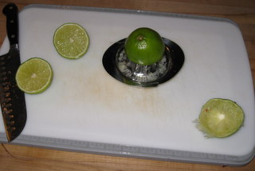

Peppers, cilantro, lime juice and spices in the processor.

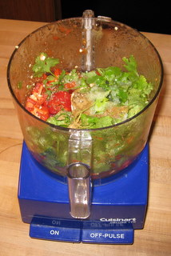

After chopping down into green liquid.  Doesn't look like much but
it's pure flavor!

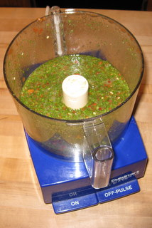

Everything's in the pot.  Red and green - Christmas!

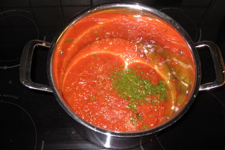

I stop cooking when the some tomato foam appears on the surface,
that's enough.

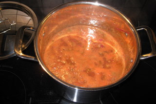

What's missing from this picture?  Right, beer!  Enjoy.

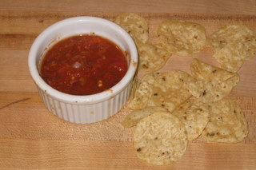

Please leave comments [at the github repo](https://github.com/chrisinmtown/chrisinmtown.github.io)
