# Refreshing the A/T Fluid in a 2009 Honda CR-V

### 23 July 2012

This blog post offers some pictures and details of my experience with
draining and refilling the automatic transmission fluid on a 2009
Honda 4WD CR-V as part of a 60,000 mile service. I hope it helps
someone out there!

I started down this road when I got a kick in the backside from the
car's maintenance minder (display indicator about what service to do
next), which showed codes "1" and "3" next to the "A" at the 60K oil
change. Cryptic, right?  The book says A is oil change, 1 is air
filter and 3 is A/T fluid.  The air filter was easy.  But I had not
done an A/T fluid service before.

The cloud  lead me to the
[CRVOwnersClub.com](http://www.crvownersclub.com).  In the
(very helpful!) "Maintenance and Service" forum I read the posts that
explain an A/T can't easily be drained completely without
disassembling it, it retains fluid in the torque converter and many
other places.  So the service is more properly called a fluid refresh
rather than a fluid change.

The people in the forum categorically stated to use Honda fluid, and
also explained to drain from the bottom, replace the crush washer on
the drain bolt, and refill thru the dipstick tube with a long-neck
funnel.  There was some disagreement about the filter, with some
people saying to change it, and others saying to ignore it, hmm.  And
the forums had much discussion of the official flush-and-fill
procedure, which seems to entail draining, refilling and driving
*4* times in rapid succession to get the percentage of new oil up
somewhere near 80%.  Seriously?  I admit I tend towards over
maintenance, but that seemed excessive.

Just for kicks and giggles I asked my local dealer about their price
for the A/T service at 60K miles, and the service dude claimed $90
plus parts. I asked specifically about the 4X flush method from the
CRV forums, and the service dude asked if the A/T is shifting OK. Yes
I said, so he asked, why would I do the 4X flush and fill? From what I
heard from him, I gather the Honda service department's $90 price for
a regular A/T service at 60K is just to drain and refill ONCE.  And I
later got confirmation of this from people in the CR-V forums.  So a
single drain-and-refill was looking reasonable.

The first step was laying in supplies.  At my local friendly NAPA I
found a long-necked plastic funnel for $2.50, made by Blitz in the
U.S. of A.!

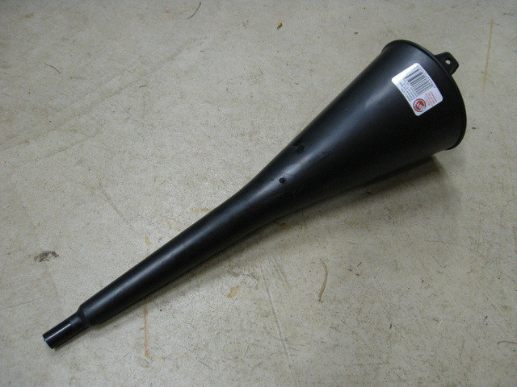

Just in case I decided to go for the 4X procedure I bought a case of
A/T fluid at my local Honda dealer.  Honda charged me $6.50/quart plus
tax, which was less than I expected to pay based on comments found on
the CR-V owners forums.  Honda sold me ATF DW-1 fluid (not the previous
generation Z1 fluid), the Honda parts guy said no more ATF Z1.

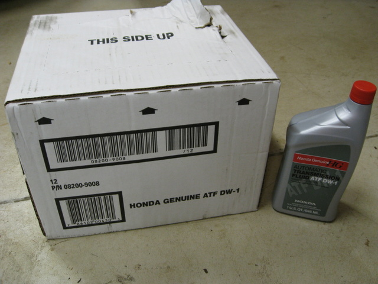

After driving the car around the block a few times it was plenty warm.
I found the drain plug quickly enough, roughly in the center and just
inches behind the front of the car.  It's accessible without putting
the car on ramps.  Gotta give the Honda engineers credit for making
the access very easy, not burying this one behind something awful!
Here's the front of the car just to show how to find the plug.

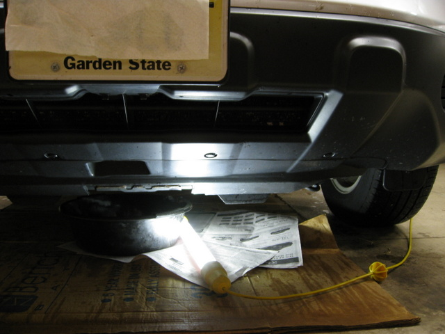

In this next picture I'm a bit closer, the transmission housing is lit
up by my trouble light, and you can see the bottom edge of the plug
already. 

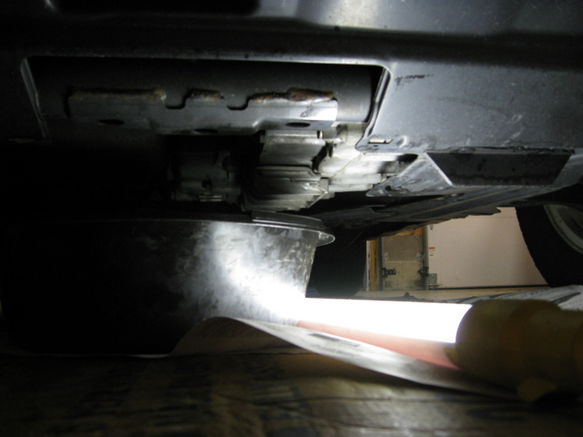

I've moved closer still and you can see the A/T drain plug.  The bolt
is round on the outside and has a 3/8" square hole on the inside,
conveniently the exact right size for a 3/8" socket wrench :).

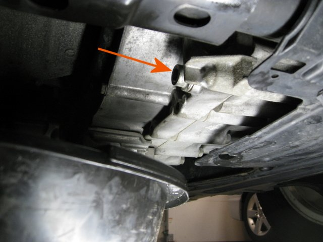

I put a long-handled 3/8 inch drive socket wrench into the bolt and
started tugging.  Gently at first, then a lot harder.  The
transmission moved a bit as I pulled on it.  I can only estimate
without a torque wrench set for loosening, but I think I put at least
75 ft-lb of pressure on it. I guess all those hot-cold cycles make the
bolt stick.  Then when it finally turned it went suddenly, and I
whacked the wrench into a metal member.  Luckily no fingers were in
the way for once!  The bolt and washer came out easily and the fluid
poured out.

Here's the drain plug, still with the old crush washer and some goopy
stuff on it.  

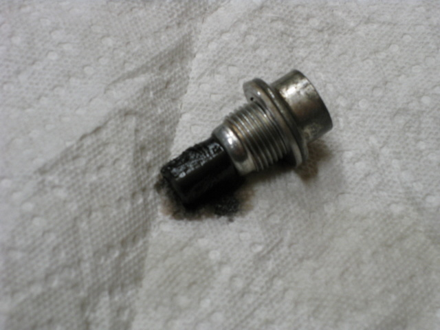

Here's the drain plug all cleaned off, lying next to the new aluminum
crush washer that Honda sold me for $3.12, ouch.  After the fluid had
slowed to a trickle I put the plug back in.  Used the torque wrench
set to 35 ft-lb which was the number I got from the CRV owner's club
forums.  Altho Honda is delightfully clear about publishing the
required torque for the oil-pan drain plug (29 ft-lb), my owner's
manual is silent about A/T fluid service, it basically says "take the
car in for service."  So the recommendation of 35 ft-lb seemed
reasonable considering the crush washer is made of aluminum.

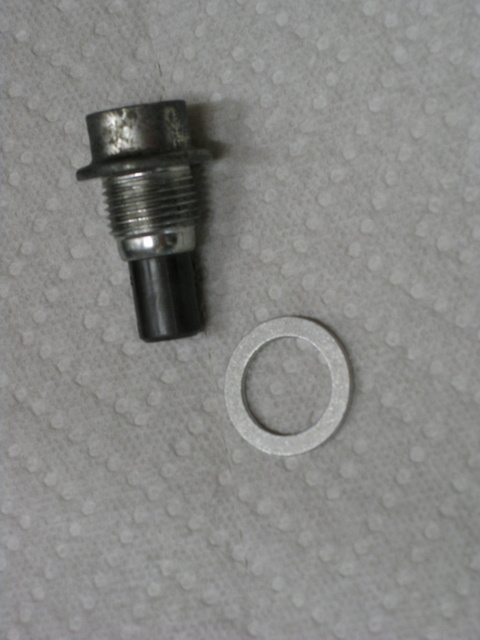

Time to refill what I took out.  Here I've aimed the trouble light
down into the engine compartment to show the A/T fluid dipstick, the
pull ring is yellow, located low and to the left of the battery.

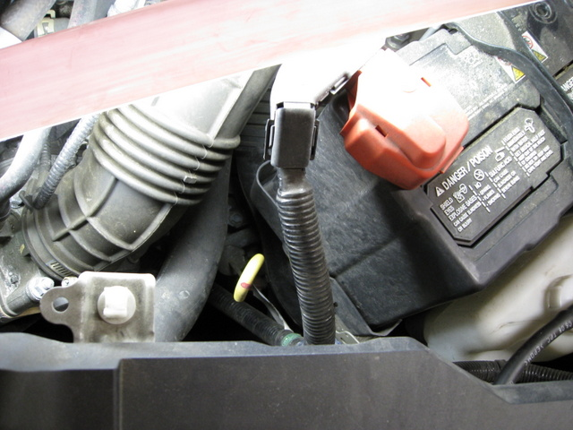

In this picture I've pulled the dipstick and inserted the long-neck
funnel.  Turns out that it was just exactly long enough, the space is
narrow and the top of the funnel was wedged just as the bottom part
went into the fill tube.

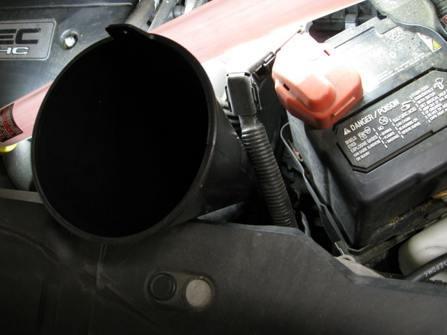

Leaving the quart container upside down was the easy way to fill.  At
first I thought I might have to fill very slowly, but the fluid never
backed up or overflowed.

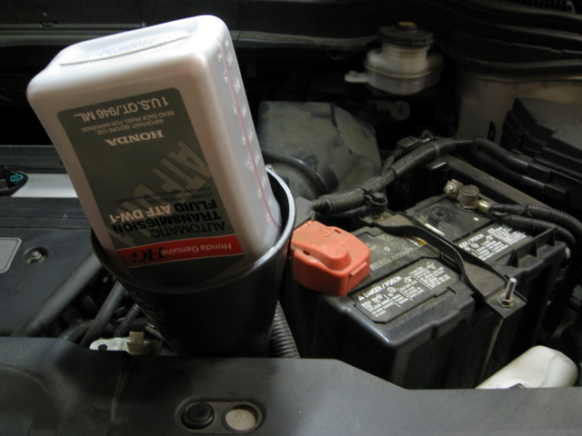

This shot shows the color of the old stuff.  It didn't smell burned to
me but it was certainly a dark color.

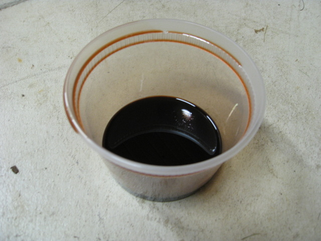

Here's the new stuff for easy comparison.  Looks like cough syrup.

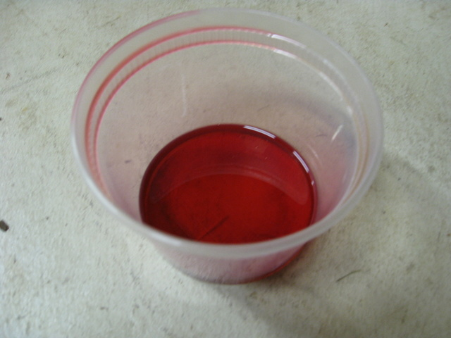

To figure out how much to put in, I refilled each empty bottle with
dirty fluid, and added the next only when it was obvious it was needed.
That showed me that only 3 quarts came out.  This was a notable variance
from the advice I found in the CR-V forums, where people claimed that
3.7 quarts came out.  Hmm, low on fluid?

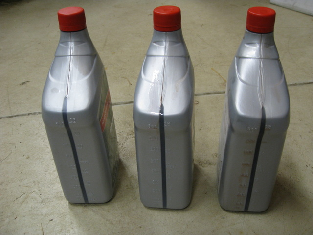

The last picture shows the business end of the dipstick.  The word HOT
is printed between the two holes, can't quite see it here. I guess the
fluid level should be right between the two holes when the car is hot.
After replacing the 3 quarts that I drained out, the fluid was just
below the bottom hole on the dipstick.  I had to add another half a
quart before the fluid came to the middle of the word HOT.  Guess I
should have checked the level BEFORE I started draining, but totally
forgot.

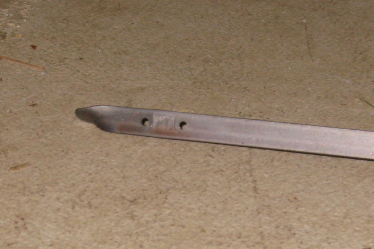

In the end this bit of maintenance was not nearly as bad as I thought
it would be when the code first popped up on the MM, in fact it was
about as easy as a regular oil change.

---

[Blog index](../index.html) / feedback to christopher d&ouml;t lott &aacute;t gmail d&eth;t&nbsp;com
