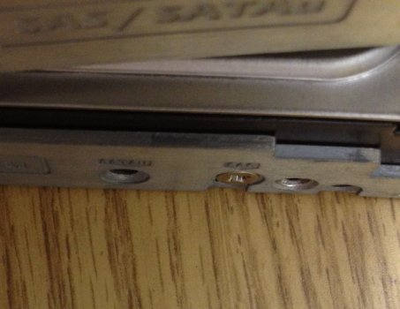
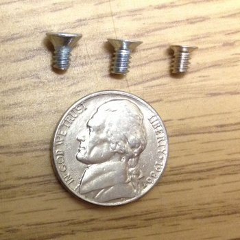

# Finding 6-32 Screws for Server Disk Trays

### 31 Jan 2013

I lucked into a few gently used rack-mount servers at work, and spent
a while reconfiguring them and adding them to a Hadoop cluster.  The
first task was installing disks into empty server disk trays, some
people call them sleds.  Buy some 3.5inch drives, fasten them with the
usual little screws, all easy, right?  My IT staff had plenty of 6-32
x 1/4inch screws, I ordered a case of Seagate drives, and off I went.

Once everything arrived I finally took a close look at the clearance
on the side of the tray.  The tray frame provides a hole that's just
barely countersunk.  If the screw head sticks out, that tray just does
not want to fit into the slot, and I did *not* want to force it. Grr.



So off to the cloud of course.  I found all sorts of esoteric screws for
repairing laptops, and those parts are definitely *odd*.  But these
server screws were apparently even less common.  Still I found some
that were very promising.

One source that specifically advertised screws to fit my exact tray
model was DiscounTechnology, and I ordered theirs.  This was close,
but definitely not the right thing.  DT customer service was
completely nice when I complained to them but if you don't got it, you
don't got it, right?  Here's their link anyhow:<BR/>
http://discountechnology.com/Counter-Sunk-Screws-6-32-x-0-25-with-100-degree-angle-for-Dell-trays-x-20


This picture shows the most common 6-32 screw on the left, the ones
from DT in the middle, and the ones I actually need on the right. 



Turns out that both Dell and SuperMicro use these super-tiny-head
screws on their server disk trays.  I finally got a package of screws
from the nice people at [Padova Technologies](https://www.padovatech.com).
They had sold us a batch of servers some time back and were willing to
share their surplus of screws.

Hope this picture helps you tell your vendor what's required!  I wish
I had a better ending to this post, like a solid recommendation where
you can just buy them.  If you find a reliable source for these tiny
screws, drop me a line and I'll add a link.

## Update 9 Nov 2017

I finally have a better ending to this post!  Peter O. of the United
Kingdom sent a solid recommendation for sourcing these elusive
disk-tray screws.  And I quote:

>    Thank you for your blog post
>  
> I came across it after ordering the wrong screws for Dell 2.5 and 3.5
inch caddys.  Right thread and length but head diameter and
countersink way too big.
>
> Almost ordered from DiscTech too, but postage to the UK was prohibitive!
>
> Anyway, thanks to your post I then included SuperMicro instead of Dell in my searches and found this:
>
>  https://www.supermicro.com/products/accessories/index.cfm?Type=30

```
MCP-410-00005-0N     Screw bag (100 pcs) and label for 24x hot swap 3.5" HDD tray
MCP-410-00006-0N     Screw bag (100 pcs) and label for 24x hot swap 2.5" HDD tray
```

> Finally armed with part numbers a good number of sellers of those come up on Google.

Please leave comments [at the github repo](https://github.com/chrisinmtown/chrisinmtown.github.io)
