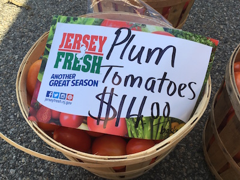
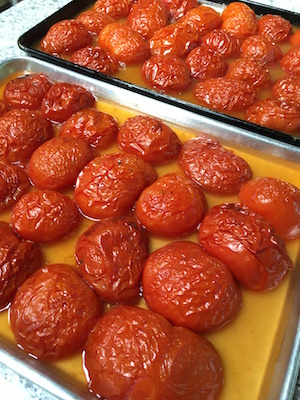

# Making New Jersey Red Sauce

### 27 August 2016

This is the holy grail that appears in my local New Jersey
farmers' markets in good years about late August: a huge basket of
ripe tomatoes for a very small price.  That's the time to make red
sauce!  

Fresh tomatoes have abundant water, so much that it can make the sauce too 
thin.  Roasting the tomatoes first solves this problem and adds huge flavor.
I also recommend processing and using the skins, a roasted tomato skin blends
down to a thick paste with all kinds of flavor, no waste!  Altho running the
oven on a sweaty August day when the A/C is running hard just kills me, the
result is great.  I've tried parboiling the tomatoes to remove the skins, but
that yields a watery sauce. 

This yields 8-10 cups of finished sauce, plenty for several meals.

__Ingredients__

* About 24 large tomatoes or 40 plum tomatoes
* 1 red onion 
* 3 cloves garlic (or more)
* 2 sprigs of fresh basil (or more - depends on your family :)
* 1 sprig fresh oregano
* Extra virgin olive oil

__Directions__

* Lightly spread olive oil on 2 13x18 sheet trays.  Don't need
  much, just want to prevent them sticking.
* Wash tomatoes, slice in half and remove the stem/core bit.
* Arrange the halves on baking sheets, leaving a bit of space.
  Don't overfill, they throw  off a lot of juice as they roast.
* Bake or broil tomatoes at 400 deg F about 20-30 minutes until skins
  wrinkle, loosen and char.  The picture here shows them just barely
  ready. Extra char means extra flavor!  This also evaporates some water.
* While the tomatoes are roasting, dice the onion and crush the
  garlic, put in pot with generous olive oil, sweat over modest heat
  until soft and slightly caramelized.
* Pluck skins off tomatoes - tongs work well!  Try to resist eating
  the skins.  They're a little sweet.
* Blend the skins with a bit of tomato juice from the sheet trays
  until they are paste, add to pot.
* Coarsely chop the tomatoes and add to pot.  
* If the juice left on the trays is super thin and watery, put it
  in a separate pot and boil to reduce it; if it looks ok, add it to
  the pot also. 
* Simmer 15 minutes, I prefer uncovered to let yet more water escape
  and reduce it.  If you had to reduce the tray juice separately, add
  it to the main pot.
* Finely chop and add the herbs, simmer another minute or two
* Use an immersion blender in the pot to produce a smooth sauce.

---

[Blog index](../index.html) / feedback to christopher d&ouml;t lott &aacute;t gmail d&eth;t&nbsp;com
