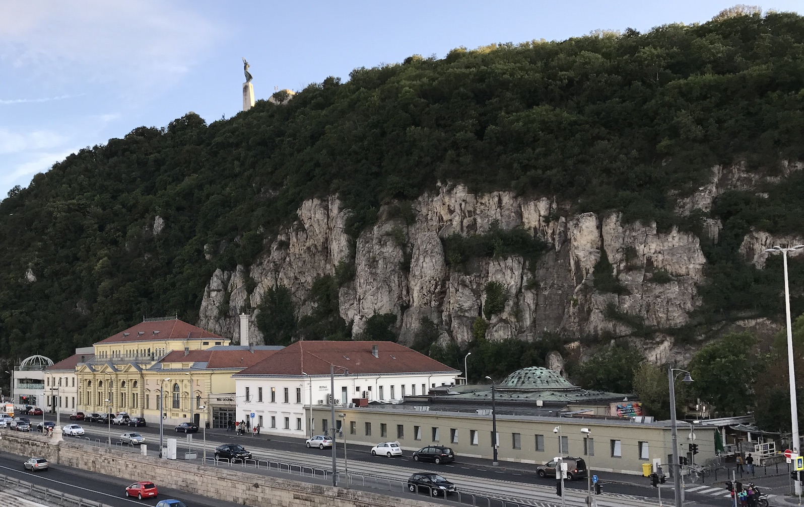
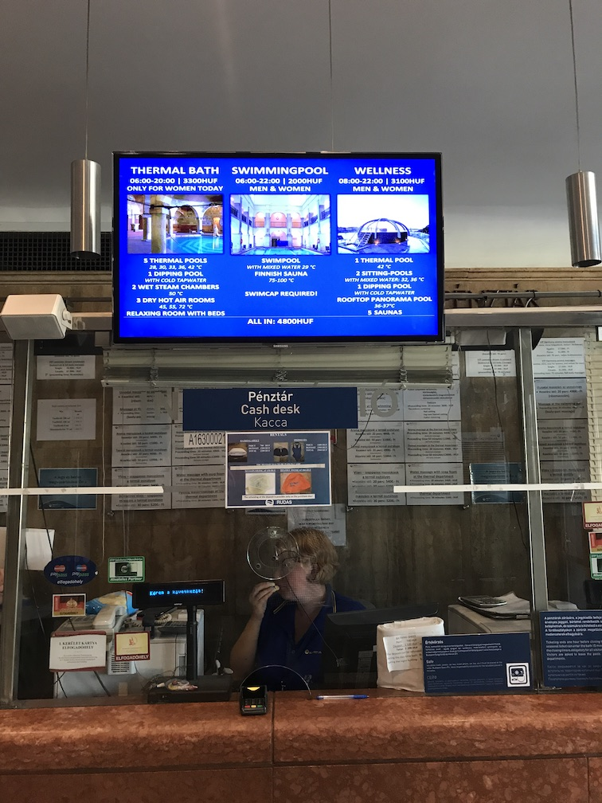
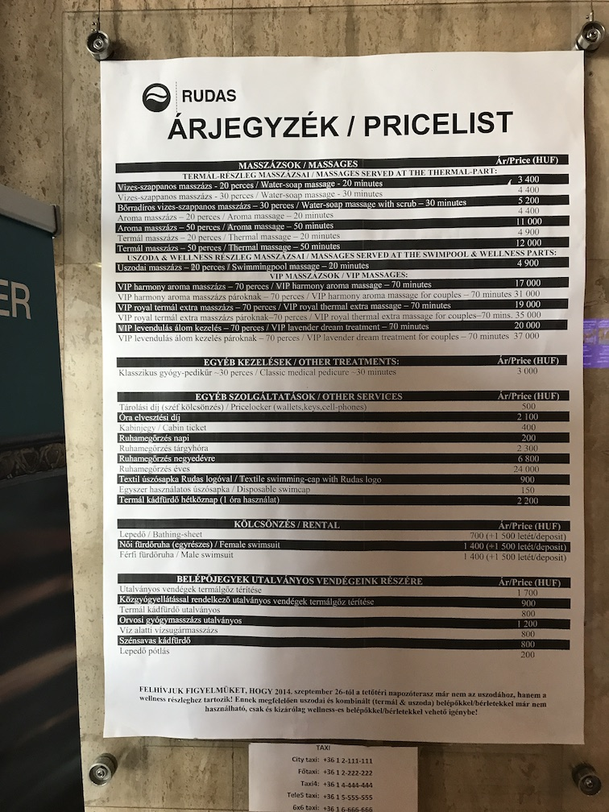

# A Visit to the Rudas Thermal Bath in Budapest

### 17 September 2017

I'm a novice at spa culture, but when in Rome .. so I visited the
Rudas Thermal Bath while in Budapest. I hope this blog post will help
the next novice :) In Sep 2017 the exchange rate was about 250 HUF for
1 USD.  The first picture is the baths from outside. The thermal baths
are in the low building on the right, that dome lets in light.

In a Turkish bath you relax in warm-water pools, steam rooms and
hot-air saunas at your own pace. The Rudas complex has a thermal
(Turkish) bath, a swimming pool and a "wellness" spa. Swimming pools
and spas are everywhere but ancient thermal baths are rare, so I'll
focus only on that.

First pick your day: men only MWThF, women only Tue, mixed on
weekends. Expect to stay an hour or two.

What to bring: money (HUF 3300 weekdays, 3700 weekends), maybe a
bottle of water, possibly your shampoo. Flip-flops? I saw nobody
wearing them. Friends? The signs say silence but there was much
talking. A bathing suit? Only on the weekends.

A covering is required, full nudity not allowed. The standard garment
for men on their days is a white cloth apron about 14 inches square
with a tie string. You wear it in front walking around, turn it around
to sit in the sauna - never want bare skin on wood etc. A long
swimsuit is so uncomfortable in the sauna that I highly recommend
wearing the apron, anyhow it's included in the entry fee. Some people
wore two: one front for modesty and one back for convenience, I wasn't
that savvy on my first visit :). Will you look ridiculous? You will
look exactly like everyone else.

What about securing your stuff while you're inside? The standard entry
fee to the thermal baths includes a private cabin that your wristband
locks and unlocks. It's not exactly high security, so I left my
valuables back at my place. The baths have a real safe where you can
leave your phone etc. for an additional fee of HUF 500.

Questions? The price list at the entry was in English. The staff was
not fluent in English, but very friendly and spoke enough to get me
through.

OK you're finally inside! Shower off the street dirt (look for a
shower with a soap dispenser) then enter the main chamber. You'll see
five pools: small side pools at 28, 30, 33 and 42 deg C, and a large
center pool at 36 deg C. Move among them as you like! Side chambers have
steam rooms - don't know the temperature as I could not even see the
floor in front of me - and hot air rooms at 50-55 deg C. Steam first?
Steam last? Entirely up to you. After leaving a hot room look for the
shower stall with a rope and a bucket of cold water, feels good when
dumped over you. (Unlike some spas, there is no open-to-the-outside
room where you can cool off in fresh air after some sauna time.)  When
your skin and heart can't take anymore and you are on your way out
there is a cold water pool at 18 deg C to, uh, tighten everything up again
lol.

Somewhat confusingly there are no towels here, no terrycloth plush
anything. After you leap shrieking from the cold water pool you grab a
large sheet off a shelf, take it to a chaise lounge in the relaxation
room, wrap yourself up and rest.

You may wish to return to the showers and use your own fave shampoo
before dressing. I was not savvy enough to realize this either on my
first vist.

For what it's worth, the bathroom doors have no locks and many signs
that say one person at a time.

If you want to splurge, many many services like massages, pedicures
etc. are available, see the list below. The cheapest massage is HUF
3400 for 20 minutes. (They tell you the start time for your service so
you have to keep an eye on the clock, which frankly disturbed my
attempt at relaxation, but what can you do.) Yes it more than doubles
the price, I thought the basic massage was great.

Please leave comments [at the github repo](https://github.com/chrisinmtown/chrisinmtown.github.io)
