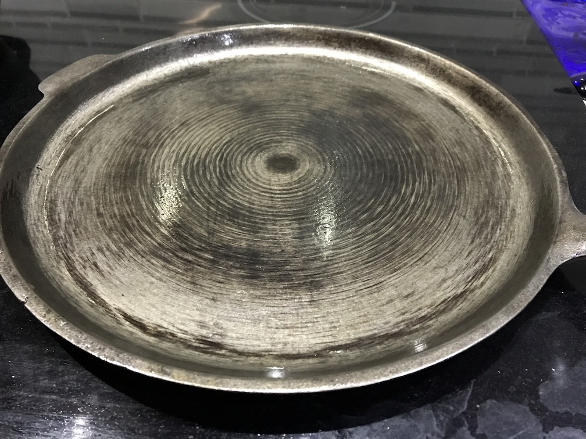
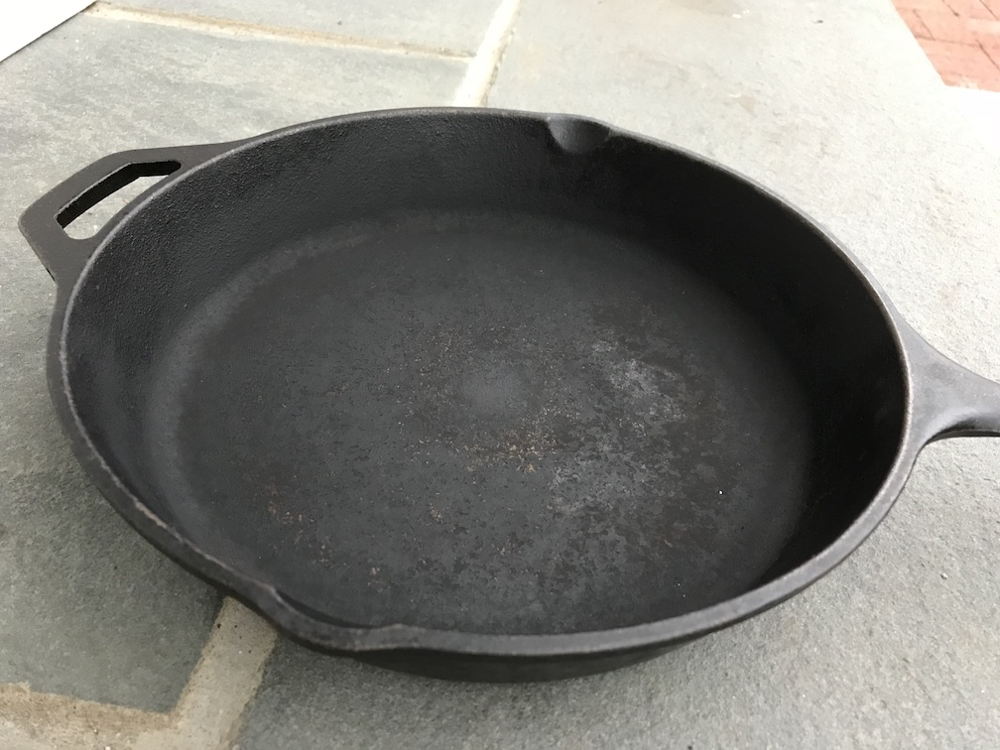
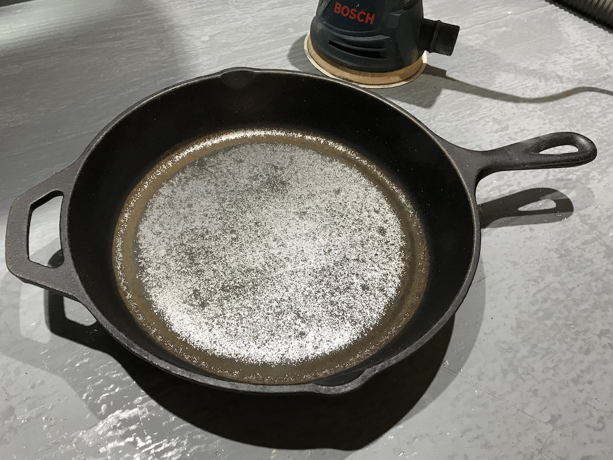
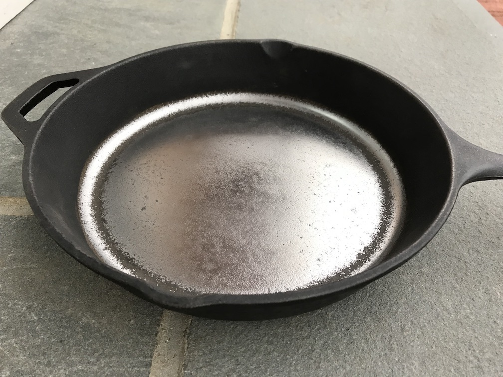
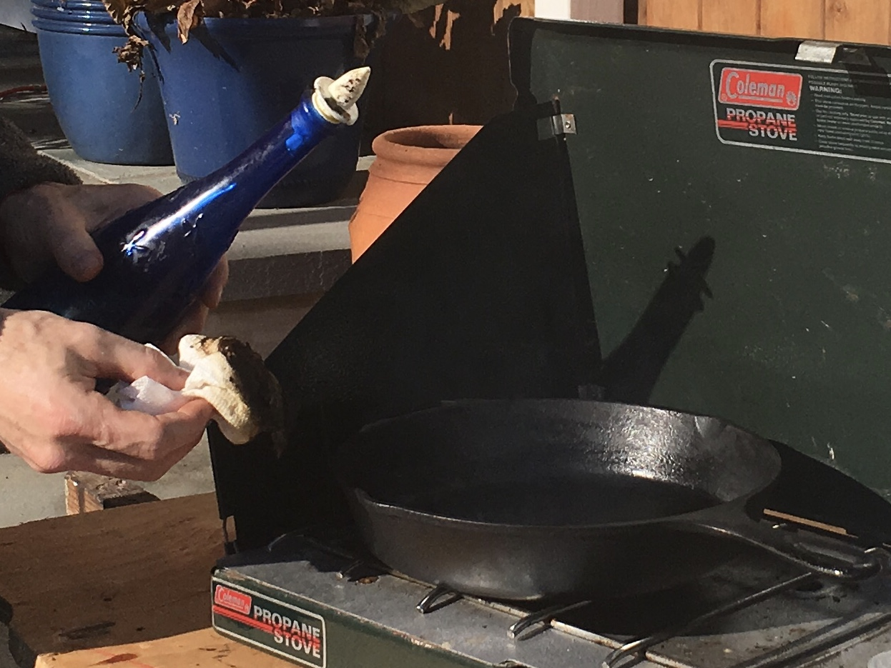
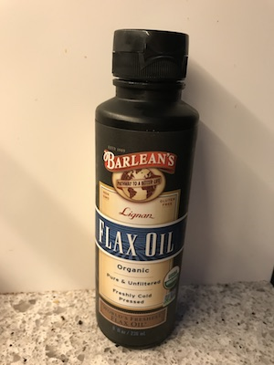
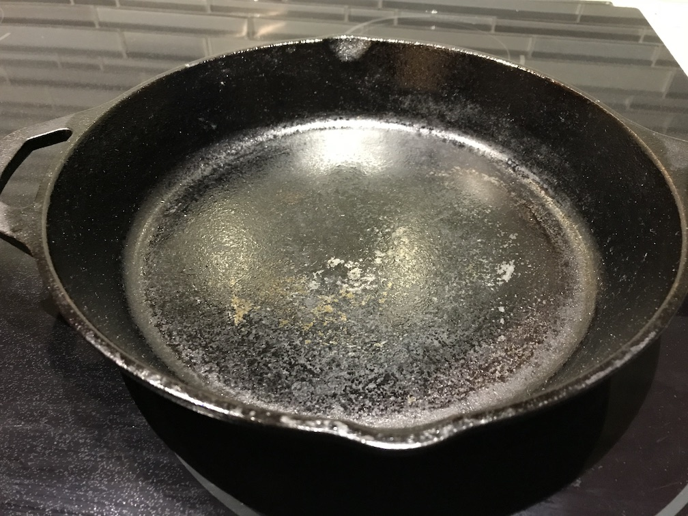

# Polishing a Modern Cast-Iron Pan

### 16 December 2017

Can I improve a modern cast-iron pan?  I'm a recent convert to using
cast-iron pans. They're cheap at about $25, they work great on an
induction stovetop, and they make a mean steak, you should try it:
https://cooking.nytimes.com/recipes/1016334-cast-iron-steak

Why polish my pan?  Modern pans such as those from Lodge are very
rough on the inner surface, just the texture of the sand from the
casting, and I suppose they save plenty by not machining them at all
after casting.  This means unless you fry your egg in a puddle of
oil, flipping it for easy-over is tough.  And some searching yielded
lots of material - hey there's a surprise lol.  For  example:
http://www.instructables.com/id/Iron-Skillet-Seasoning-Modification

Fanning the flames, a friend gave me a vintage pan that his wife
banned from the kitchen (!).  The picture below shows the inner
surface after I sanded off a few years of rust. Look at the circular
machining marks!  The cast surface was smoothed down by spinning
this against some tool. The result is far smoother than modern pans.

That vintage pan got me thinking.  Could I improve my modern pan
that came straight from wally world?  Here's the "before" picture.
This is a Lodge skillet that we've used to make some great steaks.

Well I don't own a grinder but I have a sander and plenty of 80 grit
discs, so I got to it.  This next picture shows my progress after
about 20 minutes of sanding. Yes I used a dust collector, no need to
breathe more iron filings than necessary.
__I SHOULD HAVE STOPPED HERE.__
More on that later.

After about 45 minutes the base was VERY smooth so I stopped.

Then the seasoning.  This means "varnishing." I know that sounds
gross but in the end you really are trying to create a thin layer of
solid dried oil on the surface, just like that layer of stuff on
your sheet trays after many years.  Here's a picture of doing it the
WRONG way.  A coleman stove is insanely hot in small areas, it burns
off the oil instead of curing it.

To season effectively ya gotta use the right oil.  Initially I used
all the wrong oils.  I tried bacon fat, crisco, canola oil.  Nothing
really worked.  Finally I found this blog that convinced me to pony
up the $1+/oz for flaxseed oil at my local health-food store:
http://sherylcanter.com/wordpress/2010/01/a-science-based-technique-for-seasoning-cast-iron/

We followed the directions, put on a thin coat and baked it in a 450
degree oven upside down for an hour.  That did NOT fill the house
with smoke but it didn't smell so great either.  It's tough to get the
even finish you want all over, but we came close.  With time I think
the entire surface will darken to an even black.

Looking closely, I found that a thin layer of oil coalesces into
tiny drops all over the surface, then those tiny drops turn into
little plastic-like dots, very very tough to remove.  With the next
coat, more dots accumulate until eventually you get a reasonably
even coating.  So I'm cooking on plastic?  Well, uh, it sorta seems
like it.  But it sure cooks a MEAN egg!

### Update 6 months later

The baked-on oil came off while trying
to clean clean some cooked-on carbonized sauce, something with sugar
in it.  The finish was more fragile than I expected, I can only
guess that I polished off too many imperfections and now the oil
cannot grab well.  If anyone reads this far, don't polish your pan
down to a mirror, just knock off the high spots and call it a day.

Also see Stephanie Y.'s discussion of cast-iron cookware:
https://campingcooks.com/cast-iron-cookware-user-guide/
